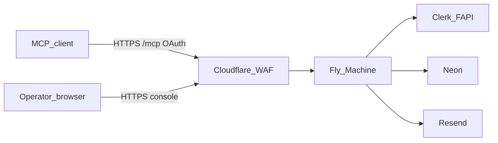

<!-- Research twin of CreatePlan ~/.cursor/plans/botpasses_brand_domain_0b5dd3a1.plan.md. Canonical Build UI is that file. -->

# Plan: Botpasses brand and botpasses.com cutover

Research twin: [docs/plans/2026-08-30-botpasses-brand.md](docs/plans/2026-08-30-botpasses-brand.md)
Task file: [.loadout/tasks/botpasses-brand/TASK.md](.loadout/tasks/botpasses-brand/TASK.md)
CreatePlan: `~/.cursor/plans/botpasses_brand_domain_0b5dd3a1.plan.md`

## 1. Summary

- **Problem:** The product still ships as Agent Grant Vault (`agent-vault`, `AgentVault`, `agent-grant-vault`) on example hosts (`staging.vault.example.com`). Email `from` is hardcoded to `noreply@mail.agent-vault.invalid`. Fly apps are `agent-vault-*`. The owned domain is **botpasses.com**.
- **Outcome:** Users, MCP clients, operators, and infra all see **Botpasses**. Prod origin is `https://botpasses.com`. Staging is `https://staging.botpasses.com`. npm package, MCP `serverInfo.name`, `/health`, operator UI, Fly app names, and docs match. Live DNS, certs, Clerk FAPI, and Resend `mail.botpasses.com` are cut over, or the runbook lists the exact missing credential.
- **Approach:** One brand module (`src/brand.ts`). Dual-bin `botpasses` + `vault`. Keep `VAULT_*` env names. Reuse existing Neon databases (copy `DATABASE_URL` onto new Fly apps). **Create `botpasses-staging` / `botpasses-prod` and copy Fly secrets before any push of the renamed tomls to `origin/dev`.** No new runtime dependencies.

## 2. Scope

### In scope

- Product display name **Botpasses**; slug `botpasses`
- Hosts: prod `https://botpasses.com`, staging `https://staging.botpasses.com`, `www` 301 to apex (not a second OAuth resource)
- npm `name`, description, scripts; `bin.botpasses` canonical and `bin.vault` alias
- MCP initialize `serverInfo.name` and `instructions`; Claude connector display **Botpasses**; `/health` `product`; WWW-Authenticate realm
- Operator HTML (local + hosted), CLI usage and listen logs, default login URL, default `$VAULT_HOME` dirname `~/.botpasses`
- Hosted email: `VAULT_EMAIL_FROM` required at **boot** when `RESEND_API_KEY` is set; sender uses that From
- Fly app names in [fly.staging.toml](fly.staging.toml) / [fly.prod.toml](fly.prod.toml)
- Backup object key prefix, `.env.example`, README, AGENTS.md, CHANGELOG 0.3.0, ops runbook, ADR 0001
- [scripts/demo-isolation.sh](scripts/demo-isolation.sh) temp dir name
- Tests for brand, health, pages, email from, boot, default home, login help URL, AgentPass still dark
- Operator cutover: Fly apps + secrets + token, Cloudflare DNS/WAF/cache, Clerk production domains, Resend, GitHub rename to `naffis/botpasses`

### Non-goals (with rationale)

- **Marketing site / logo / favicon** — v1 origin is the operator console at `/`
- **Renaming `VAULT_*` env vars** — Fly secrets, boot checks, and tests already use that prefix
- **Renaming AgentPass HTTP paths** (`/agentpass/*`) — protocol-owned names, not this product
- **Auto-migrate `~/.agent-vault`** — operators set `VAULT_HOME` or re-init
- **Publishing to npm** — package.json name changes in-repo; registry publish is out of this change (`botpasses` was unpublished, npm 404, at plan time)
- **New Neon projects** — reuse existing `DATABASE_URL` / `DATABASE_URL_DIRECT` on the new Fly apps
- **Neon/Sentry/R2 dashboard cosmetics** — runbook note only
- **Destroying `agent-vault-*` Fly apps** — keep until `botpasses-*` `/health` is green through Cloudflare
- **Separate `app.` / `mcp.` hostnames** — one origin per plane already serves console + `/mcp` + OAuth PRM
- **`authorizedParties` on `verifyToken`** — MCP `azp` is not the app origin (D-07)
- **Editing unrelated dirty-tree files** (loadout copies, other agents' WIP) — shared-trunk; touch only the allowlist in the task file

### Assumptions (labeled)

- **A-1:** You own `botpasses.com` and can put the zone on Cloudflare (or it already is).
- **A-2:** Fly, Clerk, Resend, Neon, and R2 accounts from hosted v0.2 are the targets. The runbook creates Fly apps if missing.
- **A-3:** Staging and production stay isolated (two Fly apps, two Neon projects already, two Clerk apps). Sessions must not be shared across planes.
- **A-4:** GitHub rename `naffis/agent-vault` → `naffis/botpasses` is part of this cutover (GitHub redirects clones and the web UI). Actions secrets stay on the repo. Rename **after** the first green staging deploy.
- **A-5:** Local `vault` remains a compatibility alias. Until npm publish, docs show `npx vault` and `npm run botpasses` for this checkout; `npx botpasses` is the public command after a future publish.
- **A-6:** No production traffic yet on custom domains, so a hard DNS cutover is acceptable.
- **A-7:** GitHub `FLY_API_TOKEN` must be able to deploy **new** app names. Fly **deploy tokens are per-app**. If the current secret is a deploy token for `agent-vault-staging` only, replace it with `flyctl auth token` (org) or new deploy tokens for `botpasses-staging` and `botpasses-prod` **before** the toml push. Evidence: Fly deploy tokens cannot be shared across apps; missing app or unauthorized token surfaces as `Could not find App`.
- **A-8:** Existing Neon databases are reused. New Fly apps get the same `DATABASE_URL` values as the old apps (if old apps exist) or values from the Neon dashboard (if they do not).

### Open questions

None.

## 3. Current state (in-repo, evidence-based)

### Files read (path — why)

- [README.md](README.md) — product name, connector, example URLs, Fly DNS A-8
- [AGENTS.md](AGENTS.md) — CLI; docs say default home `.vault/` while code uses `~/.agent-vault`
- [package.json](package.json) / lockfile — `"name": "agent-vault"`, single bin `vault`
- [fly.staging.toml](fly.staging.toml), [fly.prod.toml](fly.prod.toml)
- [.env.example](.env.example)
- [src/operator-page.ts](src/operator-page.ts), [src/hosted/operator-page.ts](src/hosted/operator-page.ts)
- [src/mcp.ts](src/mcp.ts), [src/hosted/mcp.ts](src/hosted/mcp.ts) — name plus initialize `instructions`
- [src/server.ts](src/server.ts), [src/hosted/http.ts](src/hosted/http.ts)
- [src/cli.ts](src/cli.ts) — usage, login URL, listen log
- [src/vault.ts](src/vault.ts)
- [src/hosted/email.ts](src/hosted/email.ts), [src/hosted/main.ts](src/hosted/main.ts), [src/hosted/boot.ts](src/hosted/boot.ts)
- [src/hosted/clerk-auth.ts](src/hosted/clerk-auth.ts)
- deploy and backup workflows
- [test/http.test.ts](test/http.test.ts), [test/hosted.test.ts](test/hosted.test.ts) (boot AC-11 does not set `RESEND_API_KEY`)
- [scripts/demo-isolation.sh](scripts/demo-isolation.sh)
- [docs/plans/2026-08-30-grant-vault-product.md](docs/plans/2026-08-30-grant-vault-product.md) — A-8 superseded
- Git remote `https://github.com/naffis/agent-vault.git` on `dev`
- No `docs/adr/` yet → ADR path is [docs/adr/0001-botpasses-identity.md](docs/adr/0001-botpasses-identity.md)

### What exists today

Hosted kernel on Fly + Neon + Clerk + Resend; local sqlite CLI. Branding is Agent Grant Vault. [src/hosted/main.ts](src/hosted/main.ts) creates a Resend sender whenever `RESEND_API_KEY` is set, with a hardcoded invalid From. [src/hosted/boot.ts](src/hosted/boot.ts) does not check `VAULT_EMAIL_FROM`. Push to `dev` runs `flyctl deploy --remote-only -c fly.staging.toml`.

### Data flow

`VAULT_PUBLIC_URL` is the OAuth resource in `/.well-known/oauth-protected-resource` and the Host allowlist. Changing it is a breaking MCP client re-add. Under A-6 that is acceptable.

### Gaps / constraints

- README A-8 `vault.<zone>` fights the product name. Flatten to apex + `staging`.
- AGENTS.md `.vault/` vs code `~/.agent-vault`. Unify to `~/.botpasses`.
- Email cannot send until Resend verifies a domain **and** code stops using `.invalid`. Fail at **boot** when the API key is present, not only on first send.
- Renaming `app =` in toml then pushing `dev` deploys to a **new** Fly app name. If that app does not exist, or the token cannot see it, CI fails with `Could not find App`.
- New Fly apps have **empty secrets**. Copy from old apps; set `VAULT_PUBLIC_URL`, `VAULT_EMAIL_FROM`, `CLERK_FRONTEND_API`.
- Clerk FAPI CNAMEs must be grey-cloud.
- `authorizedParties` on `verifyToken` would break MCP tokens. Do not add it.
- Shared working tree is dirty with unrelated loadout files. Do not revert or reformat them.

### Reusable components / deps

`@clerk/backend`, `pg`, Node 22. No new packages.

## 4. External research

### Questions investigated (original)

Fly + Cloudflare orange-cloud; Full (strict); Clerk production DNS; Resend subdomain; npm dual bin; MCP connector display names.

### Questions investigated (review, fresh)

1. What does `flyctl deploy` do when `app` in toml does not exist?
2. Apex DNS: A/AAAA vs CNAME flattening on Cloudflare + Fly?
3. Exact `_fly-ownership` hostname per cert?
4. Are Fly GitHub deploy tokens per-app?
5. Does GitHub repo rename keep Actions secrets and clone redirects?
6. What is `CLERK_FRONTEND_API` for a custom production FAPI host?

### Sources consulted

- Fly Understanding Cloudflare — https://fly.io/docs/networking/understanding-cloudflare/ — `_fly-ownership` TXT; Full (strict); Flexible redirect loops; Origin CA fallback for wildcard/ACME fights
- Fly custom domains — https://fly.io/docs/networking/custom-domain/ — apex: prefer A/AAAA, not CNAME, unless the DNS host flattens; `_fly-ownership` name comes from `fly certs setup`
- Fly certificates API example — https://fly.io/docs/machines/api/certificates-resource/ — ownership TXT is `_fly-ownership.<hostname>` with app- and org-specific values
- Fly community "Could not find App" — https://community.fly.io/t/docker-app-fails-to-deploy-from-gha-could-not-find-app/12299 — missing app **or** deploy token not authorized for that app both look like "app does not exist"
- Fly GitHub Actions CD — https://fly.io/docs/launch/continuous-deployment-with-github-actions/ — `fly tokens create deploy` is **per application**; org-wide token is `flyctl auth token`
- Cloudflare Full (strict) — https://developers.cloudflare.com/ssl/origin-configuration/ssl-modes/full-strict/
- Cloudflare CNAME flattening — https://developers.cloudflare.com/dns/cname-flattening/ — apex CNAME is possible on CF; Fly still recommends A/AAAA at apex
- Clerk production — https://clerk.com/docs/guides/development/deployment/production — FAPI CNAME DNS-only behind Cloudflare; subdomain allowlist; `pk_live_` / `sk_live_`
- Clerk how it works — https://clerk.com/docs/guides/how-clerk-works/overview — prod FAPI on `clerk.example.com` for same-site cookies
- Clerk publishable key encodes FAPI host — https://clerk.com/blog/refactoring-our-api-keys — `CLERK_FRONTEND_API` in this repo is the hostname; [src/hosted/main.ts](src/hosted/main.ts) prefixes `https://`
- Resend domains — https://resend.com/docs/add-a-domain and https://resend.com/docs/dashboard/domains/introduction — send from a subdomain; records DNS-only on Cloudflare
- npm bin map — https://docs.npmjs.com/cli/v10/configuring-npm/package.json
- Claude remote MCP — https://claude.com/docs/connectors/custom/remote-mcp — display Name is host-side; URL is `https://…/mcp`
- GitHub rename repository — https://docs.github.com/en/repositories/creating-and-managing-repositories/renaming-a-repository — clones/fetches/pushes to the old URL redirect; update `git remote`; do not recreate a repo named `agent-vault` under the same owner or redirects break
- npm `botpasses` — https://www.npmjs.com/package/botpasses — 404

### Implications (adopt / adapt / reject)

- **Adopt** Fly orange-cloud + `_fly-ownership` + Full (strict); Origin CA fallback.
- **Adopt** apex **A and AAAA** orange-cloud to Fly IPs (`fly ips list`). Staging uses A/AAAA the same way. Do not rely on apex CNAME flattening. Public origins are `botpasses.com` / `staging.botpasses.com` only.
- **Adopt** one `_fly-ownership` TXT per hostname: `_fly-ownership.botpasses.com` and `_fly-ownership.staging.botpasses.com`. Copy values from `fly certs setup <host> -a <app>`.
- **Adopt** Resend domain `mail.botpasses.com`; From `Botpasses <noreply@mail.botpasses.com>`; all Resend records grey-cloud.
- **Adopt** two Clerk production instances; FAPI `clerk.botpasses.com` and `clerk.staging.botpasses.com` grey-cloud; `CLERK_FRONTEND_API` = that hostname without scheme.
- **Adopt** create Fly apps + copy secrets + confirm token **before** pushing renamed tomls.
- **Adopt** org-level Fly token or new per-app deploy tokens (A-7).
- **Adapt** prior A-8 `vault.<zone>` → apex + `staging`.
- **Reject** renaming `VAULT_*`.
- **Reject** code-level `authorizedParties` tied only to the app URL.
- **Reject** new Neon projects in this change.
- **Reject** keeping Fly names `agent-vault-*` (serious alternative: public DNS only). User asked the **app** to be Botpasses, including Fly.

## 5. Requirements

### Functional (EARS)

- **R-01** The system SHALL present **Botpasses** on local and hosted operator pages (title and h1).
- **R-02** WHEN `/health` is requested, the system SHALL return `{ ok: true, product: "botpasses" }` with no key fingerprint.
- **R-03** Local and hosted MCP `initialize` `serverInfo.name` SHALL be `botpasses`. MCP `instructions` SHALL say Botpasses (not Agent grant vault).
- **R-04** The npm package name SHALL be `botpasses`. `bin` SHALL map `botpasses` and `vault` to [bin/vault.js](bin/vault.js).
- **R-05** WHEN `VAULT_HOME` is unset, the local kernel SHALL use `$HOME/.botpasses`.
- **R-06** CLI `login` help SHALL default the hosted origin to `https://staging.botpasses.com`.
- **R-07** Docs and `.env.example` SHALL use `https://staging.botpasses.com` and `https://botpasses.com`.
- **R-08** Fly staging config `app` SHALL be `botpasses-staging`. Fly prod config `app` SHALL be `botpasses-prod`.
- **R-09** WHILE `VAULT_MODE=hosted` and `RESEND_API_KEY` is set, IF `VAULT_EMAIL_FROM` is missing or empty, THEN `hostedBootError` SHALL return a message and the process SHALL exit 78. WHEN Resend sends, the JSON `from` SHALL equal `VAULT_EMAIL_FROM`.
- **R-10** WHEN a 401 needs `WWW-Authenticate`, the realm SHALL be `botpasses`.
- **R-11** Docs, `.env.example`, AGENTS.md, CHANGELOG **0.3.0**, ADR, and the ops runbook SHALL match R-01…R-10 in the same change.
- **R-12** The ops runbook SHALL specify the DNS table in §7, TLS, Clerk, Resend, cache bypass, `www` redirect, Fly create-before-push, secret copy, token check, and GitHub rename.
- **R-13** AgentPass routes and `VAULT_AGENTPASS` SHALL remain unchanged. Existing AgentPass tests SHALL still pass.
- **R-14** CLI and hosted process listen logs SHALL say Botpasses, not "Agent grant vault".
- **R-15** [scripts/demo-isolation.sh](scripts/demo-isolation.sh) SHALL use a `botpasses-` temp prefix.

### Non-functional

- No new runtime dependencies.
- Host allowlist still derives from `VAULT_PUBLIC_URL`.
- Isolation tests still fail if a canary appears in email HTML or MCP results.
- Copy: Botpasses, not AgentVault / Agent Grant Vault, except CHANGELOG 0.2.0 history, historical plans under `docs/plans/2026-08-30-grant-vault-product.md`, and the AgentPass protocol name.
- Touch only the task-file allowlist. Shared-trunk: do not revert sibling WIP.

### Acceptance criteria

- **AC-01** Given local console HTML at `/`, then it contains `Botpasses` and does not contain `Agent Grant Vault`.
- **AC-02** Given hosted operator HTML, then the same as AC-01.
- **AC-03** Given `/health` on local and hosted servers, then `product` is `botpasses`.
- **AC-04** Given MCP initialize, then `serverInfo.name` is `botpasses` and `instructions` does not contain `Agent grant vault`.
- **AC-05** Given `package.json`, then `name` is `botpasses` and `bin.botpasses` and `bin.vault` both equal `./bin/vault.js`.
- **AC-06** Given `VAULT_HOME` unset, when default home is resolved, then the path ends with `/.botpasses`.
- **AC-07** Given `login` with `VAULT_PUBLIC_URL` unset, then stdout contains `https://staging.botpasses.com`.
- **AC-08** Given `createResendSender` with empty from, when send is called, then it throws before fetch. Given from `Botpasses <noreply@mail.botpasses.com>`, then the JSON body `from` equals that string.
- **AC-09** Given the fly tomls, then `app` values are `botpasses-staging` / `botpasses-prod`.
- **AC-10** Given grep of `src/`, `scripts/`, `README.md`, `AGENTS.md`, `.env.example`, `package.json` for `Agent Grant Vault|AgentVault|agent-grant-vault|staging.vault.example.com|mail.agent-vault.invalid|Agent grant vault|Agent Vault`, then zero matches. Allowed leftovers: CHANGELOG 0.2.0 section, `docs/plans/2026-08-30-grant-vault-product.md`, `.loadout/tasks/grant-vault-product/`, `npx vault` as the compatibility command, `VAULT_*` env names, `/agentpass` paths.
- **AC-11** Given `npm test && npm run typecheck`, then both exit 0.
- **AC-12** Given existing AgentPass tests in [test/agentpass.test.ts](test/agentpass.test.ts), then they still pass with `VAULT_AGENTPASS` unset (dark) and set (enabled).
- **AC-13** Given `hostedBootError` with `VAULT_MODE=hosted`, `DATABASE_URL`, `VAULT_KEK`, `RESEND_API_KEY=re_x`, and no `VAULT_EMAIL_FROM`, then the result matches `/VAULT_EMAIL_FROM/`. Given the same without `RESEND_API_KEY`, then the result is `undefined` (existing AC-11 sqlite test still holds).
- **AC-14** Given a hosted 401 that sets `WWW-Authenticate`, then the header contains `realm="botpasses"`.

### Edge cases and error paths

- `www.botpasses.com`: Cloudflare redirect rule 301 to `https://botpasses.com/{path}` (preserve path/query). No Fly cert for `www`.
- `RESEND_API_KEY` unset: boot does not require `VAULT_EMAIL_FROM`; grants still return the 8-digit code; `notify_failed` if a sender is missing at send time (existing).
- Old `~/.agent-vault`: ignored unless `VAULT_HOME` points there. README one sentence.
- `npx vault` after package rename: works via dual bin in this package.
- Fly ACME stuck behind WAF: import Cloudflare Origin CA (`fly certs import`).
- Clerk CNAME orange-cloud: forbidden; DNS check fails.
- Push of renamed toml before `fly apps list` shows `botpasses-staging`: GitHub Actions staging job fails. Hard gate in T-07.
- New Fly app with no secrets: process exit 78. Copy secrets first.
- Deploy token for old app only: same "Could not find App" error. A-7.

## 6. Design decisions (mini-ADRs)

### D-01: Canonical hosts

Options: apex+staging / `app.`+marketing / `vault.botpasses.com`. Decision: `https://botpasses.com` and `https://staging.botpasses.com`. `www` redirect-only.

### D-02: Brand module

`src/brand.ts` exports `PRODUCT_NAME`, `PRODUCT_SLUG`, `MCP_SERVER_NAME`, `HEALTH_PRODUCT`, `DEFAULT_HOME_DIRNAME`, `STAGING_ORIGIN`, `PRODUCTION_ORIGIN`, `WWW_AUTHENTICATE_REALM`.

### D-03: Keep `VAULT_*`

Rename vs dual-read vs keep. Keep.

### D-04: Dual CLI bin

Both names; docs canonical is `botpasses` after publish; this checkout uses `npx vault` / `npm run botpasses` (A-5).

### D-05: Two Clerk production instances

Not satellite (would share users). FAPI `clerk.botpasses.com` and `clerk.staging.botpasses.com`, grey-cloud. `CLERK_FRONTEND_API` is the hostname only.

### D-06: Email from env + boot fail-closed

`VAULT_EMAIL_FROM` required at hosted boot when `RESEND_API_KEY` is set (exit 78). Sender takes `from` as argument; empty from throws. Documented value `Botpasses <noreply@mail.botpasses.com>`. Resend domain `mail.botpasses.com`. Existing [test/hosted.test.ts](test/hosted.test.ts) boot test omits `RESEND_API_KEY` and must keep passing.

### D-07: No `authorizedParties` on `verifyToken`

Clerk dashboard subdomain allowlist instead. MCP `azp` containing `mcp` stays valid.

### D-08: GitHub repo rename

`gh repo rename botpasses` after first green staging deploy. Then `git remote set-url origin https://github.com/naffis/botpasses.git`. Do not create a new repo named `agent-vault` under `naffis`.

### D-09: Create Fly apps and copy secrets before toml push

Options: (1) rename toml then push (CI creates nothing, deploy fails) (2) keep old Fly names (3) create apps + copy secrets + fix token, then push. Decision: **(3)**. `fly apps create botpasses-staging` and `botpasses-prod`; copy secrets from `agent-vault-*` if those apps exist; set new public URL / email / Clerk frontend host; confirm `fly apps list` and a token that can deploy the new names (A-7). Then push `dev`.

### D-10: Apex A/AAAA, not CNAME

Fly custom-domain guide: apex CNAME is fragile. Cloudflare can flatten; still lock A+AAAA orange-cloud to `fly ips list` IPv4/IPv6. Staging uses A/AAAA the same way. Do not publish a platform default hostname as a public origin.

## 7. Technical design

### DNS and TLS (runbook table)

Orange-cloud (proxied):

- `botpasses.com` A → Fly IPv4 of `botpasses-prod`
- `botpasses.com` AAAA → Fly IPv6 of `botpasses-prod`
- `staging.botpasses.com` A/AAAA or CNAME → `botpasses-staging` (CNAME target from `fly certs setup`)

Grey-cloud (DNS only):

- `_fly-ownership.botpasses.com` TXT — value from `fly certs setup botpasses.com -a botpasses-prod`
- `_fly-ownership.staging.botpasses.com` TXT — from `fly certs setup staging.botpasses.com -a botpasses-staging`
- `clerk.botpasses.com` CNAME → Clerk dashboard value
- `clerk.staging.botpasses.com` CNAME → Clerk dashboard value
- Resend records for `mail.botpasses.com` (DKIM CNAMEs, SPF TXT, MX) exactly as Resend shows
- `_dmarc.botpasses.com` TXT `v=DMARC1; p=none` (no rua mailbox required for v1)

Redirect:

- Cloudflare Redirect Rule: hostname `www.botpasses.com` → `https://botpasses.com` + `${1}` path, 301

TLS:

- Cloudflare SSL/TLS mode **Full (strict)**; Always Use HTTPS
- `fly certs add` per hostname; if ACME stalls, Origin CA covering `botpasses.com` and `staging.botpasses.com`, then `fly certs import`

Cache / WAF:

- Cache Rule: bypass cache for `botpasses.com` and `staging.botpasses.com` (console, `/api`, `/mcp`, `/.well-known` are all dynamic)
- WAF managed rules on; skip Bot Fight/challenge for `/health` and `/ready`

### Data model

No schema change.

### APIs / UI

Operator titles; `/health`; MCP `serverInfo` + `instructions`; CLI usage/login/listen; Resend `from`; backup key `botpasses-${STAMP}.dump.enc`; boot log line.

### Failure modes

- `fly apps create` if name taken: pick the error, do not silently reuse a stranger's app
- `fly secrets set` is idempotent
- Copy secrets without printing values (`fly secrets list` shows names only; set from local env or `fly ssh console` is unnecessary — operator pastes into `fly secrets set` from their password manager / existing `fly secrets` export they already have)
- Rollback: leave `agent-vault-*` running; DNS still points nowhere until switched; git revert tomls if new apps never received traffic

### Env

New: `VAULT_EMAIL_FROM`. Changed values: `VAULT_PUBLIC_URL`, `CLERK_FRONTEND_API`. Unchanged names: all other Fly secrets. README Fly secret list adds `VAULT_EMAIL_FROM` and `CLERK_FRONTEND_API` (the latter is already in `.env.example`).

### Security

- Do not log `VAULT_EMAIL_FROM` as a dedicated field
- Clerk subdomain allowlist: only that plane's app host
- CAA must allow Let's Encrypt and Google Trust Services (Clerk)
- No secrets in the runbook; use obvious tokens such as `$API_KEY`

## 8. Implementation tasks

Allowlist (whole single-loop): `src/brand.ts`, `src/operator-page.ts`, `src/hosted/operator-page.ts`, `src/mcp.ts`, `src/hosted/mcp.ts`, `src/server.ts`, `src/hosted/http.ts`, `src/cli.ts`, `src/vault.ts`, `src/hosted/email.ts`, `src/hosted/main.ts`, `src/hosted/boot.ts`, `test/brand.test.ts`, `test/http.test.ts`, `test/hosted.test.ts`, `test/helpers.ts`, `test/cli.test.ts`, `package.json`, `package-lock.json`, `fly.staging.toml`, `fly.prod.toml`, `.env.example`, `.github/workflows/backup-prod.yml`, `README.md`, `AGENTS.md`, `CHANGELOG.md`, `scripts/demo-isolation.sh`, `docs/ops/botpasses-cutover.md`, `docs/adr/0001-botpasses-identity.md`, `docs/plans/2026-08-30-botpasses-brand.md`, `.loadout/tasks/botpasses-brand/TASK.md`. Do not edit other dirty files.

### T-01: Brand module

- Depends on: none (research twin and TASK.md already written in this review)
- Touch: [src/brand.ts](src/brand.ts), [test/brand.test.ts](test/brand.test.ts)
- Do: Export D-02 constants
- Acceptance: AC-06 unit-tested
- Verify: focused `test/brand.test.ts`

### T-02: Product surfaces + boot

- Depends on: T-01
- Touch: pages, MCP, server, hosted http, cli, vault, email, main, boot
- Do: Wire brand constants; `createResendSender(apiKey, from)`; `hostedBootError` requires `VAULT_EMAIL_FROM` when `RESEND_API_KEY` is set
- Acceptance: AC-01…AC-04, AC-07, AC-08, AC-10 for `src/`, AC-13, AC-14, R-14
- Verify: `test/http.test.ts`, `test/hosted.test.ts`, `test/cli.test.ts`, new email test

### T-03: Package and bin

- Depends on: T-01
- Touch: package.json, lockfile via `npm install`
- Do: name, description, keywords, dual bin, script `botpasses` aliasing `vault`
- Acceptance: AC-05
- Verify: read package.json name and bin

### T-04: Infra config in git (no push)

- Depends on: T-01
- Touch: fly tomls, `.env.example` (include `VAULT_EMAIL_FROM` and real example URLs), backup-prod.yml object key
- Do: app names; do **not** push to `origin/dev` in this task
- Acceptance: AC-09
- Verify: grep tomls

### T-05: Docs, ADR, runbook, changelog

- Depends on: T-02, T-03, T-04
- Touch: README, AGENTS.md, CHANGELOG 0.3.0 (leave 0.2.0 text as history), docs/ops/botpasses-cutover.md (full DNS table from §7), docs/adr/0001-botpasses-identity.md (D-01, D-03, D-05, D-09)
- Do: A-5 CLI wording; AgentPass one-liner; default home `~/.botpasses`; Fly secret list includes `VAULT_EMAIL_FROM`
- Acceptance: AC-10, R-11, R-12, R-15
- Verify: grep; read runbook

### T-06: Tests and gate

- Depends on: T-02…T-05
- Touch: tests listed above; helpers temp prefix `botpasses-`
- Do: AC-01…AC-14
- Acceptance: AC-11, AC-12
- Verify: `npm test && npm run typecheck` with pasted output

### T-07: Operator cutover (sequenced)

- Depends on: T-04, T-05 (runbook exists); T-06 green locally
- Touch: live Fly, Cloudflare, Clerk, Resend, GitHub; no extra git paths
- Do, in order:
  1. `fly apps list` — create `botpasses-staging` and `botpasses-prod` in `iad` if missing (`fly apps create …` then first `fly deploy -c fly.staging.toml` from a logged-in laptop if CI token cannot create apps)
  2. Copy secret **names** from `agent-vault-staging` / `agent-vault-prod` if they exist; `fly secrets set` on the new apps including `VAULT_PUBLIC_URL`, `VAULT_EMAIL_FROM`, `CLERK_FRONTEND_API`, reused `DATABASE_URL`
  3. Confirm A-7: token can `fly status -a botpasses-staging`. If not, put an org token or new deploy token in GitHub `FLY_API_TOKEN`
  4. `fly certs add` + Cloudflare records from §7
  5. Clerk production instances + grey-cloud FAPI + live keys on Fly
  6. Resend `mail.botpasses.com` verify
  7. Cache bypass + Full (strict)
  8. **Then** push `dev` (only when the user asks to commit/push) so Actions deploys to apps that exist
  9. `curl -fsS https://staging.botpasses.com/health` → `product: botpasses`
  10. GitHub rename after that green deploy; `git remote set-url`
- If a dashboard or token is missing: print a remaining-checklist of named systems. In-repo ACs still must be green.
- Acceptance: runbook commands are copy-pasteable; if Fly+CF credentials are present, staging `/health` through Cloudflare matches AC-03
- Verify: `fly certs check`, `dig`, Clerk domain status, Resend verified, `/health`

## 8b. Task topology

- Choice: **single-loop**
- Escalation test 1: FAIL — brand constants, pages, package.json, README, fly tomls intersect
- Escalation test 2: FAIL — full `npm test` is the verifier
- Task file: `.loadout/tasks/botpasses-brand/TASK.md`
- Units: none
- Isolation: shared-trunk (`dev`)
- Concurrency: 1

## 9. Test plan

- `test/brand.test.ts`
- Extend `test/http.test.ts` (title + health product)
- Hosted health product + operator HTML + AC-13 boot email in `test/hosted.test.ts`
- Email From fail-closed
- CLI login default origin
- package.json bin map (in brand or a small test)
- AgentPass file still passes (AC-12)
- Gate: `npm test && npm run typecheck`
- Manual: Cloudflare path, Clerk login, Resend test send, MCP connector add at `https://botpasses.com/mcp`, `www` redirect, GitHub old URL redirect

## 10. Rollout and rollback

**Ship order (hard):**

1. Land code unstaged; commit/push only when asked
2. T-07 steps 1–7 (apps, secrets, token, DNS, Clerk, Resend) **before** `git push origin dev` that contains renamed tomls
3. Push `dev` → staging Actions deploy to `botpasses-staging`
4. Confirm staging `/health` through Cloudflare
5. Prod: `workflow_dispatch` after prod DNS/certs/secrets
6. GitHub rename; update local remote

**Rollback:** Keep `agent-vault-*` until new `/health` is green. DNS is the switch. Revert tomls if new apps never served traffic. Clerk/Resend DNS can remain.

**Monitoring:** `/health`, `/ready`, Fly logs, Clerk production checklist, Resend domain status, Sentry if `SENTRY_DSN` is set.

## 11. Risk register

- Fly deploy to missing app or wrong token — high — D-09 + A-7
- New apps empty secrets — high — copy secrets before first Machine boot
- ACME blocked by WAF — medium — Origin CA import
- Clerk CNAME proxied — high — grey-cloud twice in runbook
- Staging and prod Clerk sharing users — high — two production instances (D-05)
- Email unverified — medium — boot requires From; Resend verify before expecting mail
- Default home change — low — document `VAULT_HOME`
- Cache of `/mcp` — medium — zone cache bypass
- Creating a new `naffis/agent-vault` repo after rename — high for redirects — D-08 warning
- Name collision with AgentPass / botpass.online — low — README one-liner

## 12. Definition of done

- All ACs pass
- `npm test && npm run typecheck` green with output pasted
- Docs, changelog 0.3.0, ops runbook, ADR 0001 in the same change
- No leftover in-scope old brand strings (AC-10)
- Fly apps exist and secrets copied before toml push
- Live `/health` through Cloudflare, or a named remaining-checklist of missing operator credentials
- Edits unstaged unless asked to commit
- Unrelated dirty-tree files untouched

## Review changelog

- Dual-wrote research twin and TASK.md (CreatePlan previously had no git-shareable twin).
- **P0 D-09:** create Fly apps, copy secrets, fix deploy token **before** pushing renamed tomls. Cite Fly "Could not find App" and per-app deploy tokens.
- **P0 D-06:** `VAULT_EMAIL_FROM` at hosted **boot** when Resend is configured, not only on first send. Existing boot test stays valid because it omits `RESEND_API_KEY`.
- **P1 D-10:** apex A/AAAA, two `_fly-ownership` TXT names, staging CNAME allowed.
- **P1 A-7 / A-8:** Fly token scope; reuse Neon URLs.
- **P1 AC-10:** full string inventory including MCP instructions, listen logs, "Agent Vault", demo script. CHANGELOG 0.2.0 excluded as history.
- **P1 AC-12 / AC-13 / R-14 / R-15.**
- **P1** lock ADR path `docs/adr/0001-botpasses-identity.md`; remove "if one exists".
- **P1** cache bypass for the whole origin; `www` redirect rule spelled out.
- **P1** GitHub rename after green staging; do not reuse the old repo name.
- **P1** shared-trunk allowlist; do not touch sibling WIP.
- **P1 A-5:** `npx botpasses` is not a registry command until publish.
- Pre-mortem mitigations folded into D-09, cache bypass, boot fail-closed, home-dir docs.
- Cheap P2 after checker: AC-14 for R-10 WWW-Authenticate realm.

## Self-critique (review)

Pass 1 originally FAILED on deploy sequencing, boot vs send for email, incomplete grep, missing research twin, and Fly token/app coupling. Those are now locked. Alternative kept and rejected: keep Fly names `agent-vault-*` and only change DNS (simpler CI, fights the "call the app botpasses" ask). `authorizedParties` still rejected after re-reading clerk-auth `azp` MCP branch.
