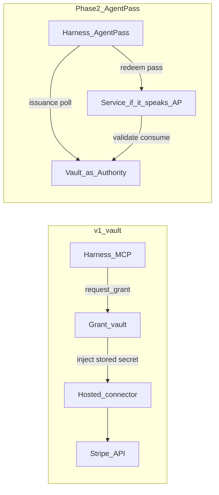

# AgentPass: leverage, do not replace the vault

**Yes, it makes sense** — as an extra authorization *protocol*, not as the product. [AgentPass](https://agentpass.com/) ([spec v0.1 draft](https://agentpass.com/spec), [clerk/agentpass](https://github.com/clerk/agentpass)) is Clerk’s open protocol for **task-scoped agent authorization**. It does not store view-once API keys. The spec banner says it is not production-audited. We do not make v1 depend on it.

This is locked in the existing product plan ([grant_vault_product_1a24ec63.plan.md](/Users/naffis/.cursor/plans/grant_vault_product_1a24ec63.plan.md)) as **D-10** and **T-11**. This note is the research decision, not a new Build.

## What AgentPass actually is

A **Harness** (Codex, Claude Code, OpenClaw) obtains a short-lived, **single-use**, optionally holder-bound **AgentPass** from an **Authority**, then **redeems** it at a **Service** for a browser session or a Service-minted bearer token. The Service MUST NOT parse the pass; it calls Authority `validate`, which **atomically consumes** it.

Three Authority types: enterprise (DNS `_agentpass.{email_domain}`), federated (“Sign in with Google” analogue), service (the Service runs its own approval).

Properties that rhyme with our `prompt` grant: task-scoped, single-use, holder-bound, continuously re-checked via `authorization_check`.

Properties that do **not** replace us:

- No envelope store. Stripe/GitHub view-once keys still need a vault.
- Almost no Services publish `_agentpass-service.{host}` yet. Until they do, there is nothing to redeem against for Stripe.
- After redeem, the **Service** mints a new token. That is better *when* Linear/Stripe speak AgentPass — then we would not store that live key at all. That is later, not now.

Unrelated products with the same name (MCP hosts, on-chain “AgentPass”) are not this protocol.

## Two jobs, both real

| | AgentPass | Our vault |
| --- | --- | --- |
| Job | Authorize this **task** at a Service | Hold the **credential** the Service already issued |
| Credential | Service mints a new session/token after redeem | We inject `STRIPE_KEY` / login we stored |
| Consume | Authority `validate` CAS | Our `prompt` CAS |
| Browser | Service session URL for computer-use agents | We skipped autofill; not our v1 path |
| Maturity | v0.1 draft, few harnesses/Services | Kernel exists; MCP is how Grok/ChatGPT work today |

## Recommendation (locked)

**Adopt the shape now, implement the HTTP later.**

1. **v1 (T-01…T-10):** Keep MCP + stored `secret`/`login` + connector. Grants already get optional `task_id` and `task_description` so the inbox shows *why*. Same CAS consume as AgentPass validate. No AgentPass DNS/JWKS/issuance endpoints.
2. **Phase 2 (T-11, after T-10):** We become an **Enterprise and/or Federated Authority**. Same inbox/email/code as T-06. Endpoints: configuration, issuance + poll, validate (CAS), authorization_check, JWKS. Holder-binding **required** (spec says recommended). Flag `VAULT_AGENTPASS=1`. Do not start until a real Harness can hit staging, or keep it dark.
3. **We are not the Service for Stripe.** We do not mint Stripe sessions. Optional later item kind `delegated` (no envelope; grant = approve AgentPass for `service.origin`) only when vendors exist.
4. **We are not a Harness.** Cursor/Grok implement that. When they speak AgentPass, they can use us *in addition to* MCP.
5. **Do not replace Clerk MCP OAuth** with AgentPass. ChatGPT still needs DCR. Clerk-as-AS (D-01) and Clerk-authored AgentPass are complementary, not the same API.

## Why not v1 Authority

- Spec says do not use in production.
- No customer harness will call `/agentpass/requests` on day one; they will call MCP.
- Building JWKS + DNS + holder-proof before the connector works delays the two jobs you named (stop copying keys; stop hunting view-once keys).

## What “done” looks like for this research

Already written into the product plan: A-7, D-10, grant `task_*` columns, T-11, adopt/adapt/reject row, research twin, TASK.md merge step 11. No code until you ask to implement T-01…T-10 (T-11 stays Phase 2).
