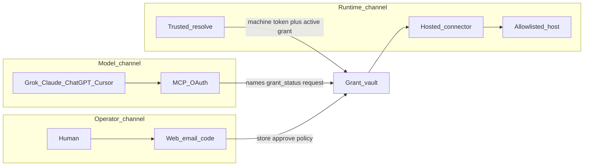
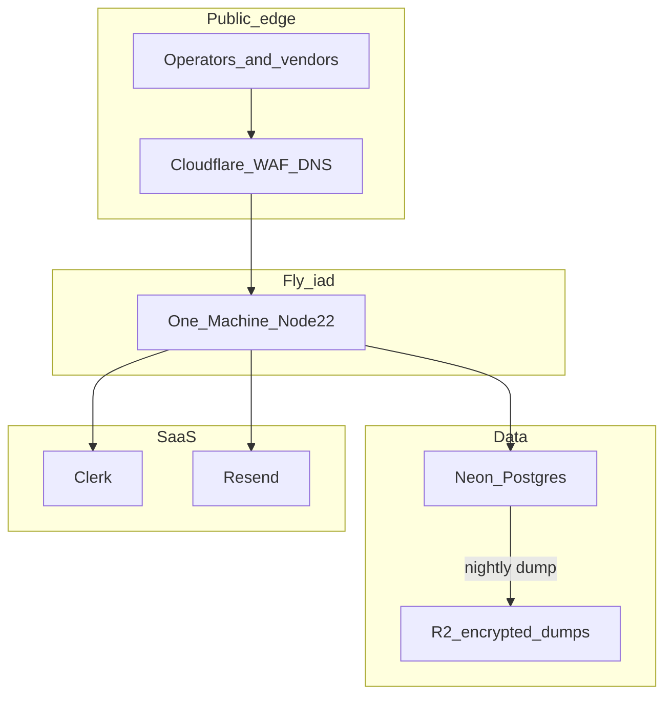
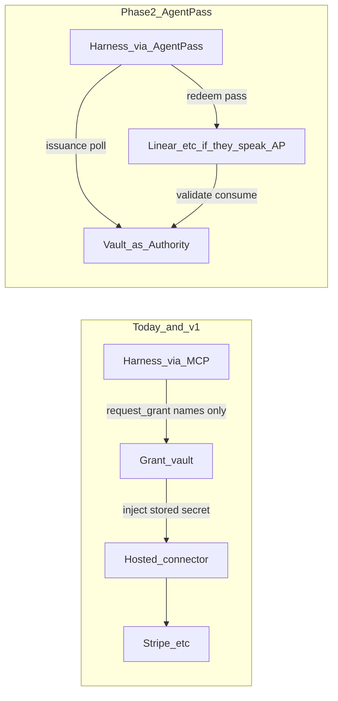

# Agent grant vault product

You store named credentials **once** in this product. Agents and apps request use. You authorize with a policy. The **runtime** (our hosted connector or your trusted app) gets the value. The model never does. That is the password-manager *side* you need — not LastPass.

Audience (locked): **multi-user product** — sign-up, orgs, per-user/org vaults.

Research twin: [docs/plans/2026-08-30-grant-vault-product.md](docs/plans/2026-08-30-grant-vault-product.md). Topology: [.loadout/tasks/grant-vault-product/TASK.md](.loadout/tasks/grant-vault-product/TASK.md).

## Problem

Today’s kernel ([src/types.ts](src/types.ts), [src/vault.ts](src/vault.ts), [src/mcp.ts](src/mcp.ts), [src/server.ts](src/server.ts), [src/db.ts](src/db.ts)) is a **single-operator local process**:

- One opaque `value` per `NAME`. **No username+password item.**
- Grants are only `(secret, agent, tool)` × `once|session`.
- Access is unauthenticated loopback HTTP + stdio MCP. **No remote vendors.**
- Inject is only `vault run` on the same machine. **Grok/ChatGPT/Claude cloud cannot spawn your child.**
- No delete, no environments, no users, no approval inbox.
- If you “just expose `/mcp`,” any client is the operator.

Jobs:

1. Stop copying keys into every new app and every vendor.
2. Stop hunting **view-once** dashboard keys — the vault is the only copy; the agent asks again or a standing grant still holds.

## Outcome

A signed-in user can:

- Store a **secret** or a **login** once, per environment (`staging` | `production`).
- Connect Cursor, Grok, Claude, ChatGPT, and apps without pasting values into `mcp.json`.
- Choose `prompt` | `session` | `item_standing` | `folder_standing` per client × item or folder.
- Approve via web, Resend magic link, or an 8-digit code — **no native app**.
- Have Grok *use* an allowlisted API **without** the model seeing the key.

**Where it runs:** Fly.io Machines (Node 22) in `iad`, Neon Postgres (separate staging/prod projects), Cloudflare DNS + WAF in front. Local CLI stays sqlite on the operator’s machine. Not a Tunnel to a laptop, not Workers/D1.

## Assumptions (labeled)

- **A-1** First paying/operating tenant is Adwave; schema is multi-tenant from day one.
- **A-2** Local v0.1 sqlite vaults are **not** auto-imported. Operators re-store items into the hosted org. Local CLI remains a single-user kernel for `vault run`.
- **A-3** Username on `login` items is listable to the model (same class as last-4). Password is never listable.
- **A-4** “Folder” if the operator never created one means the environment root (`staging` or `production`).
- **A-5** Connector `prompt` consumes the grant on the **first invocation attempt**, even if the origin returns 4xx/5xx. Re-approve to retry. Prevents double-spend on retries.
- **A-6** Clerk instance is ours; we enable CIMD + DCR in the Clerk dashboard (ChatGPT requires DCR).
- **A-7** [AgentPass](https://agentpass.com/) is a **v0.1 draft** ([spec](https://agentpass.com/spec), [clerk/agentpass](https://github.com/clerk/agentpass)). The spec itself says it is not production-audited. We do not make v1 depend on Services implementing AgentPass.
- **A-8** Operator owns a DNS zone. T-10 runbook requires these records before first staging traffic: `A`/`AAAA` (orange-cloud) for `staging.vault.<zone>` and `vault.<zone>`, plus `_fly-ownership` TXT. Zone string is an operator input, not a code default.
- **A-9** First **Build** implements T-01…T-10 only. T-11 is Phase 2 and must not start from that Build.
- **A-10** Clerk **Organizations** is enabled. Every operator session has `orgId`. First user in an org is `owner`; later members are `operator` unless promoted.

## Open questions

None. Remaining vendor quirks are handled by specified fallbacks in D-01, D-07, and D-11.

## How access should work

Vendors converge on **remote MCP over HTTPS** and **REST**.

- Grok: `grok mcp add --transport http` + OAuth, or grok.com/connectors ([xAI MCP](https://docs.x.ai/build/features/mcp-servers)).
- ChatGPT: remote MCP **requires OAuth 2.1 + Dynamic Client Registration**; bearer-only is rejected.
- Claude: remote connector + OAuth; tool-registry bugs exist if the connector display name is non-ASCII — ship the name `AgentVault`.
- Cursor: remote MCP or local stdio.

**Inject for cloud vendors:** `vault run` never runs in xAI/OpenAI/Anthropic. Options considered:

- 1Password local MCP — **reject** as only path.
- Infisical MITM proxy — **reject** as only path (their cloud will not route through us).
- Runtime GET of the secret by the vendor — **forbidden** for model tokens (plaintext in vendor infra).
- **Vault-executed connector (adopt):** MCP tool `http.request`. We attach the granted credential and call the item’s allowlisted host. Model gets status + body, never the key.

Trusted apps you register may call `POST /runtime/resolve` (plaintext to *your* process, not the model).



Three channels:

- **Model / MCP:** `list_items`, `request_grant`, `list_grants`. Username and last-4 only.
- **Operator:** store, delete, rotate, approve, revoke, policy, audit.
- **Runtime:** connector (untrusted) or `/runtime/resolve` (trusted). Local `vault run` for your CLI.

## How authorization should work

- `prompt` — one connector call or one resolve, then consumed. Default. No `policies` row.
- `session` — active until TTL (default 8h) or revoke. No `policies` row.
- `item_standing` — writes `policies` (`kind=item_standing`, that client + item). Later `request_grant` for the same pair returns an **already-active** grant (no inbox).
- `folder_standing` — writes `policies` (`kind=folder_standing`). **Owner only.** `confirm_name` required. Later `request_grant` for any item in that folder/env auto-activates.

Roles: `owner` and `operator` may store, rotate, approve `prompt`/`session`/`item_standing`, and revoke. Only `owner` may approve `folder_standing` or delete the org.

No “all vaults forever” one-click.

Approval (no native app):

1. Web inbox (mobile Safari).
2. Resend magic link (signed, 15 min, single use).
3. 8-digit code in the MCP result; hashed at rest; 10 min; 5 attempts then new code.

## Usernames and passwords

**Not in the kernel today.** Add:

- `secret` — one concealed value. Public: name, last-4, env, `inject` mode.
- `login` — username (listable) + password (concealed) + optional URL. `inject`: `basic` or `header:Name`.

Rotation: overwrite concealed field in place. Same name. Next use gets the new envelope.

## What we will not build

- LastPass clone, autofill, TOTP-as-product, passkeys, import-all-1Password.
- `get_secret` / `read_value` on model tokens.
- Native iOS/Android app.
- Infisical MITM as the only inject path.
- 1Password-local-only as the only path.
- Cloudflare D1 / Workers / **Cloudflare Containers** as the stateful vault (D-06, D-11).
- **Cloudflare Tunnel as product ingress.** Tunnel is a lab pattern (expose a laptop/VPS). Product traffic uses Fly anycast + Cloudflare DNS/WAF.
- **LiteFS** for hosted HA. Async replication can drop writes ([LiteFS architecture](https://github.com/superfly/litefs/blob/main/docs/ARCHITECTURE.md)); Fly warns not to pair it with Machine autostop ([LiteFS docs](https://fly.io/docs/litefs/)). Wrong for a grant-consume vault.
- **Hosted sqlite-on-a-volume** as the multi-tenant store. No PITR, one disk is the blast radius, cannot add a second Machine without a shared DB.
- Auto-migrate local `~/.agent-vault` sqlite into hosted orgs.
- **Replace the vault with AgentPass.** AgentPass does not store view-once API keys and almost no Services publish `_agentpass-service.{host}` yet. It authorizes a *task at a Service*; we hold *credentials the Service already issued*.
- **v1 AgentPass Authority** (DNS TXT, JWKS, browser-session redeem). Phase 2 (T-11) after T-10. v1 still stores `task.id` / `task.description` on grants so the adapter does not require a schema rewrite.

## Design locks

**D-01 Identity:** **Clerk** is the authorization server. Vault is an MCP resource server. Use `@clerk/express` + `@clerk/mcp-tools` ([Clerk MCP guide](https://clerk.com/docs/expressjs/guides/ai/mcp/build-mcp-server)). Enable CIMD for clients that support it; enable **Dynamic Client Registration** so ChatGPT can connect. Fallback if Clerk cannot issue audience-bound tokens for a vendor: Grok `--header Authorization: Bearer` with a Clerk machine token scoped `mcp:model` (already supported by xAI). Do not invent an OAuth server.

**D-02 Tenancy:** User → Clerk org → vault → environment (`staging` | `production`) → optional folder → items. Every query includes `org_id`. Two different “staging” words: **Fly apps** are deploy planes; **vault environments** are secret namespaces. The prod Fly app serves both vault namespaces. The staging Fly app **refuses** vault environment `production` (404, no decrypt) so fixtures cannot hold live keys. A `mcp:model` or trusted token minted for vault env `staging` cannot read vault env `production` items (R-08).

**D-03 Crypto:** Keep AES-256-GCM for item envelopes ([src/crypto.ts](src/crypto.ts)). Platform **KEK** in instance env (`VAULT_KEK`, 32 bytes hex). Per-org **DEK** generated at org create, wrapped by KEK, stored in `orgs.wrapped_dek`. Item encrypt uses org DEK; AAD includes `org_id`. This is application-enforced isolation plus wrap — not a per-tenant HSM CMK. BYOK is a non-goal. Pattern: [WorkOS envelope encryption](https://workos.com/blog/envelope-encryption-explained).

**D-04 Surfaces:** Remote Streamable HTTP MCP + OAuth, REST (same rules), stdio MCP, trusted resolve, local `vault run`.

**D-05 Untrusted vs trusted:** Model OAuth tokens (`mcp:model`) cannot call `/runtime/resolve`. Trusted clients get a hashed key shown once (`avt_…`).

**D-06 Runtime stack:** **Stay on Node 22 + the TypeScript kernel.** Operator/MCP HTTP uses **Express** only where Clerk’s MCP helpers require it (`@clerk/express`). Storage is behind a `VaultStore` interface (T-01): local CLI keeps `node:sqlite`; **hosted uses Neon Postgres** (T-10). Why not Workers+D1: D1 has no `BEGIN` ([D1 batch-only transactions](https://dev.to/hirodeath/cloudflare-d1-has-no-begin-transaction-so-i-tested-its-limits-and-the-batch-api-5813)); Workers cannot DNS-pin SSRF ([ssrf-guard on Workers](https://github.com/devslab-kr/ssrf-guard-js/blob/main/README.md)). Why not Cloudflare Containers for the vault: container disk is ephemeral ([Containers FAQ](https://developers.cloudflare.com/containers/faq/)); persistence would be Durable Object SQL or D1, which is not this kernel. Email: **Resend**. Listen **8788** inside the Machine; Fly maps 443 → 8788.

**D-07 Hardening:** Auth on all operator/runtime routes; `/.well-known/*` public; Host/Origin allowlist; JSON body cap 128KiB; connector response cap 256KiB; atomic consume via `UPDATE … WHERE status='active'` and **exactly one row** (sqlite `changes === 1`, Postgres `rowCount === 1`); drop MCP `revoke_grant`; operator `POST /api/grants/:id/revoke` remains; rate-limit `request_grant` in-process (30/hour/org) — safe because v1 is one Machine; refuse bind to non-loopback unless `VAULT_PUBLIC_URL` is https. `/health` MUST NOT include a key fingerprint (today’s kernel leaks `vault.fingerprint` on `/health` — remove in T-03). Default listen port today is **8787** in [src/server.ts](src/server.ts); change to **8788**.

**D-08 Connector SSRF:** Operator sets `allowed_hosts[]` on the **item** (exact hostnames, no wildcards). Model passes `item_name` + path + method + optional JSON body — **not** a free URL. Reject IP literals, `localhost`, `*.local`, `*.internal`, link-local, metadata hosts. Follow redirects only if the next host is still on that item’s list. Methods: GET POST PUT PATCH DELETE. Strip hop-by-hop and `Host`. Inject: `secret` → `Authorization: Bearer <value>` or `header:<Name>`; `login` → `Authorization: Basic`. DNS-resolve and reject private ranges before connect (Node `ssrf-guard` / pinned lookup).

**D-09 Local vs hosted:** v0.1 local CLI keeps working (`VAULT_MODE` unset → sqlite). Hosted is the same repo with `VAULT_MODE=hosted` and `DATABASE_URL` (Neon). No sqlite file copy between machines or envs. Staging Neon is a **separate project**, never a branch of prod (would copy real ciphertext).

**D-10 AgentPass (Clerk protocol) — adapt as Phase 2 Authority, do not replace the product:**

[AgentPass](https://agentpass.com/) is an open protocol (Clerk, MIT, [spec v0.1 draft](https://agentpass.com/spec)): a **Harness** (Codex, Claude Code, OpenClaw) gets a short-lived, single-use, holder-bound **AgentPass** from an **Authority**, then **redeems** it at a **Service** for a browser session *or* a Service-minted bearer token. Services MUST NOT parse the pass; they call the Authority `validate` endpoint, which **atomically consumes** it.

This is the same *shape* as our `prompt` grant, but a different *job*:

- AgentPass: “This agent may act as alex@org at Linear for this task.” Linear mints a **new** scoped token. No long-lived key in our sqlite.
- Our vault: “This agent may use the `STRIPE_KEY` we already stored” (or a login). Stripe does not speak AgentPass today.

**Leverage now (v1, no AgentPass HTTP):** Grant rows include optional `task_id` and `task_description` (from MCP `request_grant` or operator). Inbox shows the task text. `prompt` consume stays CAS — same invariant as AgentPass validate. That is the hook T-11 attaches to.

**Phase 2 (T-11, not first Build):** We are an **Enterprise Authority** for our email domain (`_agentpass.{domain}` TXT → our config URL) and/or a **Federated Authority** Services list by policy. Implement `GET /agentpass/configuration`, `POST /agentpass/requests`, `GET /agentpass/requests/{id}`, `POST /agentpass/validate`, `POST /agentpass/authorization-check`, plus JWKS. Approval UX is the same inbox/email/code. Map: issuance `pending` → our pending grant; `approved` + `agentpass.value` → opaque id we consume on validate; `scope` from the Service’s `available_scopes` (not from our item last-4). Holder-binding (`harness.cnf` + `harness_proof` JWT) is REQUIRED on our Authority (spec says RECOMMENDED; we require it).

**We are not the Service for Stripe.** We do not redeem AgentPasses into Stripe sessions. Item kind `delegated` is a T-11 non-goal (no envelope; grant means “approve AgentPass for `service.origin`”).

**We are not a Harness.** Grok/Cursor implement that. When they speak AgentPass, they can use us as Authority *in addition to* MCP.

**Do not use AgentPass as v1 production auth.** Spec banner: work-in-progress, not security-audited.

**D-11 Production infrastructure (compute, data, edge, ship):**

This is a multi-tenant secrets product. The previous “one Node + Tunnel + disk sqlite” shape cannot grow (no PITR, no second instance, no WAF, no deploy pipeline). Locked stack:

| Layer | Choice | Rejected |
| --- | --- | --- |
| Compute | **Fly.io Machines** (Docker, Node 22, region `iad`). **v1: one Machine per app** (`min_machines_running = 1`, `auto_stop_machines = "off"`). | Home VPS + Tunnel; Railway as sole host; AWS ECS in v1; **two Machines in v1** (MCP Streamable HTTP keeps `Mcp-Session-Id` in process memory; Fly round-robin breaks sessions — [The New Stack on MCP LB](https://thenewstack.io/scaling-ai-interactions-how-to-load-balance-streamable-mcp/), [Fly sticky / fly-replay](https://fly.io/docs/blueprints/sticky-sessions/)) |
| Data (hosted) | **Neon Postgres**, two **projects** (staging / prod), prod branch **protected** | Hosted sqlite+volume; LiteFS; Fly Postgres (no instant branch/PITR UX we want); D1 |
| Data (local) | `node:sqlite` | — |
| Secrets | **Fly secrets** per app (complete list): `VAULT_KEK`, `DATABASE_URL` (Neon **pooled** `-pooler` host), `DATABASE_URL_DIRECT` (migrations + `pg_dump`), `CLERK_SECRET_KEY`, `CLERK_PUBLISHABLE_KEY`, `RESEND_API_KEY`, `VAULT_PUBLIC_URL`, `VAULT_APPROVAL_HMAC` (32-byte hex), `SENTRY_DSN`, and on prod only `BACKUP_KEY`, `R2_ACCOUNT_ID`, `R2_ACCESS_KEY_ID`, `R2_SECRET_ACCESS_KEY`, `R2_BUCKET` | KEK in git, image, or Neon; app using the direct URL for request traffic |
| Edge | **Cloudflare** DNS + orange-cloud WAF on the operator hostname; SSL **Full (strict)**; `_fly-ownership` TXT ([Fly + Cloudflare](https://fly.io/docs/networking/understanding-cloudflare/)) | Tunnel as the public URL |
| MCP path | Same Fly app; **SSE/stream keepalive every 25s** so Cloudflare 100s proxy-read and Fly idle timeouts do not drop sessions ([CF connection limits](https://developers.cloudflare.com/fundamentals/reference/connection-limits/); [Fly `idle_timeout`](https://fly.io/docs/reference/configuration/)) | Grey-cloud MCP-only hostname unless keepalive proves insufficient (then split `mcp.<zone>` DNS-only) |
| CI | GitHub Actions: push `dev` → test → `fly deploy` **staging**; prod = `workflow_dispatch` after staging green ([Fly GH Actions](https://fly.io/docs/launch/continuous-deployment-with-github-actions/)) | Laptop `fly deploy` as the only path |
| Backups | Neon PITR (prod history ≥ 7 days) + GitHub Actions cron `0 4 * * *` UTC workflow `backup-prod.yml`: `pg_dump` via `DATABASE_URL_DIRECT`, AES-256-GCM with `BACKUP_KEY`, put object in R2 ([Neon choose connection](https://neon.com/docs/connect/choose-connection)) | Volume snapshots only; dump over pooled URL |
| Observability | JSON logs to stdout (Fly); **Sentry** for exceptions (redact secrets); `/health` and `/ready` (DB ping) | Logging concealed values |

**Topology (v1):** two Fly apps, `agent-vault-staging` and `agent-vault-prod`. **One Machine each.** Grants and items are in Neon (shared, CAS-safe). MCP session state is **in-process** on that Machine. Do not set `count = 2` until T-10b (not in first Build): persist `mcp_sessions(id, fly_machine_id)` and `fly-replay: instance=…` when `Mcp-Session-Id` is bound to another Machine, plus `[[http_service.http_options.replay_cache]] type = "header" name = "mcp-session-id"` ([Fly replay_cache](https://fly.io/docs/networking/dynamic-request-routing/)).

**Scale path (open, not first Build):** T-10b affinity → two Machines in `iad`; Neon read replica; second region only after affinity works cross-region. BYOK / KMS wrap of `VAULT_KEK` is a non-goal for v1.





## Contracts

### Data model (hosted Neon Postgres; local sqlite same tables)

- `orgs(id, name, wrapped_dek, created_at)`
- `org_members(org_id, user_id, role)` — role `owner` | `operator`
- `vaults(id, org_id, name)`
- `environments(id, vault_id, name)` — name in `staging` | `production`
- `folders(id, environment_id, name)` — optional
- `items(id, environment_id, folder_id null, kind, name, last4, username null, allowed_hosts_json, inject, iv, ciphertext, tag, created_at, updated_at)` — kind `secret` | `login`; name unique per environment
- `clients(id, org_id, kind, name, hashed_secret null, clerk_oauth_user_id null)` — kind `model` | `trusted`
- `policies(id, org_id, client_id, item_id null, folder_id null, environment_id, kind, created_at)` — kind `item_standing` | `folder_standing`; unique `(org_id, client_id, item_id)` or `(org_id, client_id, folder_id, environment_id)`
- `grants(id, org_id, client_id, item_id null, folder_id null, environment_id, policy, status, expires_at, created_at, approved_at, consumed_at, task_id null, task_description null)` — task fields reserved for AgentPass issuance mapping (D-10)
- `approval_challenges(id, grant_id, code_hash, expires_at, attempts)`
- `audit(id, org_id, action, actor, item_name, client_id, at)` — no value column

Atomic consume (sqlite `changes`, Postgres `rowCount`):

```sql
UPDATE grants SET status = 'consumed', consumed_at = ?
WHERE id = ? AND status = 'active';
-- require exactly one row updated before decrypt
```

`request_grant`: if a matching `policies` row exists, insert grant as `active` and skip inbox/email/code. Else insert `pending`.

### HTTP / MCP (hosted)

- `GET /.well-known/oauth-protected-resource` — public, Clerk PRM
- `GET /.well-known/oauth-authorization-server` — public, Clerk AS metadata (older clients)
- `POST /mcp` — Clerk `mcpAuthClerk`; Streamable HTTP
- `GET|POST /api/items`, `POST /api/items/:id/rotate`, `DELETE /api/items/:id` — operator session
- `POST /api/grants/request` — model or operator
- `POST /api/grants/:id/approve` — operator session; body `{ policy, confirm_name? }`
- `POST /api/grants/:id/revoke` — operator session; **not** on MCP
- `POST /api/grants/approve-by-code` — operator; body `{ code }`
- `GET /` — Clerk-gated operator HTML (same Express process)
- `GET /api/inbox` — pending grants
- `GET /api/audit`
- `POST /runtime/resolve` — trusted client only; body `{ item_name, environment }`; returns concealed fields to that client
- `GET /health` — process up; no key fingerprint
- `GET /ready` — Neon ping (`SELECT 1`); 503 if DB down

MCP tools: `list_items`, `request_grant`, `list_grants`, `http.request`. No revoke. No get_secret.

`http.request` arguments: `item_name`, `method`, `path` (must start with `/`), `body` optional object. Host comes from the item, not the model.

### Email / codes

- Magic link: HMAC-signed token, 15 minutes, one-use, stored jti in `approval_challenges`.
- Code: 8 digits, SHA-256 with per-row salt, 10 minutes, max 5 attempts.

## Requirements (EARS)

- **R-01** The system SHALL store items as `secret` or `login` and SHALL persist concealed fields only as envelopes.
- **R-02** WHEN a model client calls MCP, the system SHALL return names, last-4, username, and grant metadata only.
- **R-03** IF the caller token is `mcp:model`, THEN the system SHALL reject `/runtime/resolve` and any tool that returns a concealed field.
- **R-04** WHEN `request_grant` fires AND no matching standing policy exists, the system SHALL create `pending`, enqueue Resend + inbox, and include an 8-digit code in the MCP result.
- **R-05** WHEN the operator approves with a policy, the system SHALL activate only matching grants.
- **R-06** WHILE a grant is `active`, `http.request` SHALL attach the concealed field to that item’s allowlisted host and SHALL redact the exact value (and last-4 if length ≥ 8) from the tool result.
- **R-07** WHEN an item is rotated, the system SHALL keep the name and SHALL use the new envelope on the next use.
- **R-08** A staging client token SHALL NOT read or grant production items.
- **R-09** IF policy is `folder_standing`, THEN approve SHALL require `confirm_name` equal to the folder or environment name.
- **R-10** Isolation tests SHALL fail if a canary appears in MCP, REST model payloads, audit JSON, email HTML, or approval pages.
- **R-11** WHEN two `prompt` consumes race, THEN exactly one SHALL decrypt (CAS `changes = 1`).
- **R-12** The system SHALL reject connector targets that fail D-08 host checks.
- **R-13** WHEN hosted, the system SHALL persist via Neon (`DATABASE_URL`) and SHALL NOT open a sqlite file on the Machine.
- **R-14** WHEN an MCP stream is idle, the process SHALL write an SSE comment keepalive at least every 25 seconds.
- **R-15** WHEN `request_grant` matches an `item_standing` or `folder_standing` policy, the system SHALL activate without inbox/email/code.
- **R-16** WHEN an operator calls `POST /api/grants/:id/revoke`, the system SHALL set status `revoked`. WHEN MCP lists tools, `revoke_grant` SHALL be absent.

## Acceptance criteria

- **AC-01** Given a stored secret with canary `sk_live_CANARY…`, When MCP `list_items` / `request_grant` / `list_grants` / `http.request` run, Then no response string includes the canary.
- **AC-02** Given a `mcp:model` token, When `POST /runtime/resolve`, Then status is 403 and body has no concealed fields.
- **AC-03** Given a pending grant and a valid unused code, When `approve-by-code`, Then grant is `active` and a second submit of the same code is 409.
- **AC-04** Given `folder_standing` without `confirm_name` (or wrong name), When approve, Then status stays `pending`.
- **AC-05** Given two concurrent `http.request` with policy `prompt`, When both start, Then exactly one origin fetch uses the secret and the other is `inject_denied`.
- **AC-06** Given a staging trusted token, When resolve a production item, Then 404/403 and no decrypt.
- **AC-07** Given `allowed_hosts=["api.stripe.com"]`, When `http.request` path is used, Then the outbound URL host is `api.stripe.com` and a request to `169.254.169.254` never leaves the process.
- **AC-08** Given unauthenticated `POST /api/items`, When called, Then 401.
- **AC-09** Given rotate, When connector runs, Then origin sees the new value (probe file / mock) and MCP result does not.
- **AC-10** Given `VAULT_MODE=hosted` and a Neon URL, When two app processes consume the same `prompt` grant, Then exactly one decrypts (CAS across processes).
- **AC-11** Given `VAULT_MODE=hosted` and `DATABASE_URL` set, When the process starts with `VAULT_HOME` also set, Then it exits nonzero (code 78) without opening sqlite. Given a GitHub Actions `postgres:16` service as `DATABASE_URL`, When `GET /ready`, Then 200.
- **AC-12** Given an `item_standing` policy for client C and item I, When C calls `request_grant` for I, Then the grant is `active` and no Resend send occurs.
- **AC-13** Given an active grant, When `POST /api/grants/:id/revoke` with an operator session, Then status is `revoked`. When MCP `tools/list`, Then the tool list does not include `revoke_grant`.
- **AC-14** Given `/health` on hosted, When called unauthenticated, Then body has no `fingerprint` key and no key hex.

## Edge cases and failures

- Empty name / empty concealed / name not `^[A-Z][A-Z0-9_]{0,127}$` → 400, no write.
- Duplicate item name in an environment → 409.
- Expired magic link / code → 410; grant stays pending.
- Resend outage → grant still pending; code path works; audit `notify_failed`.
- Origin timeout (10s) → `prompt` already consumed (A-5); audit `inject` + connector error; MCP returns error without secret.
- Partial connector response containing canary → redact before return; if redact fails closed, return 502 generic.
- Org delete → refuse if production items exist unless `confirm_name` is org slug; then delete rows (ciphertext gone; KEK wrap unused).
- Clerk outage → operator web and new MCP OAuth fail; existing in-memory sessions expire; no decrypt without auth.

## Implementation tasks

Pipeline. Shared trunk. Concurrency 1.

### T-01 Schema and kernel types

Extract `VaultStore` (create/read/update/CAS consume/audit). Implement **SqliteStore** in [src/db.ts](src/db.ts) for local. Schema matches the contracts above (`org_id` on every hosted row). Grants include optional `task_id` and `task_description` (D-10); `request_grant` accepts them. Local v0.1 schema remains if `VAULT_MODE` unset. Hosted migrations live as versioned SQL applied by both adapters (sqlite types mapped: `TEXT` timestamps). Do not implement Neon in this task; the interface must not leak `node:sqlite` types. Acceptance: typecheck; empty-org test; v0.1 `vault list` still works; a fake in-memory store can satisfy the interface in unit tests.

### T-02 Identity and tenancy

Clerk Organizations on operator routes (`@clerk/express`). Session without `orgId` is 403. Org create wraps DEK. Membership `owner`/`operator` (A-10). Acceptance: AC-08.

### T-03 Channel split and hardening

Authn; Host/Origin; body caps; CAS consume; remove MCP revoke; keep operator revoke; port 8788; strip `/health` fingerprint; rate limit. Acceptance: AC-05, AC-08, AC-13, AC-14.

### T-04 Item types

CLI + operator UI for `secret`/`login`, delete, rotate, `allowed_hosts`, `inject`. Acceptance: AC-01 on password; AC-09.

### T-05 Grant policies

`policies` table + four grant kinds + `confirm_name` + owner-only `folder_standing`. `request_grant` short-circuits on standing (R-15). Acceptance: AC-04, AC-12; table-driven unit tests.

### T-06 Approval channels

Inbox, Resend, hashed codes. Acceptance: AC-03. Fallback if Resend key missing: log `notify_failed`, code still works.

### T-07 MCP OAuth + REST + stdio

`@modelcontextprotocol/sdk` Streamable HTTP + `@clerk/mcp-tools`. CORS exposes `WWW-Authenticate`. Stdio hosted mode: operator runs `vault mcp --user-jwt` from `vault login` (device/browser), never put Clerk secret in `mcp.json`. Acceptance: mocked Clerk token can `request_grant` and cannot resolve (AC-02).

### T-08 Runtime and connector

Trusted resolve. `http.request` with D-08 guards. Keep `vault run` for local trusted CLI. Acceptance: AC-01, AC-05, AC-07.

### T-09 Isolation and docs

Extend [test/isolation.test.ts](test/isolation.test.ts). README + `CHANGELOG.md`: Grok, Claude (`AgentVault` ASCII name), ChatGPT DCR, Cursor, policies, login items, Fly vs vault-env, deploy runbook pointer. CI `on.push.branches` includes `dev`. Gate: `npm test && npm run typecheck`. Acceptance: AC-13, AC-14.

### T-10 Production deploy (Fly + Neon + Cloudflare)

Files: `Dockerfile` (Node 22 bookworm-slim, non-root, `EXPOSE 8788`), `fly.staging.toml`, `fly.prod.toml`, `src/store/postgres.ts` (`pg`), `migrations/*.sql`, `.github/workflows/deploy-staging.yml`, `.github/workflows/deploy-prod.yml` (`workflow_dispatch` only).

**Implement PostgresStore.** CI job uses a GitHub Actions `postgres:16` service for AC-10. Hosted process refuses to start if `VAULT_MODE=hosted` and `DATABASE_URL` is missing, or if a sqlite path is set.

**Provision (runbook, not in-app):** two Neon projects; prod root branch protected, PITR ≥ 7 days; two Fly apps in `iad`; Fly secrets set per app; Cloudflare DNS A/AAAA orange-cloud + `_fly-ownership`; Full (strict); WAF managed rules on. Staging: fixture items only.

**Fly config (each app):** `min_machines_running = 1`, `auto_stop_machines = "off"`, `[http_service.http_options] idle_timeout = 600`, internal port 8788, force HTTPS. Cloudflare: orange-cloud `AAAA` (and `A` if allocated) + `_fly-ownership` ([Fly + Cloudflare](https://fly.io/docs/networking/understanding-cloudflare/)).

**Do not** set `count = 2` in this task. T-10b (after first production week, not first Build): `Mcp-Session-Id` → `fly-replay` as specified in D-11.

**CI:** on push to `dev`, after `npm test && npm run typecheck`, `flyctl deploy --remote-only -c fly.staging.toml`. Prod deploy only via dispatch after a named staging SHA is green.

**Rollback:** `fly releases rollback` on that app (previous image). Neon PITR if data is wrong. Encrypted envelopes stay; KEK stays in Fly secrets. No down-migration of item rows.

Acceptance: AC-10, AC-11; `/mcp` keepalive unit test; runbook in README lists every Fly secret **name** (no values) and the DNS records in A-8.

### T-11 AgentPass Authority (Phase 2 — after T-10)

Implement [Authority Protocol §5](https://agentpass.com/spec) on the same Node host: configuration, issuance + poll, validate (CAS consume, same as `prompt`), authorization_check, JWKS. Enterprise DNS `_agentpass.{email_domain}` when we operate the org domain. Reuse T-06 inbox for approval. Tests: issuance pending → approve → validate consumes → second validate fails; holder_proof required. **Do not** start T-11 until a real Harness (Claude Code / Codex) can be pointed at a staging Authority, or keep it dark behind `VAULT_AGENTPASS=1`. Non-goal in T-11: acting as a Service that mints Stripe tokens.

## Task topology

- Choice: **pipeline**
- Escalation test 1: **FAIL** — stages share `src/db.ts`, `src/vault.ts`, `src/server.ts`, `src/mcp.ts`
- Escalation test 2: **FAIL** — later tests need T-01 types
- Task file: `.loadout/tasks/grant-vault-product/TASK.md`
- Isolation: shared-trunk (`shared-working-tree`)
- Concurrency: 1

## Dependencies (named + fallback)

- **Clerk** — identity + MCP AS. Fallback: WorkOS only if Clerk cannot enable DCR/CIMD on the account (re-plan T-07; do not invent OAuth).
- **@clerk/mcp-tools, @clerk/express, @modelcontextprotocol/sdk, cors** — T-02/T-07. First runtime deps in this repo.
- **Resend** — email. Fallback: skip send, codes still work.
- **Fly.io** — compute + secrets + HTTPS. Fallback: same Docker image on a single Hetzner/VPS with Caddy (loses second Machine HA; document as emergency only).
- **Neon** — hosted Postgres + PITR. Fallback: Fly Postgres unmanaged (no Neon branching; still shared SQL).
- **Cloudflare** — DNS + WAF. Fallback: grey-cloud DNS-only to Fly (lose WAF; keep Fly TLS).
- **pg** — Postgres driver. App uses pooled Neon URL; migrator and `backup-prod.yml` use `DATABASE_URL_DIRECT` ([Neon connection methods](https://neon.com/docs/connect/choose-connection)).
- **Sentry** — exception telemetry. Fallback: Fly logs only.
- **ssrf-guard or equivalent Node DNS pin** — T-08. Fallback: allowlist + reject IP literals only (weaker; document in README).

## Test plan

Proves R-01…R-16 via AC-01…AC-14 plus policy matrix and CAS race (two Node processes against one Postgres). Gate: `npm test && npm run typecheck`. Manual: one Grok connector smoke on staging fixtures (cannot automate vendor UI).

## Rollout, monitoring, rollback

- Ship T-01…T-09 to **Fly staging** with Neon staging + fixtures. Prod after isolation gate green, different `VAULT_KEK`, different Neon project, different Clerk instance.
- Logs: `org_id`, `grant_id`, `client_id`, `item_name`, `action` — never concealed values, never codes in plaintext after hash.
- Alerts: Sentry + Fly: `inject_denied` > 20/5m per org; connector 5xx > 10/5m; `/ready` failing; Resend failure rate.
- Rollback: `fly releases rollback` (app image). Data: Neon PITR or restore R2 dump. Grants freeze if both Machines stop. No down-migration of item rows (forward-only). To undo a bad policy: revoke grants (operator).

## Risks and pre-mortem

- **ChatGPT DCR off in Clerk** — enable DCR in T-07 checklist; verify with a ChatGPT developer-mode connect on staging.
- **Claude tools not in chat** — connector display name `AgentVault` only (ASCII).
- **Standing folder = Grok exfiltrates via connector to an allowlisted host the operator added** — hosts are operator-set per item; audit every `http.request`; revoke is one click.
- **KEK in Fly secrets stolen** — all orgs decryptable. Mitigate: two apps, no KEK in MCP child env, rotate by re-wrapping org DEKs (T-10 runbook). KMS wrap is a v1 non-goal.
- **Neon or Fly outage** — `/ready` 503; MCP vendors retry. No local sqlite fallback in hosted (would fork the truth).
- **Cloudflare 524 on MCP** — keepalive 25s; if still failing, grey-cloud `mcp.<zone>` (D-11).
- **Someone scales Fly to 2 Machines** — MCP sessions 404/reset. Mitigate: D-11 forbids `count = 2` until T-10b fly-replay. README warning.
- **Standing policy forgotten** — revoke deletes the `policies` row and active grants for that client×item/folder.
- **Resend phishing lookalike** — links only to `VAULT_PUBLIC_URL`; show item name + client + last-4 in the email, never the value.

## External research (adopt / adapt / reject)

- [1Password Environments MCP](https://www.1password.dev/environments/mcp-server) — names only. **Adopt invariant. Reject** local-only.
- [Infisical Agent Proxy](https://infisical.com/docs/documentation/platform/agent-proxy/overview) — **Adopt** as our connector, not MITM.
- [MCP authorization 2025-11-25](https://modelcontextprotocol.org/specification/2025-11-25/basic/authorization) — **Adopt** resource server + PRM.
- [xAI MCP](https://docs.x.ai/build/features/mcp-servers) — **Adopt**; header fallback.
- [Clerk MCP + CIMD/DCR](https://clerk.com/docs/expressjs/guides/ai/mcp/build-mcp-server) — **Adopt** AS.
- [ChatGPT requires DCR](https://apigene.ai/blog/remote-mcp-servers) — **Adopt** enable DCR.
- [CIBA](https://auth0.com/docs/get-started/authentication-and-authorization-flow/client-initiated-backchannel-authentication-flow/mobile-push-notifications-with-ciba) — **Non-goal v1** (email/code cover phone approve).
- [WorkOS envelope encryption](https://workos.com/blog/envelope-encryption-explained) — **Adopt** KEK/DEK wrap; **reject** building a KMS.
- [D1 has no BEGIN](https://dev.to/hirodeath/cloudflare-d1-has-no-begin-transaction-so-i-tested-its-limits-and-the-batch-api-5813) — **Reject D1** for this vault.
- [Workers SSRF cannot DNS-pin](https://github.com/devslab-kr/ssrf-guard-js/blob/main/README.md) — **Reject Workers fetch** for connector egress.
- [1Password Login vs API Credential](https://support.1password.com/item-categories/) — **Adopt** `login` + `secret`.
- Doppler/HashiCorp read-value MCP — **reject**.
- [AgentPass](https://agentpass.com/) / [spec v0.1](https://agentpass.com/spec) / [clerk/agentpass](https://github.com/clerk/agentpass) — **Adapt as Phase 2 Authority.** **Reject** as v1 foundation or as a replacement for stored secrets. **Adopt** task-scoped single-use consume + holder-binding ideas into grant rows now (`task_id`, `task_description`).
- [Fly volumes](https://fly.io/docs/js/the-basics/volumes/) / [Fly secrets](https://fly.io/docs/apps/secrets/) / [Fly GH Actions](https://fly.io/docs/launch/continuous-deployment-with-github-actions/) / [Fly + Cloudflare](https://fly.io/docs/networking/understanding-cloudflare/) / [fly.toml idle_timeout](https://fly.io/docs/reference/configuration/) — **Adopt** Machines + secrets + CF edge + GH deploy. **Reject** volume-sqlite as hosted source of truth.
- [LiteFS](https://fly.io/docs/litefs/) — **Reject** for this vault (async loss, autostop hazard).
- [Cloudflare Containers FAQ](https://developers.cloudflare.com/containers/faq/) — **Reject** (ephemeral disk).
- [Neon backups / PITR](https://neon.com/docs/manage/backups) / [Neon security](https://neon.com/docs/security/security-overview) / [protected branches](https://neon.com/blog/practical-guide-to-database-branching) — **Adopt** two projects + protected prod + PITR + R2 dump.
- [Cloudflare proxy read timeout](https://developers.cloudflare.com/fundamentals/reference/connection-limits/) — **Adopt** 25s MCP keepalive.
- [MCP load balancing / Mcp-Session-Id](https://thenewstack.io/scaling-ai-interactions-how-to-load-balance-streamable-mcp/) / [Fly sticky sessions](https://fly.io/docs/blueprints/sticky-sessions/) / [fly-replay cache](https://fly.io/docs/networking/dynamic-request-routing/) — **Reject** two Machines in v1. **Adopt** T-10b affinity before scale-out.
- [Neon pooled vs direct](https://neon.com/docs/connect/choose-connection) — **Adopt** pooled for app, direct for migrate/dump.

## Files read

- [src/types.ts](src/types.ts), [src/vault.ts](src/vault.ts), [src/mcp.ts](src/mcp.ts), [src/server.ts](src/server.ts), [src/db.ts](src/db.ts), [src/cli.ts](src/cli.ts), [src/crypto.ts](src/crypto.ts), [package.json](package.json), [README.md](README.md)

## Review changelog

- Locked Clerk (not Clerk-or-WorkOS); Resend (not Resend-or-CF-Email); port 8788.
- **Switched hosted stack from Workers+D1 to Node 22** so CAS grants and SSRF DNS pinning work.
- **Infrastructure (2026-08-30):** Replaced Tunnel+sqlite-volume with **Fly Machines + Neon Postgres + Cloudflare WAF**. Locked D-11, R-13/R-14, AC-10/AC-11, `VaultStore`, two Neon projects, GH Actions staging/prod. Rejected LiteFS, CF Containers, hosted sqlite.
- Locked KEK/DEK wrap (not “per-org key in Workers secrets”).
- Added ChatGPT DCR, Claude ASCII name, connector consume semantics, SSRF contract, ACs, rate limits, monitoring, honest local-migration non-goal.
- Added R-11/R-12, AC-01…AC-09, assumptions, edge cases, named fallbacks.
- Wrote research twin + TASK.md so create-plan completeness is not deferred to Build.
- **AgentPass (2026-08-30):** Researched spec §1–5. Complementary protocol (Authority/Harness/Service), not a vault. Locked D-10 + T-11 Phase 2; v1 stores task fields only.
- **Review-plan (2026-08-30):** P0 MCP affinity — v1 is one Machine; standing `policies` table; operator revoke route; `/health` must drop fingerprint (live leak). P1 Neon pooled/direct, secret inventory, GH backup cron, Fly vs vault-env, Clerk Orgs, AC-11…AC-14, first Build = T-01…T-10.

## Self-critique

This review pass: two-Machine HA was incorrect for Streamable HTTP (in-process sessions). Standing grants had no persistence. Operator revoke was missing from the hosted contract while MCP revoke was banned. `/health` fingerprint leak in live kernel was unnamed. Those are now locked. Remaining scale-out is T-10b, not an in-scope either/or.
