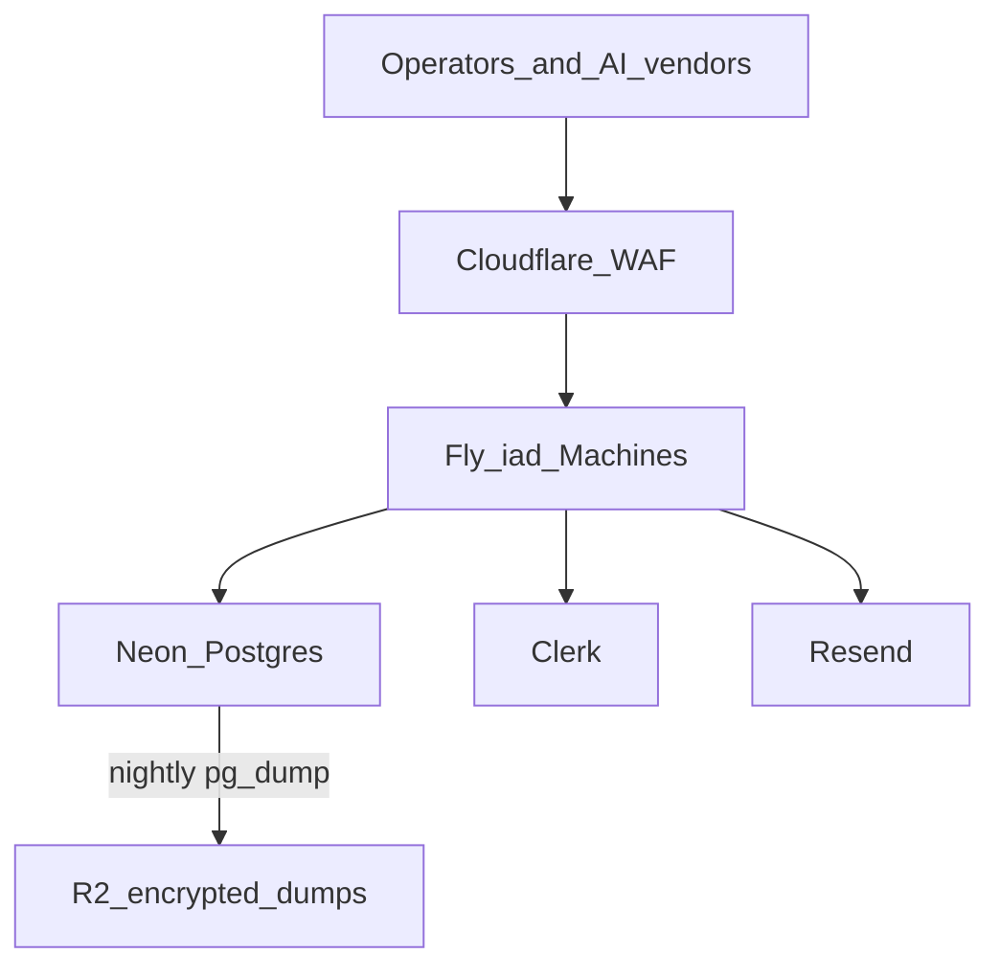

# Production deploy: Fly + Neon + Cloudflare

This updates the product plan ([grant_vault_product_1a24ec63.plan.md](/Users/naffis/.cursor/plans/grant_vault_product_1a24ec63.plan.md)) **D-06 / D-11 / T-01 / T-10**. Not a new product. No code until you ask to implement.

## Direct answer

**Deployed on:** [Fly.io Machines](https://fly.io/docs/machines/) (Docker, Node 22, region `iad`).

**Data lives in:** [Neon Postgres](https://neon.com/docs/manage/backups) — two **projects** (staging vs prod), not one sqlite file on a VM.

**Public URL:** [Cloudflare](https://fly.io/docs/networking/understanding-cloudflare/) DNS + orange-cloud WAF → Fly HTTPS. SSL Full (strict).

**Shipped by:** GitHub Actions. Push to `dev` deploys **staging**. Production is `workflow_dispatch` after that SHA is green.

**Not deployed on:** Cloudflare Tunnel, Cloudflare Workers/D1, Cloudflare Containers, a home VPS, LiteFS, or sqlite-on-a-Fly-volume.

## Why the old shape was wrong

The prior lock (one Node process + Tunnel + encrypted sqlite volume) is a lab. It cannot be the foundation of a multi-user product:

- One disk is the blast radius. No [PITR](https://neon.com/docs/manage/backups).
- A second Machine cannot share sqlite. Grant CAS would split-brain.
- Tunnel is “expose my box,” not WAF, not a deploy pipeline, not HA.
- [LiteFS](https://fly.io/docs/litefs/) can lose writes (async replication) and Fly warns not to pair it with Machine autostop. Wrong for consume-once grants.
- [Cloudflare Containers](https://developers.cloudflare.com/containers/faq/) have **ephemeral disks**. Persistence would be Durable Object SQL or D1, which we already rejected.

## What we locked (D-11)

- **Two Fly apps:** `agent-vault-staging`, `agent-vault-prod`. **One Machine each** (`auto_stop_machines = "off"`). Internal port **8788**. Do not set `count = 2` until T-10b (`Mcp-Session-Id` + fly-replay).
- **Shared DB:** CAS is `UPDATE grants … WHERE status = 'active'` in Postgres. MCP session state stays in-process on the single Machine.
- **Two Neon projects:** never branch staging from prod (that would copy real ciphertext). Prod branch protected. PITR ≥ 7 days. Nightly `pg_dump` to R2 with `BACKUP_KEY` ≠ `VAULT_KEK`.
- **Secrets:** Fly secrets per app (`VAULT_KEK`, `DATABASE_URL`, Clerk, Resend). Not in the image, not in Neon as plaintext keys.
- **MCP vs Cloudflare 100s timeout:** emit an SSE keepalive every 25s ([CF proxy read timeout](https://developers.cloudflare.com/fundamentals/reference/connection-limits/)). Fly `idle_timeout = 600`. If 524s persist, grey-cloud `mcp.<zone>` (specified fallback).
- **T-01:** `VaultStore` interface + SqliteStore (local). **T-10:** PostgresStore + Dockerfile + `fly.*.toml` + Actions. Hosted refuses to start without `DATABASE_URL` and never opens `vault.sqlite`.

Local `npx vault` is unchanged: sqlite under `$VAULT_HOME`.

## Scale path (open because the DB is shared)

T-10b fly-replay on `Mcp-Session-Id`, then a second Machine in `iad`. Neon read replica after that. Second region only after affinity works. KMS wrap of `VAULT_KEK` is a v1 non-goal.

## Rejected alternatives

- **AWS ECS + RDS now:** correct for a later enterprise SKU; months of IAM for the same loop.
- **Railway only:** faster hello-world, weaker two-env secret/HA story.
- **Fly Postgres instead of Neon:** works; we want Neon PITR + isolated projects.

Full ACs: AC-10 (CAS across two processes), AC-11 (`/ready` hits Neon, no sqlite on the Machine). Runbook and secret names land in README in T-10.
