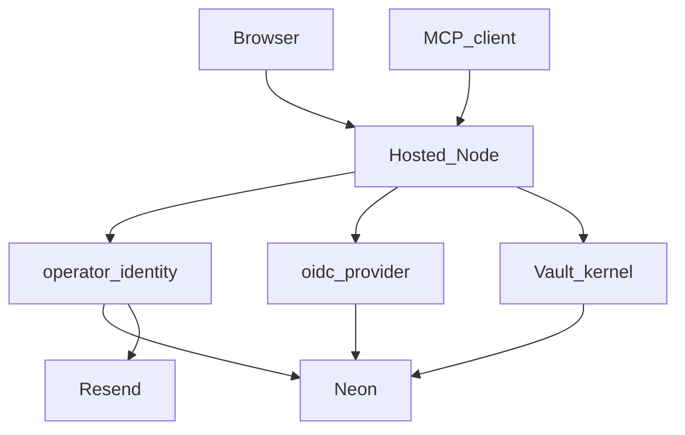

# Marketing site, design system, and first-party auth (no Clerk)

Research twins: [docs/plans/2026-08-31-marketing-site-and-docs.md](docs/plans/2026-08-31-marketing-site-and-docs.md) and [.cursor/plans/2026-08-31-marketing-site-and-docs.md](.cursor/plans/2026-08-31-marketing-site-and-docs.md). Task file: [.loadout/tasks/marketing-site-and-docs/TASK.md](.loadout/tasks/marketing-site-and-docs/TASK.md) (write on Build).

User locks: **do not use Clerk** anywhere. If an OAuth authorization server is required (it is, for MCP), **build it on this origin**. Marketing at `/`. Console at `/console`. Dark visual system at `/design`. Email OTP verifies the inbox. Email OTP is **not** enough as the only ongoing factor ([NIST SP 800-63B-4](https://doi.org/10.6028/nist.sp.800-63b-4.2pd), [OWASP MFA](https://cheatsheetseries.owasp.org/cheatsheets/Multifactor_Authentication_Cheat_Sheet.html), [ASVS 5 V6](https://github.com/OWASP/ASVS/blob/v5.0.0/5.0/en/0x15-V6-Authentication.md)).

## Task topology

- Choice: **single-loop**
- Escalation test 1: FAIL (shared `http.ts`, console HTML, Docker, CI, tests).
- Escalation test 2: FAIL (`site/dist` feeds HTTP tests and the image).
- Isolation: shared trunk (`dev`). Do not branch.

Full-suite verifier: `npm --prefix site ci && npm --prefix site run build && npm test && npm run typecheck`

Shared-tree note: dirty tree stays. Edit in place. Do not revert sibling WIP. Do not commit unless asked.

---

## 1. Summary

- **Problem:** The public origin is a token-paste console. Hosted identity and MCP OAuth both depend on Clerk ([src/hosted/clerk-auth.ts](src/hosted/clerk-auth.ts), [src/hosted/http.ts](src/hosted/http.ts) `clerkIssuer`). A new operator cannot get a vault org (`requireMember` 403). The previous plan used Better Auth as a Clerk substitute. That is the wrong class for a secrets product: the MCP plugin is days old, email OTP is not 2FA-gated by default, and open DCR is an abuse surface ([RFC 9700](https://www.ietf.org/rfc/rfc9700.html), [Parecki on DCR](https://aaronparecki.com/2026/07/29/19/solving-missing-trust-anchor-in-dynamic-client-registration-with-cimd)).
- **Outcome:** A visitor reads the product, creates an account we issue, enrolls TOTP, reaches `/console` on an HttpOnly session, and MCP clients discover **this origin** as the authorization server. No Clerk. No Better Auth. No third-party IdP.
- **Approach:** Static Astro in `site/`. Hosted Node serves `site/dist`. **Operator identity is our code** (email OTP via Resend, TOTP via `otpauth`, opaque sessions, CSRF). **OAuth is our service** on [oidc-provider 9.12](https://www.npmjs.com/package/oidc-provider) (OpenID-certified AS library; we own clients, consent, keys, and policy). Existing `/mcp` JSON-RPC stays. First operator-ready session provisions the vault org in-process.

---

## 2. Scope

### In scope

- Public URL map on hosted origins (local `vault serve` keeps console at `/`)
- Visual language + living style guide at `/design`
- Marketing, security, privacy, terms, Diátaxis docs, changelog
- Favicon, mark SVG, `og.png`, Node `robots.txt`, `sitemap.xml`, JSON-LD (Organization + WebSite only)
- Hosted console at `/console`; collect stays `/collect/:id`
- Console **Access** panel: who can reach the vault (operators, MCP/OAuth clients, machine tokens), every token issuance, revoke from that one screen
- First-party **Create account** / **Sign in** HTML on `/sign-up` and `/sign-in`
- Email OTP via existing Resend ([src/hosted/email.ts](src/hosted/email.ts))
- Required TOTP + hashed backup codes at `/enroll-totp`
- OAuth consent at `/consent` (text client name only, no remote images)
- Device-code page at `/device` for `vault login` (RFC 8628)
- `ensureVaultOrgForUser` on first operator-ready session
- Same-origin OAuth 2.1 AS: RFC 8414, RFC 9728, PKCE S256 only, RFC 8707 `resource` bound to `${origin}/mcp`, CIMD fetch via our SSRF pin, DCR with locked hardening
- Remove `@clerk/backend`, `clerk-auth.ts`, `CLERK_*`
- Expand-contract `clients.oauth_client_id`
- Bootstrap token remains break-glass
- ADRs 0003, 0004, 0005. Amend 0001/0002 to drop Clerk FAPI
- LICENSE, tests, README pointer, CHANGELOG 0.4.0, cutover

### Non-goals (with rationale)

- New hostname. ADR 0002: one OAuth resource per plane. AS and RS are this origin.
- Passwords, SMS, social login, Web3, passkeys in this change.
- Waitlist, pricing, blog, i18n, analytics, cookie banner, npm publish.
- AgentPass as a product feature, SOC2/SLA, SoftwareApplication rich results.
- Playwright visual/axe CI.
- Light theme.
- Starlight, Next, Mintlify, Google Fonts runtime, third-party JS.
- Changing local `vault serve` `/`.
- Rewriting `/mcp` onto `@modelcontextprotocol/server` / `legacy: "reject"`.
- Clerk, Better Auth, Auth0, WorkOS, Stytch, Logto.
- Inventing OAuth authorize/token/PKCE ourselves (that is how AS interop and CVE classes appear). `oidc-provider` is the protocol engine; we still own the service.
- oidc-provider default development interaction views in production.
- Self-serve account delete or cascading vault wipe.
- Multi-org UI.

### Assumptions

- **A-1:** Staging is the first public surface. Same routes on both planes.
- **A-2:** Privacy and terms describe implemented flows. Not legal counsel. Say that on the pages.
- **A-3:** `npx vault` from this repo remains the CLI until npm publish.
- **A-4:** Dirty-tree files stay.
- **A-5:** No production Clerk user base to migrate. Cutover voids Clerk JWTs. MCP clients re-authorize against our AS.
- **A-6:** Pin `oidc-provider@9.12.0` and `otpauth@9` (verify resolved npm versions at implement time; do not jump majors without re-reading the v9 mounting notes).
- **A-7:** `__Host-` cookies require Secure + HTTPS + no Domain. Hosted planes use them. Loopback tests use `bp_session` without the prefix (http://127.0.0.1).

### Open questions

None.

---

## 3. Current state

Files read: [src/hosted/http.ts](src/hosted/http.ts), [src/hosted/clerk-auth.ts](src/hosted/clerk-auth.ts), [src/hosted/kernel.ts](src/hosted/kernel.ts), [src/hosted/auth.ts](src/hosted/auth.ts) (already `timingSafeEqual` for machine tokens), [src/hosted/email.ts](src/hosted/email.ts), [src/hosted/ssrf.ts](src/hosted/ssrf.ts) (`resolvePublicAddresses` + `isBlockedIp`), [src/hosted/rate-limit.ts](src/hosted/rate-limit.ts) (org-scoped, not IP/email), [src/hosted/operator-page.ts](src/hosted/operator-page.ts), [src/store/schema.ts](src/store/schema.ts), [package.json](package.json), [docs/adr/0001-botpasses-identity.md](docs/adr/0001-botpasses-identity.md), [docs/adr/0002-botpasses-com-origin.md](docs/adr/0002-botpasses-com-origin.md).

Reusable: Resend sender, `timingSafeEqual`, SSRF DNS-pin, `createOrg` / `#provisionOrg`, `avt_` machine tokens, `VAULT_BOOTSTRAP_TOKEN`.

Gap: no operator signup, Clerk is the only AS, no session cookies, no CSRF, no OTP/TOTP tables.

---

## 4. External research (this review)

Fresh sources (not only the prior plan's citations):

- [OWASP Session Management](https://cheatsheetseries.owasp.org/cheatsheets/Session_Management_Cheat_Sheet.html) — server-side session ID; `HttpOnly` + `Secure` + explicit `SameSite`; `__Host-` prefix (Secure, Path=/, no Domain).
- [OWASP CSRF](https://cheatsheetseries.owasp.org/cheatsheets/Cross-Site_Request_Forgery_Prevention_Cheat_Sheet.html) — SameSite is defense in depth, not enough; signed double-submit with `__Host-` token. Naive double-submit is bypassable.
- [OWASP MFA](https://cheatsheetseries.owasp.org/cheatsheets/Multifactor_Authentication_Cheat_Sheet.html) — require MFA; TOTP; email is not a high-value second factor; no SMS for this product.
- [OWASP ASVS 5 V6](https://github.com/OWASP/ASVS/blob/v5.0.0/5.0/en/0x15-V6-Authentication.md) — OTP/TOTP single-use (6.5.1); OOB lifetime max 10 minutes (6.5.5); TOTP step 30s; rate-limit OOB (6.6.3). Email OOB is not permitted as an authenticator at ASVS L2.
- [NIST SP 800-63B-4](https://doi.org/10.6028/nist.sp.800-63b-4.2pd) — email shall not be OOB MFA.
- [RFC 9700 OAuth Security BCP](https://www.ietf.org/rfc/rfc9700.html) — AS MUST support PKCE; exact redirect_uri string match (localhost port exception only); reject PKCE `plain` in practice (S256 only).
- [MCP Authorization 2025-11-25](https://modelcontextprotocol.io/specification/2025-11-25/basic/authorization) — RS advertises AS; AS may be colocated; PKCE S256 in metadata; CIMD SHOULD; DCR MAY; 401 `WWW-Authenticate` `resource_metadata`.
- [MCP SDK v2 migration](https://ts.sdk.modelcontextprotocol.io/v2/migration/upgrade-to-v2.html) — `mcpAuthRouter` is frozen. Do not use it.
- [oidc-provider 9.12](https://www.npmjs.com/package/oidc-provider) / [docs](https://github.com/panva/node-oidc-provider/blob/HEAD/docs/README.md) — `provider.callback()` is a Node `(req, res)` handler; RFC 8707 `resourceIndicators`; PKCE required by default; DCR and device flow are features we enable explicitly; default interaction views are development-only.
- [Parecki: CIMD vs DCR](https://aaronparecki.com/2026/07/29/19/solving-missing-trust-anchor-in-dynamic-client-registration-with-cimd) — DCR metadata is self-asserted; CIMD anchors `client_id` to an HTTPS URL.
- [Better Auth 2FA](https://better-auth.com/docs/1.6/plugins/2fa) — email OTP sign-in is **not** 2FA-gated. Rejected as the operator stack.
- [Better Auth MCP](https://better-auth.com/docs/plugins/mcp) — `@better-auth/mcp@1.7.2` published days ago; recommends unauthenticated DCR for older clients. Rejected as the AS.
- [oidc-provider v9 events](https://github.com/panva/node-oidc-provider/blob/v9.x/docs/events.md) — **`access_token.saved` is opaque tokens only.** Structured/JWT access tokens emit **`access_token.issued`**. Refresh tokens emit `refresh_token.saved`. A ledger hooked only on `.saved` would miss every MCP JWT.
- [RFC 7009 Token Revocation](https://www.rfc-editor.org/rfc/rfc7009) — clients notify the AS that a token is no longer needed. oidc-provider exposes this as `features.revocation`.
- [RFC 9068 JWT Access Tokens](https://www.rfc-editor.org/rfc/rfc9068) — required claims include `jti`. A JWT without `jti` cannot be denylisted; reject it at `/mcp`.
- [RFC 7009 + JWT denylist practice](https://bmf-tech.com/posts/access-token-validation-revocation/) — a JWT stays cryptographically valid until `exp`. Immediate revoke needs a `jti` denylist (or `client.revoked_at`) checked at the RS, plus short TTL. We already chose 600s (R-30).

Adopt: OWASP session + signed CSRF; ASVS OTP/TOTP lifetimes; RFC 9700 PKCE + exact redirect; oidc-provider as AS engine; CIMD-first with hardened DCR; our SSRF pin for CIMD; **`access_token.issued` for JWT ledger writes**; RFC 7009 revocation endpoint; `jti` required + denylist + `clients.revoked_at`.

Reject: Clerk; Better Auth; other SaaS IdPs; hand-rolled authorize/token; email-only login; SMS; unauthenticated DCR without rate limits and redirect https rules; rendering `logo_uri` on consent; Redis-only denylist (Neon/`access_events` is the denylist; no new cache); hooking only `access_token.saved`.

---

## 5. Requirements

### Functional

- **R-01.** Unauthenticated `GET /` on a hosted origin SHALL be the marketing homepage.
- **R-02.** `GET /console` signed-out SHALL show Sign in / Create account, not a leading token field.
- **R-03.** `GET /sign-up` and `GET /sign-in` SHALL be our HTML. After an operator-ready session, redirect to `/console`. Missing TOTP SHALL redirect to `/enroll-totp`.
- **R-04.** Collect, MCP, APIs, approve, runtime, health, ready keep current behavior except public HTML GET/HEAD SHALL NOT fail when `Authorization` is missing or invalid.
- **R-05.** Local `vault serve` `GET /` remains the local operator console.
- **R-06.** Hosted URL map is the list in §7. Diátaxis slugs (exactly these, file format so `/docs/start` → `docs/start.html`): `/docs`, `/docs/start`, `/docs/how-to/store-a-secret`, `/docs/how-to/grant-access`, `/docs/how-to/revoke-access`, `/docs/how-to/connect-cursor`, `/docs/how-to/connect-claude-code`, `/docs/connect/grok`, `/docs/connect/claude`, `/docs/connect/cursor`, `/docs/connect/openai`, `/docs/reference/mcp-tools`, `/docs/reference/cli`, `/docs/reference/http-api`, `/docs/explanation/why-the-model-never-sees-the-value`.
- **R-07.** Staging HTML responses include `X-Robots-Tag: noindex, nofollow`. Staging `robots.txt` is `User-agent: *` + `Allow: /` (no `Disallow: /`).
- **R-08.** Prod `robots.txt` allows `/` and `/docs`; disallows `/console`, `/sign-in`, `/sign-up`, `/enroll-totp`, `/consent`, `/device`, `/collect`, `/api`, `/mcp`, `/approve`, `/runtime`, `/oauth`, `/agentpass`.
- **R-09.** Hosted boot exits 78 if `site/dist/index.html` is missing, if `VAULT_SESSION_SECRET` is missing or shorter than 32 bytes, or if `VAULT_OIDC_PRIVATE_JWK` is missing or is not a private **RS256** JWK (`kty: "RSA"`, `alg: "RS256"`, `d` present). `createHostedServer` takes optional `siteRoot`.
- **R-10.** Static files resolve only under `siteRoot`. `..` and encoded `..` are 404; bodies omit source paths.
- **R-11.** Public marketing/docs/design HTML SHALL NOT contain store/issue/revoke/approve controls or forms posting to `/api/items`.
- **R-12.** Public nav: Home, Docs, Security, Design, Sign in. Footer: Privacy, Terms, Changelog.
- **R-13.** Item delete and Access revoke use `<dialog>` confirm (`data-testid="item-delete-confirm"` / `access-revoke-confirm`). The mutating request is not on the first click.
- **R-14.** Interactive controls used in tests have `data-testid`. Each HTML page has exactly one `h1`.
- **R-15.** Sign-up and sign-in: email + email OTP only. No password field. HTML pages POST to `POST /api/auth/otp/send` and `POST /api/auth/otp/verify` (JSON `{ email }` / `{ email, otp }`). TOTP enroll uses `POST /api/auth/totp/start` and `POST /api/auth/totp/confirm`. OTP is sent via Resend. HTML, JSON, and audit logs SHALL NOT contain the OTP or TOTP secret.
- **R-16.** **operatorReady** = email verified AND TOTP enabled. Operator APIs, `/consent`, and device approval SHALL 403 `{ error: "mfa_required", enroll_url: "/enroll-totp" }` otherwise.
- **R-17.** Console fetches use `credentials: "include"` plus `X-CSRF-Token`. `vault_op_token` is bootstrap only.
- **R-18.** `/design` documents tokens from [src/brand-visual.ts](src/brand-visual.ts).
- **R-19.** First operator-ready request with no `org_members` row SHALL `createOrg("workspace", userId)` then `requireMember`. Second call is a no-op. MCP access tokens SHALL NOT provision orgs.
- **R-20.** `GET /enroll-totp` has `data-testid="enroll-totp"`. `GET /consent` has `data-testid="oauth-consent"`. `GET /device` has `data-testid="device-code"`.
- **R-21.** `GET /.well-known/oauth-protected-resource` names `authorization_servers: [publicUrl]` and `resource: ${publicUrl}/mcp` (origin, no trailing slash). No `clerk.` host.
- **R-22.** AS metadata includes `code_challenge_methods_supported: ["S256"]` only (no `plain`), `authorization_endpoint`, `token_endpoint`, `jwks_uri`, `registration_endpoint`, `device_authorization_endpoint`, `revocation_endpoint` (`/oauth/revoke`, RFC 7009).
- **R-23.** Unauthenticated `POST /mcp` returns 401 with `WWW-Authenticate` containing `resource_metadata=`.
- **R-24.** Runtime code and `.env.example` SHALL NOT contain `@clerk/backend`, `CLERK_*`, `better-auth`, or `@better-auth/`.
- **R-25.** `vault login` prints `/sign-in`, `/console`, and `/device`. No Clerk string.
- **R-26.** Session cookie on hosted HTTPS: name `__Host-bp_session`; `Secure`; `HttpOnly`; `SameSite=Lax`; `Path=/`; no `Domain`. Cookie value is a 32-byte random (base64url). Server stores only `SHA-256(token)`.
- **R-27.** State-changing operator `POST`/`DELETE`/`PATCH` SHALL reject requests that lack a valid signed CSRF token (header `X-CSRF-Token` matching `__Host-bp_csrf` HMAC). Safe GET/HEAD do not mutate.
- **R-28.** Email OTP: 8 digits; lifetime 10 minutes; single use; 5 verify failures invalidate the challenge; send limits 5 / email / 15 min and 10 / IP / 15 min; store only `scrypt` hash of the code (N=16384, r=8, p=1, 32-byte key); unknown emails return the same 200 body as known emails and do not reveal existence.
- **R-29.** TOTP: RFC 6238, SHA-1, 6 digits, 30s step, ±1 window; secret ≥160 bits, wrapped with `VAULT_KEK` like a DEK; last used timestep stored so a code cannot be reused; 10 backup codes, 10 charset chars each, `scrypt` hashed, shown once.
- **R-30.** OAuth: PKCE S256 required; exact `redirect_uri` match (RFC 9700 localhost port exception only); access token JWT `aud` exactly `${origin}/mcp`; lifetime 600 seconds; refresh rotation with reuse detection (family revoke).
- **R-31.** DCR `POST /oauth/register`: HTTPS `redirect_uris` only, except `http://127.0.0.1:<port>/...` or `http://localhost:<port>/...` for native; reject `javascript:`, `data:`, and `file:`; `client_name` max 80 chars; do not persist or render `logo_uri` / `policy_uri` as HTML; 20 registrations / IP / hour.
- **R-32.** CIMD: when `client_id` is an `https://` URL, fetch via [src/hosted/cimd-fetch.ts](src/hosted/cimd-fetch.ts) using `resolvePublicAddresses` + pin + no redirects + 16 KiB body cap. Reject if resolved addresses are blocked ([src/hosted/ssrf.ts](src/hosted/ssrf.ts)).
- **R-33.** `GET /api/access` (operator-ready session, same org as `requireMember`) SHALL return the **live snapshot only** (not the ledger): `operators` (email, role, user id), `clients` (id, name, display kind, environment, status `active`|`revoked`, created_at, last_token_at, last_seen_at, consented_by_email), `grants` (id, item name, client name, status, created_at, approved_at), `sessions` (id prefix of `id_hash`, created_at, last_seen_at, `current`). Display kind is `oauth` when `oauth_client_id` is non-null, else the stored `ClientKind` (`model` | `trusted`). Stored `ClientKind` stays `model` | `trusted` ([src/hosted-types.ts](src/hosted-types.ts)); do not add an `oauth` stored kind. Bodies SHALL NOT contain secret values, OTP, TOTP secrets, raw JWTs, or `avt_`/`avm_` plaintext. `VAULT_BOOTSTRAP_TOKEN` is **not** a row. Signed-out `GET /api/access` is 401.
- **R-34.** Every successful issuance of an MCP JWT access token, refresh token, machine bearer (`avt_` / `avm_`), or operator session SHALL insert one `access_events` row and one audit `token_issued` (or `session_created`) row **before the credential is returned to the client**. JWT access tokens: persist inside oidc-provider `extraTokenClaims` (async; throw fails the grant; **return `undefined`**, do not add custom JWT claims) and confirm on **`access_token.issued`** ([events.md](https://github.com/panva/node-oidc-provider/blob/v9.x/docs/events.md)). Do **not** hook `access_token.saved` for JWTs (that event is opaque tokens only). Refresh: `refresh_token.saved`. `access_events` stores `jti_hash` = SHA-256 of the JWT `jti` or machine/session id, never the token. Unique index on `jti_hash`. `GET /api/access/events` returns the ledger newest-first (limit 200). The snapshot endpoint does **not** embed this list.
- **R-35.** The hosted console SHALL have one **Access** section (`data-testid="access-panel"`) that lists R-33 rows and an **Activity** table loaded from `GET /api/access/events`. Each active client, active/pending grant, and non-current session SHALL have a Revoke control. Confirm with the same `<dialog>` as item delete (`data-testid="access-revoke-confirm"`). Empty snapshot (no clients, no grants, only the current session): show `data-testid="access-empty"` and no Revoke buttons. Any **operator** role may revoke (same as `revokeGrant` today). Cross-org id → **404** (do not leak existence).
- **R-36.** `POST /api/clients/:id/revoke` SHALL set `clients.revoked_at`, destroy that client’s **refresh / opaque** adapter payloads (JWT access tokens are not stored in the adapter), revoke its `active`/`pending` grants, set matching `access_events.revoked_at`, and write audit `client_revoked`. Further `/mcp` or `/api` calls with that client’s Bearer SHALL be 401 via R-37. `POST /api/grants/:id/revoke` stays as today ([src/hosted/kernel.ts](src/hosted/kernel.ts) `revokeGrant`). `POST /api/sessions/:id/revoke` deletes that operator session; if `:id` is the caller’s current session, **400** `{ error: "cannot_revoke_current" }` (use logout). `POST /api/sessions/revoke-others` deletes all sessions except the caller’s.
- **R-37.** Bearer verify (OAuth JWT and machine token) SHALL reject when (a) the mapped vault client has `revoked_at` set, or (b) the JWT `jti` hashes to an `access_events` row with `revoked_at` set, or (c) the JWT has **no `jti` claim**. Checks are org-scoped via the mapped client. Machine tokens have no JWT; (a) is enough (hashed secret lookup then `revoked_at`).
- **R-38.** First successful OAuth consent (or first `/oauth/token` if consent was skipped) SHALL `ensureModelClient({ oauthClientId: oidc client_id, name: client_name })` so Access lists one vault `cli_*` per OAuth client. Dual-read `oauth_client_id ?? clerk_oauth_user_id`.
- **R-39.** `features.revocation: true`. `POST /oauth/revoke` is RFC 7009 (client-authenticated). Console revoke uses R-36, not RFC 7009. On RFC 7009 success, mark the matching `access_events` row revoked and write audit `token_revoked`.
- **R-40.** Store additions (sqlite-hosted + postgres, same names): `listMembers(orgId)`, `listOperatorSessions(orgId)` (join `operator_sessions` → `users` → `org_members`), `listAccessEvents(orgId, limit=200)`, `insertAccessEvent`, `revokeAccessEventsForClient(clientId)`, `setClientRevoked(id, at)`, `touchClientLastSeen(id, at)` (UPDATE only when `last_seen_at` IS NULL or older than 60 seconds). Existing `listClients` / `listGrants` / `listAudit` are reused. `last_token_at` is set at issuance, not at `/mcp`.

### Non-functional

- WCAG 2.2 AA on tokens; skip link; one `h1`; 24px targets; 360 / 800 / 1120; `prefers-reduced-motion`; `color-scheme: dark`.
- One CSP: `default-src 'self'; script-src 'self' 'wasm-unsafe-eval'; worker-src 'self' blob:; style-src 'self'; font-src 'self'; img-src 'self'; connect-src 'self'; base-uri 'self'; form-action 'self'; frame-ancestors 'none'`.
- HTML `Cache-Control: no-cache`. Fingerprinted assets immutable.
- Static: `nosniff`, `Referrer-Policy: no-referrer`.
- Auth pages also send `Cache-Control: no-store`.

### Acceptance criteria

- **AC-01.** Fixture dist: `GET /` 200, H1 says the model does not get the key, Create account → `/sign-up`, Sign in → `/sign-in`, no `Operator token`.
- **AC-02.** `GET /console` 200, matches `Issue Grok Bot token`, `data-testid="console-signin"`. `vault_op_token` remains the bootstrap key.
- **AC-03.** `GET /docs/start` and `GET /docs` 200. `/pagefind/` files exist.
- **AC-04.** `GET /privacy`, `/terms`, `/security`, `/design` 200. Privacy names Fly, Neon, Cloudflare, Resend, Sentry and does not name Clerk. Design shows token hex and the mark.
- **AC-05.** `GET /../src/hosted/http.ts` and `GET /%2e%2e/package.json` 404; bodies omit source.
- **AC-06.** Staging HTML has `X-Robots-Tag` matching `noindex`. Staging `robots.txt` does not contain `Disallow: /`. Prod `robots.txt` allows `/docs` and disallows `/console` and `/sign-in`.
- **AC-07.** `vault login` stdout contains `/sign-in`, `/console`, and `/device`. Grant email without magic token href ends with `/console`. No Clerk string.
- **AC-08.** Isolation: canary absent from `/`, `/docs/*`, `/console`, `/sign-in`, `/collect/:id`.
- **AC-09.** Local `vault serve` `GET /` still matches local operator HTML.
- **AC-10.** Hosted boot without dist `index.html` exits 78. Docker proven by Dockerfile `COPY --from=site`, not `docker build` in `npm test`.
- **AC-11.** `GET /` nav: Home, Docs, Security, Design, Sign in. No form posts `/api/items`.
- **AC-12.** `GET /docs/connect/grok` breadcrumbs include Docs and `data-testid="docs-search"`. Copy does not tell the operator to paste a Clerk JWT.
- **AC-13.** Console HTML contains `data-testid="item-delete-confirm"` and `<dialog`. DELETE is not on the first click handler.
- **AC-10b.** Hosted boot without `VAULT_SESSION_SECRET` or `VAULT_OIDC_PRIVATE_JWK` exits 78.
- **AC-14.** Sign-up/sign-in 200; body has no `sk_`, `VAULT_SESSION_SECRET`, `VAULT_OIDC`, `CLERK_`, OTP digits from a fixture challenge.
- **AC-15.** Invalid Bearer on `GET /` is 200 marketing; on `GET /api/items` is 401.
- **AC-16.** `/` and `/sign-in` CSP `connect-src` and `style-src` are `'self'` only.
- **AC-17.** `ensureVaultOrgForUser("user_new")` creates one org; second call same id; MCP principal does not provision.
- **AC-18.** Session without TOTP on `GET /api/items` is 403 `mfa_required`.
- **AC-19.** Protected-resource metadata has no `clerk.`; AS metadata `code_challenge_methods_supported` is exactly `["S256"]` and includes `revocation_endpoint` ending in `/oauth/revoke`.
- **AC-20.** `rg` over `src` and `package.json` finds no `@clerk/backend`, `CLERK_SECRET_KEY`, `better-auth`, `@better-auth/`.
- **AC-21.** Hosted `Set-Cookie` on successful OTP (loopback test uses `bp_session`) includes `HttpOnly` and `SameSite=Lax`. A fixture HTTPS header test asserts `__Host-bp_session` and `Secure` and no `Domain=`.
- **AC-22.** `POST /api/auth/otp/send` with `{ "email": "…" }` returns 200 `{ ok: true }` for both unknown and known emails (same body). Sixth `POST /api/auth/otp/verify` on one challenge is 401. A sixth send for the same email inside 15 minutes is 429. `GET /sign-in` remains HTML (AC-14).
- **AC-23.** The same TOTP code accepted once is rejected on the immediate second verify (replay).
- **AC-24.** `POST /api/items` with a valid session cookie and no `X-CSRF-Token` is 403.
- **AC-25.** DCR with `redirect_uris: ["https://evil.example/cb"]` 201 or 200 stores exact URI; DCR with `javascript:alert(1)` is 400; consent HTML contains the client_name text and does not contain an `<img` for a logo.
- **AC-26.** A token requested with `resource=${origin}/mcp` verifies `aud` equal to that URL; a token with a different resource is rejected at `/mcp`.
- **AC-27.** `POST /mcp` without Authorization is 401 and the `WWW-Authenticate` value includes `resource_metadata=`.
- **AC-28.** After an operator-ready session and one `POST /api/clients/model` issue, `GET /api/access` 200 includes that client with status `active` and `last_token_at` set. The JSON has no `avm_` value.
- **AC-29.** `GET /console` HTML contains `data-testid="access-panel"` and `data-testid="access-revoke-confirm"`.
- **AC-30.** Given an issued model Bearer, `POST /api/clients/:id/revoke` then `POST /mcp` with that Bearer is 401. `GET /api/access` shows the client `revoked`. Audit contains `client_revoked` and no token plaintext.
- **AC-31.** Completing `/oauth/token` (test fixture that issues a **JWT** access token) inserts `access_events` kind `oauth_access` and audit `token_issued` with vault `client_id` and consented user email, not the JWT. The test proves the write ran on the JWT path (`access_token.issued` / `extraTokenClaims`), not `access_token.saved`.
- **AC-32.** `POST /api/grants/:id/revoke` from the Access panel still flips grant status to `revoked` (existing kernel path) and the grant row remains listed.
- **AC-33.** A fixture JWT that verifies signature + `aud` but **omits `jti`** is 401 at `POST /mcp`. A JWT whose `jti` was marked revoked on `access_events` is 401 even when `clients.revoked_at` is null and `exp` is in the future.
- **AC-34.** Operator in org A calling `POST /api/clients/:id/revoke` with org B’s client id receives **404**. `GET /api/access` signed-out is **401**.
- **AC-35.** `GET /docs/how-to/revoke-access` is 200 and names the Access panel. `GET /api/access` JSON does not contain an `audit` or `events` array (ledger is only `/api/access/events`).

### Edge cases

- `/index.html` is marketing. `/console/` equals `/console`. Other trailing slashes 308.
- Two concurrent first operator-ready calls: unique `(org_id, user_id)`; loser reads winner.
- Resend down: auth pages show a visible error; marketing still serves; OTP not logged.
- Email OTP succeeded, TOTP missing: session cookie may exist; operator APIs 403.
- Collect signed-out: Sign in + optional bootstrap paste.
- `avt_` machine tokens resolve before session/JWT ([src/hosted/auth.ts](src/hosted/auth.ts)).
- Delete the Clerk `clerkIssuer` well-known JSON so clients never see a Clerk host.
- oidc-provider default views disabled; unknown interaction renders our `/sign-in`.
- Loopback `__Host-` cannot be set: A-7.
- JWT access tokens are **not** in `oidc_payloads`; client revoke must not assume adapter `destroy` of access tokens. Refresh tokens are.
- Concurrent `POST /api/clients/:id/revoke` and `POST /mcp`: verify reads `revoked_at` + `jti` after signature check; first committed revoke wins; `/mcp` is 401.
- `touchClientLastSeen` no-ops when last write was < 60s ago (no write storm).
- Empty Access: `access-empty`; no revoke controls.
- Current-session revoke: 400 `cannot_revoke_current`.
- Cross-org revoke/list: 404, not 403.
- Ledger insert failure during `/oauth/token` fails the grant (no token in the response).
- `listMembers` does not exist today ([src/store/types.ts](src/store/types.ts)); T-09 adds it. Do not scan `org_members` from HTTP.

---

## 6. Design decisions

### D-01 through D-08 (unchanged locks)

`/` marketing, `/console` console, Astro `site/` file format (`trailingSlash: 'never'`, `build.format: 'file'`, `inlineStylesheets: 'never'`), Node serves `site/dist`, JSON-LD Organization+WebSite, README pointer, Diátaxis, ordered routes with public HTML **before** `auth()`.

Visual tokens (hex is test source of truth; CSS also emits `oklch()` twins): `--bg: #0B0F0C`, `--bg-elev: #151C17`, `--fg: #F2F5F2`, `--muted: #C5D0C7`, `--line: #2A332C`, `--accent: #7DDA88`, `--accent-dim: #244024`, `--danger: #E07070`. Display Fraunces, body IBM Plex Sans, mono IBM Plex Mono, self-hosted OFL. Mark: 24×24 ticket-shaped SVG at `src/brand-assets/mark.svg`.

Auth HTML paths: `/sign-in`, `/sign-up`, `/enroll-totp`, `/consent`, `/device`. No `/tasks/*`.

Route order addendum: after `/health` `/ready`, mount **our** well-known documents and `oidc.callback()` for `/oauth/*`, `/oauth/device/*`, `/.well-known/oauth-authorization-server`, `/.well-known/openid-configuration`, `/.well-known/oauth-protected-resource`. Remove `clerkIssuer` from [src/hosted/http.ts](src/hosted/http.ts).

### D-09: Build the AS; do not use Clerk or Better Auth

- Options: (A) Clerk; (B) another SaaS IdP; (C) Better Auth 1.7 library; (D) hand-roll authorize/token/PKCE; (E) first-party operator modules + **oidc-provider** as the AS engine on this origin.
- Decision: **E**.
- Why A/B fail: user lock and the same vendor-AS class.
- Why C fails: MCP plugin is new; email OTP is not MFA-gated; docs push unauthenticated DCR; we would still not "own" token policy. User asked to **build** the OAuth service.
- Why D fails: RFC 9700 + MCP interop. Official SDK AS helpers are frozen. This is the CVE class.
- Why E: [oidc-provider](https://www.npmjs.com/package/oidc-provider) is OpenID-certified, implements PKCE, RFC 8707, DCR, device grant, JWKS; `callback()` mounts on `node:http`. We write interactions, adapter, CIMD fetch, DCR policy, and operator auth. That is "our OAuth service."
- Informed by: RFC 9700, MCP 2025-11-25, oidc-provider v9 docs, OWASP session/CSRF, ASVS V6.
- Consequences: add `VAULT_SESSION_SECRET` and `VAULT_OIDC_PRIVATE_JWK`; remove `CLERK_*`; delete FAPI CNAMEs; privacy drops Clerk; we commit adapter SQL.

oidc-provider config locks:

- `pkce.required`: always. Methods: `S256` only (`plain` disabled).
- `features.resourceIndicators`: enabled. `getResourceServerInfo` returns access token JWT, `aud` = `${origin}/mcp`, scopes `mcp`. Any other `resource` is rejected.
- `features.registration`: enabled (MCP DCR MAY). Apply R-31 in `extraClientMetadata` / `extraTokenClaims` validators.
- `features.deviceFlow`: enabled. `deviceFlow.charset`: digits. `userCodeInputSource` is our `/device` page.
- `features.revocation`: **true**. Endpoint path `/oauth/revoke` (override `routes.revocation` if the library default is `/token/revocation`).
- `features.devInteractions`: **false**.
- `cookies.keys`: derived from `VAULT_SESSION_SECRET`. Short cookies `sameSite: 'lax'`, `secure` on hosted.
- Adapter: [src/hosted/oidc-adapter.ts](src/hosted/oidc-adapter.ts) on Postgres (hosted) and memory (unit tests).

### D-10: operatorReady (email OTP is not MFA)

Email OTP is inbox proof (sign-up and each sign-in). TOTP (or a backup code) is required before operator APIs, consent, and device approval. Matches NIST + ASVS: email is not an authenticator for this assurance.

### D-11: Vault org on first operator-ready session

`ensureVaultOrgForUser(userId)` → existing `createOrg`. MCP tokens never provision. User ids are `usr_${uuid}` we mint.

### D-12: One strict CSP

No third-party script or style. Auth JS is same-origin `/assets/auth.js`.

### D-13: Keep `/mcp` transport

Verify Bearer with `jose` against our JWKS (`VAULT_OIDC_PRIVATE_JWK` public part). Audience `${origin}/mcp`. Map `client_id` to `ensureModelClient({ oauthClientId })`.

### D-14: Column expand

`003_identity.sql` adds operator + OAuth adapter tables and `clients.oauth_client_id`. Dual-read `oauth_client_id ?? clerk_oauth_user_id`. Do not drop the old column in this change.

### D-15: Session and CSRF (OWASP)

- Opaque session, hashed at rest, rotate on OTP success and on TOTP enroll ([OWASP session](https://cheatsheetseries.owasp.org/cheatsheets/Session_Management_Cheat_Sheet.html)).
- Idle 12 hours; absolute 7 days; logout deletes the row.
- CSRF: signed double-submit ([OWASP CSRF](https://cheatsheetseries.owasp.org/cheatsheets/Cross-Site_Request_Forgery_Prevention_Cheat_Sheet.html)). Cookie `__Host-bp_csrf` (loopback `bp_csrf`); value is random; server HMAC-SHA256 with `VAULT_SESSION_SECRET` compared via `timingSafeEqual`. Console JS reads the cookie only if we use a non-HttpOnly CSRF cookie (double-submit requires JS-readable CSRF cookie; session stays HttpOnly). CSRF cookie: `Secure`, `SameSite=Lax`, `Path=/`, **not** HttpOnly, `__Host-` on hosted.
- SameSite=Lax (not Strict) so a top-level GET from an MCP client to `/oauth/authorize` can see the session after the user is already signed in. Strict would force a re-login on every connect; Lax + CSRF on mutations is the BCP for an AS.

### D-16: CIMD fetch is our SSRF boundary

Do not use oidc-provider's default `fetch` for client metadata. `fetchCimdDocument` uses `resolvePublicAddresses`, connects only to those IPs, refuses redirects, 16 KiB cap, HTTPS only. Cache 1 hour by URL.

### D-17: One Access panel; full issuance ledger; revoke here

Local `vault serve` already lists grants, revoke, and audit ([src/operator-page.ts](src/operator-page.ts)). Hosted console does not: [src/hosted/operator-page.ts](src/hosted/operator-page.ts) has inbox approve and Grok issue only. Hosted APIs already have `POST /api/grants/:id/revoke` and `GET /api/audit` ([src/hosted/http.ts](src/hosted/http.ts)); there is no `GET /api/grants`, no `GET /api/clients`, and no client revoke. Token issue (`createModelClient`) is not audited.

- Options: (A) keep revoke only on grants; (B) Access panel that lists operators, clients, grants, sessions, and every token issuance, with revoke on each live credential; (C) a single “revoke everything” button and no history.
- Decision: **B**.
- Why A fails: OAuth and `avt_`/`avm_` bearers would be invisible and unrevokable from the console, which is the product’s “one place.” Why C fails: operators need to see *who* still has a token and a durable record after revoke.
- Implementation:
  - Expand `clients` with `revoked_at`, `last_token_at`, `last_seen_at`, `consented_by_user_id` (nullable). Dual-read old rows as active (`revoked_at` null).
  - New `access_events` (id, org_id, client_id null for operator sessions, actor_user_id, kind `oauth_access`|`oauth_refresh`|`machine`|`session`, jti_hash UNIQUE, issued_at, expires_at, revoked_at).
  - JWT ledger write: `extraTokenClaims` (fail-closed) + listen **`access_token.issued`**. Refresh: **`refresh_token.saved`**. Never `access_token.saved` for our JWT ATs.
  - On first consent/token: `ensureModelClient({ oauthClientId })`. Access lists vault `cli_*` rows.
  - `/mcp` success calls `touchClientLastSeen` (60s throttle). No audit row.
  - Revoke client: `revoked_at` + destroy **refresh/opaque** adapter rows + revoke open grants + mark `access_events` revoked. JWT ATs die via R-37 (`revoked_at` or `jti` denylist), not adapter destroy.
  - Add store `listMembers` (missing today).
- Test: AC-28..AC-35. Inverse: isolation scan still forbids canary/JWT/`avm_` in `/api/access`, `/api/access/events`, and Access HTML.
- Rejected alternative: Redis `jti` denylist (adds infra; Neon already holds `access_events`). Rejected alternative: rely on 600s TTL only (product promise is immediate revoke).

---

## 7. Technical design



Operator: email → OTP → enroll TOTP → rotate session → `ensureVaultOrgForUser` → `/console`.

MCP: 401 + `resource_metadata` → RFC 9728 → RFC 8414 → CIMD or DCR → `/oauth/authorize` (our sign-in + consent) → JWT `aud=${origin}/mcp` → `POST /mcp`.

CLI: RFC 8628 `/device` after TOTP, or bootstrap `avt_`.

### URL map (hosted)

- `/` `/design` `/security` `/privacy` `/terms` `/changelog`
- `/docs` plus the R-06 Diátaxis slugs (including `/docs/how-to/revoke-access`)
- `/sign-in` `/sign-up` `/enroll-totp` `/consent` `/device`
- `/console` `/collect/:id`
- `/oauth/authorize` `/oauth/token` `/oauth/register` `/oauth/revoke` `/oauth/device/auth` `/oauth/session/end`
- `/favicon.svg` `/robots.txt` `/sitemap.xml` `/og.png`

Homepage H1: the model does not get the key (person plus a concrete API, not a schema label).

Privacy names Fly, Neon, Cloudflare, Resend, Sentry. Not Clerk. Not Better Auth.

### Modules

- [src/hosted/static-site.ts](src/hosted/static-site.ts)
- [src/hosted/operator-identity.ts](src/hosted/operator-identity.ts) — users, OTP, TOTP, sessions, CSRF
- [src/hosted/identity.ts](src/hosted/identity.ts) — replaces `clerk-auth.ts`
- [src/hosted/auth-pages.ts](src/hosted/auth-pages.ts)
- [src/hosted/oauth-as.ts](src/hosted/oauth-as.ts) — Provider factory
- [src/hosted/oidc-adapter.ts](src/hosted/oidc-adapter.ts)
- [src/hosted/cimd-fetch.ts](src/hosted/cimd-fetch.ts)
- [src/hosted/ui-chrome.ts](src/hosted/ui-chrome.ts)
- [migrations/003_identity.sql](migrations/003_identity.sql)

### Schema (003)

New tables (this shape, not a choice): `users` (id, email unique ci, email_verified_at, totp_wrapped_iv, totp_wrapped_ciphertext, totp_wrapped_tag, totp_last_step, created_at); `email_otp_challenges` (id, email, code_scrypt, expires_at, attempts, sent_at); `backup_codes` (user_id, code_scrypt, used_at); `operator_sessions` (id_hash PK, user_id, created_at, last_seen_at, expires_at); `oidc_payloads` (id TEXT, kind TEXT, payload TEXT, expires_at TEXT, PRIMARY KEY (id, kind)) for the oidc-provider adapter; `access_events` (id, org_id, client_id, actor_user_id, kind, jti_hash TEXT UNIQUE NOT NULL, issued_at, expires_at, revoked_at). Indexes: `access_events (org_id, issued_at DESC)`, `clients (oauth_client_id)`, `org_members (org_id)`. Expand `clients.oauth_client_id`, `clients.revoked_at`, `clients.last_token_at`, `clients.last_seen_at`, `clients.consented_by_user_id`. Down migration drops new tables/columns only; does not drop `clerk_oauth_user_id`.

### Env

Add: `VAULT_SESSION_SECRET` (≥32 bytes), `VAULT_OIDC_PRIVATE_JWK` (one **RS256** private JWK; `kty: "RSA"`, `alg: "RS256"`, includes `d`. RS256 is the interop default for MCP clients. Do not ship EdDSA in this change). Keep existing vault/Fly secrets except remove `CLERK_*` after cutover. Do not add `BETTER_AUTH_*`.

### CI

Site build in ci.yml, deploy-staging.yml, and deploy-prod.yml. Timeout 20. Cache both lockfiles. Identity tests use memory oidc adapter + in-process kernel. No Clerk. No Docker in `npm test`.

---

## 8. Implementation tasks

### T-01 Visual language

Touch: `src/brand-visual.ts`, `src/brand-assets/mark.svg`, `test/brand-visual.test.ts`, `site/public/og.png`, `site/public/favicon.svg`. Verify brand-visual test.

### T-02 Astro shell

Depends T-01. Touch `site/*`. Verify `dist/index.html` and `dist/design.html`.

### T-03 Content

Depends T-02. Privacy and connect docs: first-party sign-in and our `/oauth/*`. No Clerk, no Better Auth. Verify `test/site-content.test.ts`.

### T-04 Hosted serve + Docker + CI

Depends T-02. Touch `static-site.ts`, `http.ts`, `boot.ts`, `main.ts`, Docker, three workflows, `test/hosted-site.test.ts`. Verify AC-01, AC-05, AC-06, AC-10, AC-15.

### T-07 Operator identity

Depends T-01. Touch `operator-identity.ts`, `identity.ts`, `auth-pages.ts`, `kernel.ts`, `http.ts` HTML routes, `003_identity.sql` user/session/otp parts, `test/identity.test.ts`, `test/hosted-auth-pages.test.ts`. Verify AC-14, AC-16, AC-17, AC-18, AC-21, AC-22, AC-23, AC-24.

### T-08 First-party OAuth AS + delete Clerk

Depends T-07. Touch `oauth-as.ts`, `oidc-adapter.ts`, `cimd-fetch.ts`, `http.ts` (delete `clerkIssuer`; mount `provider.callback()`; WWW-Authenticate), store dual-read, `cli.ts`, `mcp-stdio-remote.ts`, `package.json` (add `oidc-provider`, `otpauth`, `jose` if needed; remove `@clerk/backend`). Verify AC-19, AC-20, AC-25, AC-26, AC-27.

### T-05 Console and collect chrome

Depends T-01, T-07. Cookie fetches + CSRF header. Bootstrap collapsed. Grok copy kept. Verify AC-02, AC-07, AC-08, AC-09, AC-13.

### T-09 Access ledger and revoke

Depends T-07, T-08, T-05. Touch `kernel.ts` (`listAccess`, `revokeClient`, `recordAccessEvent`), `http.ts` (`GET /api/access`, `GET /api/access/events`, `POST /api/clients/:id/revoke`, session revoke), `operator-page.ts` Access panel, `oauth-as.ts` (`extraTokenClaims`, `access_token.issued`, `refresh_token.saved`, `features.revocation`), `003_identity.sql` access columns + indexes, store `listMembers` / `listOperatorSessions` / `listAccessEvents` / `touchClientLastSeen` on both postgres and sqlite-hosted, `test/access-ledger.test.ts`. Docs: `/docs/how-to/revoke-access` + security page names the ledger. Verify AC-28..AC-35 and isolation (no JWT/`avm_` in access JSON or HTML).

### T-06 Docs and gates

Depends T-03..T-09. ADRs 0003/0004/0005, amend 0001/0002, README, CHANGELOG 0.4.0, cutover (set new secrets, unset Clerk, delete FAPI CNAMEs), AGENTS.md, TASK.md, research twins. Full-suite verifier.

---

## 9. Test plan

- Marketing ACs plus AC-21..AC-35 (auth/OAuth/access class).
- Fail-then-pass: AC-17 provision; AC-18 TOTP gate; AC-23 TOTP replay; AC-24 CSRF; AC-26 wrong `aud`; AC-30 revoke-then-401; AC-33 missing/`revoked` `jti`.
- Isolation scan includes new HTML (no OTP, no TOTP secret, no JWK `d`).
- Gate: `npm --prefix site ci && npm --prefix site run build && npm test && npm run typecheck`
- Manual staging: create account → OTP → TOTP → store item; unauthenticated `/mcp` 401 challenge; well-known has S256 only; no `clerk.` in metadata.

---

## 10. Rollout and rollback

- Ship on `dev`. Confirm `/`, `/sign-up`, `/enroll-totp`, `/console`, well-known, `/mcp` 401 before prod promote.
- Cloudflare: asset Cache Rule only. Delete `clerk.*` CNAMEs after the no-Clerk SHA.
- Fly: set `VAULT_SESSION_SECRET` and `VAULT_OIDC_PRIVATE_JWK`; deploy; then unset `CLERK_*`.
- Rollback: revert Fly SHA. Do not run Clerk and our AS on the same origin at once.
- Monitor: `/health`, Sentry, H1 on `/`, `data-testid="sign-in"`, well-known JSON.

---

## 11. Risk register

- First signup 403 — D-11 / AC-17.
- Email OTP treated as enough — D-10 / AC-18.
- Session XSS → CSRF — D-15 HttpOnly session + signed CSRF / AC-24.
- DCR abuse — R-31 / AC-25.
- Issued Bearer still works after revoke — R-37 / AC-30 / AC-33 (JWT not in adapter).
- Ledger hook on `access_token.saved` misses JWTs — R-34 / AC-31.
- Cross-org revoke leaks ids — R-35 / AC-34.
- `/mcp` last_seen write storm — R-40 60s throttle.
- CIMD SSRF — D-16 / existing `isBlockedIp`.
- PKCE downgrade — R-22 S256 only / AC-19.
- Wrong token audience — D-09 resourceIndicators / AC-26.
- Clerk leftover metadata — remove `clerkIssuer` / AC-19.
- `__Host-` on http tests — A-7 / AC-21 split.

---

## 12. Pre-mortem

1. **Vault emptied via stolen session cookie from XSS.** Mitigation: HttpOnly session, strict CSP, CSRF on mutations (D-12, D-15).
2. **Inbox-only account used as operator.** Mitigation: operatorReady on every operator and consent path (D-10, AC-18).
3. **Malicious MCP client registered via open DCR and phished consent with a fake logo.** Mitigation: R-31, text-only consent (AC-25), CIMD preferred (D-16).
4. **Token replayed against a different resource.** Mitigation: RFC 8707 lock to `${origin}/mcp` (AC-26).
5. **Staging indexed.** Mitigation: R-08.
6. **Operator clicks Revoke, JWT still works for 10 minutes because we only destroyed adapter rows.** Mitigation: R-37 `clients.revoked_at` + `jti` denylist; AC-30/AC-33; do not treat adapter destroy as sufficient for JWT ATs.
7. **Access panel empty of OAuth clients because DCR never created a vault `cli_*`.** Mitigation: R-38 `ensureModelClient` on first consent/token.
8. **`GET /api/access` dumps the ledger twice and 200-row audit hides who is live.** Mitigation: snapshot vs `GET /api/access/events` split (R-33/R-34, AC-35).

---

## 13. Definition of done

- All ACs including AC-21..AC-35 pass
- Site build + `npm test` + `npm run typecheck` green (paste output)
- Docs/ADRs/changelog/cutover in the same change
- AC-20 (no Clerk, no Better Auth) green
- Edits left unstaged unless asked to commit

---

## 14. Review changelog

- P0: **Clerk remains forbidden.** User lock.
- P0: **Better Auth removed from the plan.** User asked to build the OAuth service; Better Auth MCP/DCR/2FA defaults failed a security review.
- P0: First-party operator identity with OWASP sessions, signed CSRF, ASVS OTP/TOTP (D-15, R-26..R-29).
- P0: First-party AS on `oidc-provider@9.12.0` (D-09). We own consent, adapter, keys, CIMD fetch, DCR policy.
- P0: DCR hardened (R-31); CIMD uses our SSRF pin (D-16); PKCE S256 only (RFC 9700).
- P0: New ACs 21–27 for cookie, OTP, TOTP replay, CSRF, DCR, audience, WWW-Authenticate.
- P1: Env is `VAULT_SESSION_SECRET` + `VAULT_OIDC_PRIVATE_JWK`, not `BETTER_AUTH_SECRET`.
- P0: **Access panel + issuance ledger** (D-17, R-33..R-40, AC-28..AC-35). Hosted console today cannot list or revoke who holds a token; local `vault serve` already can for grants. One place to see operators, clients, grants, sessions, and every token issue; revoke client/grant/session without showing secret values.
- Kept: marketing `/`, console `/console`, Astro, Node robots, skip auth on public HTML, `<dialog>`, site build in all three workflows.
- **2026-08-31 review-plan (this pass):**
  - P0: JWT ATs emit `access_token.issued`, not `access_token.saved`. Ledger write is `extraTokenClaims` (fail-closed) + `access_token.issued`. Adapter destroy does not kill JWTs; R-37 is the class (`revoked_at` + `jti` denylist + reject missing `jti`).
  - P0: Snapshot (`/api/access`) vs ledger (`/api/access/events`) split. Display kind `oauth` is derived; stored `ClientKind` unchanged. `listMembers` added (store has no member list today).
  - P1: RFC 7009 `features.revocation` + `revocation_endpoint`. R-38 vault client join on first consent/token. 60s `last_seen` throttle. Unique `jti_hash`. Cross-org 404. Current-session revoke 400. Bootstrap token not listed. Diátaxis slugs locked including `/docs/how-to/revoke-access`. AC-33..AC-35.

---

## 15. plan-ban-sweep RECEIPT

```
RECEIPT
script: MISSING (.cursor/skills/_shared/scripts/plan-ban-sweep.sh not in this repo)
equivalent: python re \\b(TBD|TODO|FIXME|TBC|placeholder|stub|figure out|for now|probably|maybe|roughly|later we|defer)\\b
path: ~/.cursor/plans/marketing_first-party_auth_1e9ca117.plan.md
hits: 1 (this RECEIPT line only; ignored)
verdict: CLEAN
reviewed: 2026-08-31 review-plan pass (Access/JWT hooks)
```
