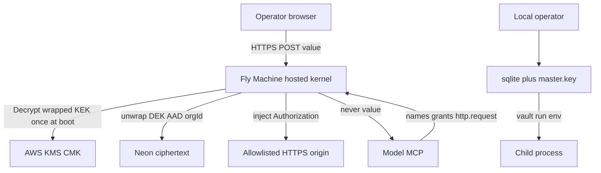

# Plan: Grant-vault hardening (honest trust model + KMS + surfaces)

Canonical interactive plan: Cursor CreatePlan **Security hardening**. Topology: [.loadout/tasks/security-hardening/TASK.md](../../.loadout/tasks/security-hardening/TASK.md). Workspace twin: [.cursor/plans/2026-08-31-security-hardening.md](../../.cursor/plans/2026-08-31-security-hardening.md).

## 1. Summary

- Problem: Operators will store live API keys in Botpasses. Today hosted ciphertext is AES-256-GCM with a per-org DEK, but the platform `VAULT_KEK` sits in a Fly env var. Anyone with that secret plus a Neon dump decrypts every org. Local HTTP has no auth. Hosted HTML has no CSP/HSTS/CORS allowlist. There is no written trust model, so a LastPass-style "we cannot read your vault" claim would be false.
- Outcome: A documented, testable grant-vault: the model does not get stored keys; no human or support path returns keys; a database dump alone cannot decrypt; staging/prod KEK material is unwrapped via AWS KMS after cutover; browser and MCP surfaces match OWASP and MCP 2025-11-25 controls.
- Approach: Keep the existing inject architecture (`http.request`, `vault run`, trusted resolve). Reject client-side zero-knowledge for hosted. Wrap the platform KEK with AWS KMS using Fly Machine OIDC (no static AWS keys). First image on a plane still boots on raw `VAULT_KEK` (expand/contract) until the operator sets `VAULT_KEK_REQUIRE_KMS=1`. Bind local envelopes to secret names. Authenticate loopback HTTP. Ship security headers, tight CORS, collect-page auth, store-backed rate limits, token rotate, `npm audit --omit=dev --audit-level=high` in CI, ADRs, and a public threat table that tells the truth. Do not invent an MCP session store.

## 2. Scope

### In scope

- Trust-model ADR (grant-vault, not zero-knowledge) and a living threat-model doc.
- AWS KMS wrap of the platform KEK on `VAULT_DEPLOY_PLANE=staging|production`, with expand/contract so the first deploy of this image does not take staging down.
- KEK rotation by re-wrapping org DEKs (no item re-encrypt), resume-safe without a KEK fingerprint column.
- Local AES-GCM AAD bound to secret name, with migrate-on-open for existing sqlite rows.
- Local `vault serve` bearer auth derived from the master key.
- Hosted HTTP headers (CSP nonce, HSTS, frame deny, nosniff, referrer, permissions, `Cache-Control: no-store`), with Clerk host slots so the marketing plan can add Clerk.js without rewriting CSP.
- CORS: allowlisted origins only; disallowed Origin fails preflight and POST (403, no `*`).
- Collect GET leaks no client/task until an operator is authenticated; details come from a new operator `GET /api/need-items/:id`.
- Refuse `VAULT_AUTH_MODE=test` on staging/prod planes. MCP auth stays bearer-only; ignore `Mcp-Session-Id` for authz.
- Org rate limiter persisted via `VaultStore` (sqlite-hosted in tests, Neon in prod), 30 grant/need creations per org per hour.
- Machine-token rotate (`POST /api/clients/:id/rotate`) invalidates the old hash on both stores.
- CI: `npm audit --omit=dev --audit-level=high` plus Dependabot.
- Isolation/canary tests for every new surface. Changelog + README + ops runbook in the same change.

### Non-goals (with rationale)

- LastPass/1Password/Bitwarden client-side zero-knowledge on hosted. The hosted connector decrypts in the Fly process to attach `Authorization` ([src/hosted/connector.ts](../../src/hosted/connector.ts)). A ZK claim would be false.
- Customer BYOK / per-org KMS CMK. One platform KEK in KMS plus per-org DEKs is the theft model this plan implements. A per-customer CMK is a separate offering and is not a dependency.
- SOC 2 Type II, a paid pentest, or a bug bounty. Those are engagements. This plan implements the technical controls they would inspect.
- Fly KMS (`/.fly/kms`). No GA page under `fly.io/docs` as of 2026-08-31; the public write-up is a Sep 2024 preview whose API was still changing and uses NaCl secretbox, not our AES-256-GCM stack.
- Replacing Clerk, adding TOTP/signup, or building the marketing site. Owned by [docs/plans/2026-08-31-marketing-site-and-docs.md](2026-08-31-marketing-site-and-docs.md). This plan owns `securityHeaders` / CORS / collect shell in [src/hosted/http.ts](../../src/hosted/http.ts); marketing owns Clerk UI and must not revert those headers.
- An MCP session map, `Mcp-Session-Id` bind, or `fly-replay` affinity. Hosted `POST /mcp` is stateless JSON-RPC per request ([src/hosted/http.ts](../../src/hosted/http.ts) lines 158–167). Building a session store would invent state the server does not have.
- Changing hosted item AAD from `orgId` (would force re-encrypt of every Neon row).
- Multi-Machine MCP affinity, Redis, or a second region.
- Turning AgentPass on.
- Hashing or removing `last4` / login `username` (operator UX; documented as metadata).
- Adding `authorizedParties` to Clerk `verifyToken` (ADR 0001; MCP `azp` is not the app origin).
- A numbered `migrations/003_rate_limit.sql`. `PostgresStore.migrate()` runs [HOSTED_SCHEMA_SQLITE](../../src/store/schema.ts) (`CREATE TABLE IF NOT EXISTS`), not the `migrations/` folder. The marketing plan already reserved `migrations/003_identity.sql`.

### Assumptions (labeled)

- **A-1** The operator will create (or already has) an AWS account used only for two KMS CMKs (staging, prod) and IAM OIDC trust to `oidc.fly.io`. No other AWS product is required. Monthly KMS cost is the AWS CMK price plus Decrypt calls.
- **A-2** Staging and prod Fly apps stay one Machine each (`fly.prod.toml` `min_machines_running = 1`). Rate-limit state lives in the store (Neon in prod), not in process memory.
- **A-3** The marketing-site plan may move `GET /` to marketing and console to `/console`. Security headers are applied in [src/hosted/http.ts](../../src/hosted/http.ts) for every HTML and JSON response, so that move does not undo this work.
- **A-4** Existing Neon orgs keep their current `wrapDek` format (AES-GCM of DEK hex, AAD `orgId`). KMS wraps the platform KEK only.
- **A-5** Local sqlite vaults that predate AAD are upgraded on the next `Vault.open` in the same process that can decrypt them (operator has the master key).
- **A-6** Fly sets `FLY_APP_NAME` (`botpasses-staging`, `botpasses-prod`). EncryptionContext `app` is that value. Missing `FLY_APP_NAME` on a plane is a boot-78 config error when the KMS path is selected.
- **A-7** `vault kek-wrap` / `vault kek-rotate` run on an operator laptop (or `fly ssh console`), not as a hosted HTTP route. The laptop uses AWS SSO, a short-lived console Encrypt, or an IAM user the operator already holds. Fly OIDC (`AWS_ROLE_ARN` → `AWS_WEB_IDENTITY_TOKEN_FILE`) exists only on the Machine. No AWS access keys in git or Fly secrets.
- **A-8** When `CLERK_FRONTEND_API` is set, CSP `script-src` and `connect-src` include `https://<CLERK_FRONTEND_API>`. Marketing adds Clerk.js against that slot.

### Open questions

None.

## 3. Current state (in-repo, evidence-based)

- What exists today: Local sqlite + raw 32-byte master key ([src/crypto.ts](../../src/crypto.ts), [src/vault.ts](../../src/vault.ts)). Hosted Neon + `VAULT_KEK` wrapping per-org DEKs with AAD `orgId` ([src/hosted/kek.ts](../../src/hosted/kek.ts), [src/hosted/kernel.ts](../../src/hosted/kernel.ts)). MCP never returns values. Inject is `vault run`, `http.request`, or `POST /runtime/resolve` ([src/hosted/http.ts](../../src/hosted/http.ts) line 408). Hosted auth is Clerk JWT, hashed `avm_`/`avt_`, or `VAULT_BOOTSTRAP_TOKEN`. Collect URLs are path-only. Isolation tests fail if canary `sk_live_CANARY_do_not_leak_f47ac10b` appears in model surfaces ([test/isolation.test.ts](../../test/isolation.test.ts)). Most hosted tests use `openHostedSqlite` ([src/store/sqlite-hosted.ts](../../src/store/sqlite-hosted.ts)), which applies `HOSTED_SCHEMA_SQLITE`.
- Gaps / constraints: KEK in Fly env ([src/hosted/boot.ts](../../src/hosted/boot.ts) requires `VAULT_KEK`). `hostedBootError` is **sync env checks only**; KMS `Decrypt` is async and belongs in [src/hosted/main.ts](../../src/hosted/main.ts). Local encrypt uses empty AAD ([src/vault.ts](../../src/vault.ts) line 77). Local HTTP has no auth ([src/server.ts](../../src/server.ts)). CORS is `*` ([src/hosted/http.ts](../../src/hosted/http.ts) lines 608–614). No CSP/HSTS/XFO. Collect HTML is public and shows client name + task ([src/hosted/collect-page.ts](../../src/hosted/collect-page.ts)); `GET /collect/:id` calls `kernel.getNeed` and embeds the fields. There is no operator `GET /api/need-items/:id` (only `POST .../fulfill`). Rate limit is in-memory ([src/hosted/rate-limit.ts](../../src/hosted/rate-limit.ts)); [HostedKernel](../../src/hosted/kernel.ts) default-constructs it. `VaultStore` has no `listOrgs`, `updateOrgWrappedDek`, `updateClientHashedSecret`, or rate-hit methods ([src/store/types.ts](../../src/store/types.ts)). Hosted MCP is stateless per POST; `Mcp-Session-Id` appears only in CORS allow/expose headers. CI has no `npm audit` ([.github/workflows/ci.yml](.github/workflows/ci.yml)). `fly.staging.toml` / `fly.prod.toml` already set `VAULT_DEPLOY_PLANE`. Grant-vault plan listed KMS wrap as a v1 non-goal; that residual risk is what this plan closes.
- Reusable components: `encrypt`/`decrypt`/`parseMasterKey`, `wrapDek`/`unwrapDek`, `assertSafePublicObject`, `hostedBootError`, `originOk`, isolation canary helpers, Clerk resolver, connector SSRF guards, `kernel.getNeed`.
- Files read (path — why):
  - `AGENTS.md` — invariants (no `get_secret`, canary tests, origins)
  - `README.md` — threat table, encryption one-liner, Fly secrets
  - `src/crypto.ts` — AES-256-GCM, empty AAD default
  - `src/hosted/kek.ts` — KEK wrap of DEK hex
  - `src/hosted/kernel.ts` — item encrypt AAD `orgId`; default in-memory limiter
  - `src/hosted/boot.ts` / `main.ts` — requires raw `VAULT_KEK`; Decrypt not present
  - `src/hosted/http.ts` — CORS `*`, `POST /runtime/resolve`, no session map
  - `src/hosted/collect-page.ts` / `operator-page.ts` — sessionStorage token, inline JS
  - `src/hosted/mcp.ts` — tool list; no session store
  - `src/hosted/auth.ts` / `clerk-auth.ts` — principals; no `authorizedParties`
  - `src/hosted/rate-limit.ts` — in-process 30/hour
  - `src/hosted/need-ops.ts` — `getNeed` already returns metadata
  - `src/hosted/connector.ts` / `ssrf.ts` — inject + DNS pin
  - `src/vault.ts` / `server.ts` / `mcp.ts` — local kernel and open HTTP
  - `src/store/types.ts` / `schema.ts` / `postgres.ts` / `sqlite-hosted.ts` — migrate = `HOSTED_SCHEMA_SQLITE`; no client rotate
  - `src/redact.ts` / `hosted/observe.ts` — leak guards
  - `docs/adr/0001`, `0002` — identity, origins, Clerk `azp`
  - `docs/plans/2026-08-30-grant-vault-product.md` — D-03 crypto, KMS non-goal
  - `docs/plans/2026-08-31-marketing-site-and-docs.md` — TOTP/signup ownership; reserved `003_identity.sql`; own CSP
  - `fly.staging.toml` / `fly.prod.toml` — app names + `VAULT_DEPLOY_PLANE`
  - `package.json` — runtime deps `@clerk/backend`, `pg` only
  - `test/crypto.test.ts`, `test/isolation.test.ts`, `test/rate-limit.test.ts`, `test/hosted-schema.test.ts`

## 4. External research

### Questions investigated

1. Can a hosted grant vault that injects Bearer tokens honestly claim LastPass-style zero-knowledge?
2. How do 1Password, Bitwarden, HashiCorp Vault, Infisical, Doppler, and WorkOS store keys, and what do they admit operators can decrypt?
3. What does envelope encryption require beyond AES-GCM of values (KEK location, rotation, AAD/context)?
4. What do MCP 2025-11-25 and the official security best practices require of HTTP MCP servers?
5. What OWASP ASVS / Secure Headers / Secrets Management controls apply to this stack?
6. Which KMS can a Fly Machine call without long-lived cloud keys?
7. Must AWS KMS Encrypt/Decrypt EncryptionContext match exactly, and how should Fly OIDC be wired in 2026 docs?
8. How should CI `npm audit` be scoped so a transitive or dev advisory does not brick the trunk?

### Sources consulted

| Source | URL | Takeaway |
| ------ | --- | -------- |
| 1Password zero-knowledge | https://1password.com/features/zero-knowledge-encryption | ZK means the vendor cannot decrypt. Requires account password + Secret Key never sent to the server. Fits a human viewing passwords in a client, not a hosted injector. |
| 1Password Secrets Automation | https://www.1password.dev/secrets-automation | Machine access uses Service Accounts or a self-hosted Connect server that *does* decrypt into apps. Analog of Botpasses hosted. |
| Bitwarden ZK white paper | https://bitwarden.com/resources/zero-knowledge-encryption-white-paper/ | If the provider can decrypt, it is not ZK. Bitwarden Secrets Manager still encrypts for automation; the runtime that injects holds keys. |
| LastPass 2022 breach (Wikipedia) | https://en.wikipedia.org/wiki/2022_LastPass_data_breach | Encrypted vaults were stolen. Offline crack of weak master passwords followed. Lesson: ciphertext next to a crackable or stolen KEK is the failure. Our hosted KEK is not password-derived; it is a raw 32-byte key in Fly secrets — a dump decrypts instantly, not after PBKDF. |
| WorkOS envelope encryption | https://workos.com/blog/envelope-encryption-explained | DEK encrypts data; KEK wraps DEKs and must live in an HSM/KMS. **Storing the KEK in an environment variable defeats the purpose.** Rotation re-wraps DEKs. Key context isolates tenants. |
| Google Cloud envelope encryption | https://docs.cloud.google.com/kms/docs/envelope-encryption | Generate DEK locally; wrap with KMS KEK; store ciphertext + wrapped DEK; AES-256-GCM; rotate KEKs; do not reuse one DEK across users. |
| HashiCorp Vault seal best practices | https://developer.hashicorp.com/vault/docs/configuration/seal/seal-best-practices | Auto-unseal with AWS/GCP KMS. Instance role `kms:Decrypt` on one key ARN. CloudTrail on the key. Do not co-host unrelated services. |
| Fly OIDC docs (2026) | https://fly.io/docs/security/openid-connect/ | Official path: IAM OIDC provider `https://oidc.fly.io/<org-slug>`, audience `sts.amazonaws.com`, `AWS_ROLE_ARN` in `fly.toml`. Trust `sub` `org-name:app:*`. |
| Fly OIDC → AWS (blog) | https://fly.io/blog/oidc-cloud-roles/ | Init writes `/.fly/oidc_token` and sets `AWS_WEB_IDENTITY_TOKEN_FILE`. SDK `AssumeRoleWithWebIdentity`. No static AWS keys. |
| Fly KMS preview | https://community.fly.io/t/fly-kms/21825 | Sep 2024 Fresh Produce; NaCl secretbox; filesystem `/.fly/kms`; API still changing. No `fly.io/docs` page on 2026-08-31. |
| Fly secrets | https://fly.io/docs/apps/secrets/ | Env-mounted secrets encrypted at rest. This is where `VAULT_KEK` lives today. |
| AWS KMS EncryptionContext | https://docs.aws.amazon.com/kms/latest/developerguide/encrypt_context.html | Context is AAD. Decrypt must supply the **same case-sensitive map**. Use `kms:EncryptionContext:` in IAM. CloudTrail logs the context. |
| AWS KMS Decrypt API | https://docs.aws.amazon.com/kms/latest/APIReference/API_Decrypt.html | Mismatch or omitted context → `InvalidCiphertextException`. Symmetric CMKs only. |
| MCP authorization 2025-11-25 | https://modelcontextprotocol.io/specification/2025-11-25/basic/authorization | OAuth 2.1; PKCE S256; **do not use sessions for authentication**; confused-deputy consent. |
| MCP security best practices | https://modelcontextprotocol.io/docs/2025-11-25/tutorials/security/security_best-practices | Verify every request; bind session IDs to user id **if you have sessions**; CSP with nonce; SSRF HTTPS. |
| MCP 2026-07-28 auth pitfalls | https://modelcontextprotocol.io/docs/2026-07-28/tutorials/security/authorization | Short-lived tokens; never log Authorization; treat `Mcp-Session-Id` as untrusted; HTTPS in production. |
| OWASP Secrets Management | https://cheatsheetseries.owasp.org/cheatsheets/Secrets_Management_Cheat_Sheet.html | Use a vault/KMS; encryption at rest; no secrets in source. |
| OWASP HTTP headers | https://cheatsheetseries.owasp.org/cheatsheets/HTTP_Headers_Cheat_Sheet.html | CSP, HSTS, XFO DENY, nosniff, Referrer-Policy, Permissions-Policy, CORS specific origins not `*`, Cache-Control `no-store` for sensitive, no X-XSS-Protection, no HPKP. |
| OWASP ASVS (via HCL mapping) | https://help.hcl-software.com/appscan/Enterprise/10.8.1/topics/r_owasp_application_security_verification_standard_report.html | 1.6.2/6.4.1 key vault; 8.3.7 approved AEAD; 2.10.4 no secrets in git. |
| Infisical KMS | https://infisical.com/docs/documentation/platform/kms/overview | Platform KMS encrypts project data; Infisical can decrypt to serve secrets. Grant-vault peer, not ZK. |
| `@aws-sdk/client-kms` | https://www.npmjs.com/package/@aws-sdk/client-kms | AWS SDK v3 KMS client; latest 3.x. Modular but still a multi-MB install. One Decrypt at boot is acceptable on a 512MB Machine. Pin 3.x; no `any`. |
| npm audit CI scoping | https://shattered.io/npm-audit-nodejs/ | Gate with `npm audit --omit=dev --audit-level=high`. Dev-only highs must not brick deploy. |
| audit-ci (IBM) | https://github.com/ibm/audit-ci | Allowlist only when a CVE is reviewed with reason + expiry. This plan does not add audit-ci unless the first omit=dev high gate is already red and the dep cannot be bumped in the same change. |
| Grant-vault plan D-03 | docs/plans/2026-08-30-grant-vault-product.md | Adopted WorkOS envelope; explicitly left KMS wrap out. This plan supersedes that residual risk only. |

### State of the art / common practice

Human password managers (1Password, Bitwarden, LastPass) encrypt in the client with a key the vendor never holds. Machine secret managers (HashiCorp Vault, Infisical, Doppler, AWS Secrets Manager, 1Password Connect) decrypt inside a trusted runtime and inject. Botpasses is the second class. SOTA for that class is envelope encryption with the KEK in a KMS/HSM, per-tenant DEKs, audited unwrap, no human reveal API, and a public threat model that does not claim ZK.

### Pitfalls & anti-patterns to avoid

- Claiming "zero-knowledge" or "even we cannot read your keys" while `http.request` unwraps DEKs on Fly.
- Leaving `VAULT_KEK` as a Fly env var and calling the system envelope-encrypted (WorkOS names this failure).
- Shipping an image that refuses raw `VAULT_KEK` on `VAULT_DEPLOY_PLANE=staging` while staging still has only the raw secret (first-deploy suicide).
- Betting the KEK on undocumented Fly KMS.
- CORS `*` with `Authorization` (OWASP: specific origins). Allowing a disallowed-Origin POST to run and only omitting ACAO (the browser still sent the stolen bearer).
- Using MCP sessions as auth (spec forbids). Inventing a session store to "bind" a header the server does not persist.
- Password-derived hosted keys (LastPass offline-crack class) — we will not introduce PBKDF for hosted KEK.
- Re-encrypting every item to rotate the KEK (rotate by re-wrapping DEKs).
- Rotation that assumes a KEK fingerprint column that does not exist, or that cannot resume after a crash.
- Adding `@ts-ignore` or `any` around AWS SDK types.
- Putting `rate_hits` only in `migrations/003_*.sql` while tests and `PostgresStore.migrate()` use `HOSTED_SCHEMA_SQLITE`.
- Bare `npm audit --audit-level=high` that fails on a dev-only or unfixed transitive high and parks the trunk.

### Implications for this plan

- **Adopt** grant-vault honesty (1Password Connect / Vault / Infisical).
- **Adopt** WorkOS/Google envelope: KEK in AWS KMS, DEK per org, AES-256-GCM, EncryptionContext as key context (exact match on Decrypt).
- **Adopt** Fly official OIDC docs + blog: Machine never stores `AWS_ACCESS_KEY_ID`.
- **Adopt** OWASP headers + CSP nonce; **reject** inventing MCP sessions.
- **Adopt** expand/contract boot (D-10) so staging stays up through the first image.
- **Adopt** `npm audit --omit=dev --audit-level=high`.
- **Reject** hosted ZK.
- **Reject** Fly KMS as the current KEK store.
- **Reject** WorkOS Vault as a product replacement (we already store items and inject; we only lacked KMS for the KEK).
- **Adapt** HashiCorp auto-unseal: on boot, `Decrypt` the wrapped KEK into process memory; zero the buffer on shutdown.

## 5. Requirements

### Functional (EARS)

- **R-01.** When `VAULT_DEPLOY_PLANE` is `staging` or `production` and `VAULT_KEK_WRAPPED` plus `VAULT_KMS_KEY_ID` are set, the hosted process shall unwrap via AWS KMS `Decrypt` with EncryptionContext `{ purpose: "vault-kek", plane: <plane>, app: <FLY_APP_NAME> }` and shall ignore a co-set raw `VAULT_KEK` (prefer wrapped). `hostedBootError` shall not return an error for that combination.
- **R-02.** When `VAULT_AUTH_MODE=test` or `VAULT_DEPLOY_PLANE` is unset, the hosted process shall unwrap using raw `VAULT_KEK` (existing tests and local `VAULT_MODE=hosted`).
- **R-03.** When `VAULT_KEK_REQUIRE_KMS=1` on a staging or production plane, the process shall refuse to boot unless wrapped + key id are set. Raw-only shall fail with a message matching `/VAULT_KEK_REQUIRE_KMS|VAULT_KEK_WRAPPED/`.
- **R-04.** When an operator runs `vault kek-rotate` with the in-memory (or supplied) old KEK and a new KEK, the process shall re-wrap every org DEK under the new KEK and leave item ciphertext unchanged. Per org: try `unwrapDek` with the new KEK (skip if it succeeds); else unwrap with the old KEK and re-wrap. One org per store transaction. Resume is re-running the same algorithm.
- **R-05.** The kernel shall expose no HTTP route that returns an item `value` except `POST /runtime/resolve` for `trusted` principals.
- **R-06.** When local `setSecret` runs, AES-GCM AAD shall be the normalized secret name. `decrypt` of a swapped envelope under a different name shall fail.
- **R-07.** When a local vault opened with the correct master key still has empty-AAD rows, open shall re-encrypt those rows with AAD=name and set `vault_meta.aad_version=1`.
- **R-08.** When `vault serve` handles `/api/*` or `POST /mcp`, a missing or wrong bearer shall return 401. The bearer shall be `HMAC-SHA256(masterKey, "botpasses-loopback")` hex.
- **R-09.** Every hosted HTML and JSON response (except `GET /health` and `GET /ready`) shall include the security header set in D-05.
- **R-10.** `Access-Control-Allow-Origin` shall never be `*`. A request with a disallowed `Origin` shall receive 403 and no ACAO (OPTIONS and POST). A request with no `Origin` (server MCP) shall be processed and shall omit ACAO.
- **R-11.** `GET /collect/:id` without an operator principal shall not include client name, suggested name, host, or task description. After the operator stores a bearer, collect JS shall `GET /api/need-items/:id` and render the form from that JSON.
- **R-12.** Hosted boot shall exit 78 if `VAULT_AUTH_MODE=test` and `VAULT_DEPLOY_PLANE` is `staging` or `production`.
- **R-13.** Hosted MCP shall authenticate solely via the request bearer. The server shall not create, persist, or consult a session map. `Mcp-Session-Id` shall not affect authz (lock with a test that two tokens sharing the same header value each see their own items).
- **R-14.** Grant and need creation shall count against a store-backed 30-per-org-per-hour limiter. `HostedKernel` shall inject a limiter that uses `VaultStore` (not a default in-memory map) unless a test passes an explicit limiter.
- **R-15.** `POST /api/clients/:id/rotate` (operator, same org) shall issue a new `avm_` or `avt_` secret, persist only the new hash via `updateClientHashedSecret` on both Postgres and sqlite-hosted, and make the previous secret 401.
- **R-16.** CI shall fail when `npm audit --omit=dev --audit-level=high` reports a high or critical advisory in runtime dependencies.

### Non-functional

- Decrypt/unwrap of the platform KEK happens once at boot, not per request. Per-request work stays `unwrapDek` + `decrypt` as today.
- KMS unavailability at boot, when the wrapped path is selected, is fail-closed (exit 78), not a plaintext fallback.
- Raw-only on a plane without `VAULT_KEK_REQUIRE_KMS=1` is a documented expand/contract path and emits structured log `kek_raw_fallback` (no key material).
- No new Fly Machine size. `@aws-sdk/client-kms` is the only new runtime dependency.
- Docs and changelog ship in the same change. Public copy never says "zero-knowledge" or "even we cannot decrypt."
- `hostedBootError` remains synchronous (env presence only). Async `Decrypt` lives in `startHosted`.

### Acceptance criteria (Given/When/Then)

- **AC-01** Given a Neon dump of items + orgs and a `FakeKms` that refuses `Decrypt` (or no KMS access), when a test tries `unwrapDek` with a guessed or empty KEK, then decrypt fails and the canary is absent. This does not by itself prove KMS; AC-04 proves the provider.
- **AC-02** Given `VAULT_DEPLOY_PLANE=production`, `VAULT_KEK_REQUIRE_KMS=1`, and only `VAULT_KEK` set, when `hostedBootError` runs, then it returns a message matching `/VAULT_KEK_REQUIRE_KMS|VAULT_KEK_WRAPPED/` and does not accept the raw-only config.
- **AC-02b** Given `VAULT_DEPLOY_PLANE=production`, `VAULT_KEK_REQUIRE_KMS` unset, and only `VAULT_KEK` set, when `hostedBootError` runs, then it returns `undefined` (raw fallback allowed).
- **AC-02c** Given `VAULT_DEPLOY_PLANE=production`, both `VAULT_KEK` and `VAULT_KEK_WRAPPED` + `VAULT_KMS_KEY_ID` set, and `VAULT_KEK_REQUIRE_KMS` unset, when `hostedBootError` runs, then it returns `undefined` (prefer wrapped; do not treat both as ambiguous).
- **AC-03** Given `VAULT_AUTH_MODE=test` and `VAULT_KEK`, when hosted tests boot, then they pass without AWS.
- **AC-04** Given FakeKms `Decrypt` returning a 32-byte key with EncryptionContext `{ purpose, plane, app }`, when `KmsKekProvider.unwrap` is called, then `parseMasterKey` accepts it and `wrapDek`/`unwrapDek` still round-trip an org DEK. Given a mismatched context, FakeKms throws and unwrap fails.
- **AC-05** Given all org DEKs wrapped under KEK-A, when `rotateKek(KEK-A, KEK-B)` runs, then every org unwraps with KEK-B, item decrypt still yields the canary, and KEK-A unwrap of the new envelopes fails. Given a second call of `rotateKek(KEK-A, KEK-B)` after half the orgs are already on B (simulate crash), then remaining orgs move to B and already-B orgs are skipped (no throw).
- **AC-06** Given a local secret stored under name `STRIPE_KEY`, when ciphertext is copied onto `OTHER_KEY` and decrypted with AAD `OTHER_KEY`, then decrypt throws.
- **AC-07** Given a pre-AAD sqlite vault (empty AAD rows, `aad_version` missing), when opened with the correct master key, then `vault_meta.aad_version` is `1` and a subsequent name-swap still fails.
- **AC-08** Given `vault serve` and no Authorization, when `GET /api/secrets` or `POST /mcp`, then 401. Given the HMAC loopback token, then 200 and no canary in the body.
- **AC-09** Given `GET /` or `GET /collect/:id` on hosted, when the response is read, then it includes `content-security-policy` with a per-response nonce that matches the script tag, `x-frame-options: DENY`, `x-content-type-options: nosniff`, `referrer-policy: strict-origin-when-cross-origin`, `permissions-policy` disabling camera/mic/geolocation, `cache-control: no-store`, and `strict-transport-security` with `max-age=63072000` and without `preload` or `includeSubDomains`.
- **AC-10** Given `Origin: https://evil.example`, when `OPTIONS /mcp` or `POST /mcp` or `GET /api/items`, then status is 403 and the `access-control-allow-origin` header is absent. Given `Origin: https://botpasses.com` on the prod plane, when `OPTIONS /mcp`, then 204 and ACAO is exactly `https://botpasses.com`. Given no Origin, when `POST /mcp` with a valid model bearer, then the RPC runs and ACAO is absent.
- **AC-11** Given an unauthenticated `GET /collect/:needId`, when HTML is parsed, then it does not contain the client name, suggested name, host, or task string. After an operator bearer, `GET /api/need-items/:needId` returns those fields (no `value`) and fulfill still requires operator.
- **AC-12** Given `VAULT_AUTH_MODE=test` and `VAULT_DEPLOY_PLANE=production`, when `hostedBootError` runs, then it matches `/VAULT_AUTH_MODE/`.
- **AC-13** Given model tokens A and B, when B sends `Mcp-Session-Id` equal to a value previously seen on A's response headers, then B is authenticated as B (lists B's items) and is not 403'd for session reuse.
- **AC-14** Given 30 grant/need creates in the current hour through process A against sqlite-hosted or Postgres, when process B (new `OrgRateLimiter` on the same store) creates one more, then it is denied.
- **AC-15** Given an `avm_` token, when rotate succeeds, then the old secret gets 401 on `/mcp` and the new secret lists items. The same test must pass against sqlite-hosted (the hosted test default).
- **AC-16** Given the isolation suite, when store/grant/`http.request`/fulfill run, then the canary is absent from MCP, REST model JSON, audit, email HTML, collect HTML, and inbox.
- **AC-17** Given `GET /runtime/resolve` with any token, then 404 or 405 (route is POST-only). Given `POST /runtime/resolve` with a model token, then 403. Given `POST /runtime/resolve` with a trusted token and an active grant, then `{ value }` is present. No other JSON path includes `value`.
- **AC-18** Given CI, when a high-severity advisory exists in a runtime dependency in the lockfile, then `npm audit --omit=dev --audit-level=high` fails. A clean runtime lockfile passes. A high advisory only in a `devDependency` does not fail this step.

### Edge cases & error paths

- KMS `Decrypt` throttling or 5xx at boot (wrapped path selected): fail closed, exit 78 after one retry with 1s delay, log event without ciphertext or key material ([src/hosted/observe.ts](../../src/hosted/observe.ts) already strips `value`/`token`).
- Wrong EncryptionContext: KMS `InvalidCiphertextException`; boot 78. Staging blob cannot unwrap on prod role (different `plane` + `app` + CMK).
- Partial KEK rotation (crash mid-org): try-new-then-old per org; no fingerprint column. Item rows untouched.
- Concurrent prompt consume: unchanged CAS.
- Collect need expired: unauthenticated GET still shows only the shell; authenticated `GET /api/need-items/:id` may return `status` other than pending without a fulfill form.
- Local wrong master key: refuse open (existing fingerprint). Do not attempt AAD migrate.
- Local empty vault: `aad_version=1` written at init.
- CORS missing Origin (Grok/Claude server MCP): allow the request; do not send `*`.
- OPTIONS preflight from allowlisted origin: 204 with ACAO = that origin, methods GET/POST/DELETE/OPTIONS, headers Authorization, Content-Type, Mcp-Session-Id (plus X-Test-* only in test mode).
- `VAULT_KEK` and `VAULT_KEK_WRAPPED` both set on a prod plane: prefer wrapped; do not exit 78.
- Neither wrapped nor raw on a plane: exit 78.
- AWS SDK missing credentials on prod plane when wrapped path is selected: boot 78 (init must have set `AWS_WEB_IDENTITY_TOKEN_FILE`).
- `vault kek-wrap` without AWS credentials: CLI exits non-zero with a message that names SSO / console Encrypt, not Fly OIDC.

## 6. Design decisions (mini-ADRs)

### D-01: Grant-vault, not zero-knowledge

- Context: User asked whether we should encrypt so even Botpasses cannot read secrets (LastPass model).
- Options: (1) Client-side ZK: operator browser/passphrase encrypts; hosted stores ciphertext only; inject requires a user-run sidecar. (2) Honest grant-vault: platform decrypts only at approved inject; no reveal API; KMS for KEK. (3) False ZK marketing while keeping hosted inject.
- Decision: **(2)**. Hosted `http.request` must hold plaintext in process to attach headers. ZK is true only for the local vault (operator-held `VAULT_MASTER_KEY`). Public docs will say that.
- Informed by: 1Password ZK page vs Secrets Automation/Connect; Bitwarden "if the provider can decrypt it is not ZK"; README already "Not a LastPass clone."
- Consequences: We will never print "zero-knowledge" in product copy. Support has no decrypt tool. Comfort comes from no-reveal + KMS + audit + isolation tests.

### D-02: AWS KMS wrap of the platform KEK via Fly OIDC

- Context: WorkOS: KEK in env defeats envelope encryption. Grant-vault plan left this as residual risk.
- Options: (1) Keep `VAULT_KEK` in Fly secrets. (2) Fly KMS `/.fly/kms`. (3) AWS KMS `Decrypt` of `VAULT_KEK_WRAPPED` using Fly OIDC (`AWS_ROLE_ARN`). (4) WorkOS Vault as the store.
- Decision: **(3)**. Staging and prod each have a CMK. Fly secret after cutover is the wrapped 32-byte KEK (base64), not the key. `EncryptionContext` is `{ purpose: "vault-kek", plane, app: FLY_APP_NAME }` and must match on Encrypt and Decrypt (AWS docs). Tests use (1) via `VAULT_AUTH_MODE=test`.
- Informed by: WorkOS envelope; Google Cloud KMS envelope; HashiCorp seal; [Fly OIDC docs](https://fly.io/docs/security/openid-connect/); Fly OIDC blog; Fly KMS preview (no docs); AWS EncryptionContext guide.
- Consequences: New dep `@aws-sdk/client-kms` (install current 3.x, lockfile regenerated). AWS account (A-1). Boot on the wrapped path depends on KMS + OIDC. Rollback: unset `VAULT_KEK_REQUIRE_KMS`, restore raw `VAULT_KEK`, keep or unset wrapped.

### D-03: One platform KEK, per-org DEKs (no BYOK in this plan)

- Context: WorkOS recommends per-tenant KEK for isolation and BYOK.
- Options: (1) Per-org KMS CMK now. (2) Platform KEK in KMS wrapping existing per-org DEKs.
- Decision: **(2)**. We already have per-org DEKs and AAD `orgId`. KMS closes "DB + Fly secret = all orgs." Per-org CMKs are a distinct product.
- Informed by: Google "one KEK wraps many DEKs"; existing `orgs.wrapped_dek_*`.
- Consequences: KEK theft from KMS+role still decrypts all orgs. Mitigation: separate staging/prod CMKs and IAM `sub` lock to each Fly app; CloudTrail; no human IAM user with Decrypt in the trust path.

### D-04: Local AAD = secret name + migrate-on-open

- Context: Local envelopes have empty AAD; a row swap is a valid decrypt.
- Options: (1) AAD=name, migrate on open. (2) Leave local as-is. (3) Force operators to re-`vault set`.
- Decision: **(1)**. Open with the correct key re-encrypts empty-AAD rows.
- Informed by: AES-GCM AAD purpose; Google DEK-per-user guidance (name bind is the local equivalent).
- Consequences: One write per old secret at first open. Wrong-key open still refuses via fingerprint (no migrate).

### D-05: Security header set and CORS

- Context: OWASP headers cheat sheet; MCP CSP nonce guidance; current CORS `*`.
- Decision: Shared `securityHeaders({ nonce, extraScriptSrc, extraConnectSrc })` on hosted responses. HTML CSP: `default-src 'none'; script-src 'nonce-<n>'` plus extra script hosts; `style-src 'unsafe-inline'; img-src 'none'; connect-src 'self'` plus extra connect hosts; `form-action 'self'; frame-ancestors 'none'; base-uri 'none'`. When `CLERK_FRONTEND_API` is set, extras include `https://<CLERK_FRONTEND_API>`. JSON CSP omitted (not rendered). HSTS `max-age=63072000` without `includeSubDomains` or `preload` (mail/clerk are other hosts; preload is irreversible). CORS: reflect `VAULT_PUBLIC_URL` origin and, when `allowLoopback`, `http://127.0.0.1:8788` / `http://localhost:8788`. Disallowed Origin → 403 + no ACAO on OPTIONS and POST (stolen-bearer browser POSTs must not run).
- Informed by: OWASP HTTP headers; MCP security best practices CSP nonce.
- Consequences: Inline scripts in collect/operator pages must receive the nonce attribute. COEP is omitted so Clerk.js is not blocked. Marketing must use the extra-host slots, not a second CSP string that drops these headers.

### D-06: Collect details require operator

- Context: `need_id` is in MCP results, so chat viewers can open `/collect/:id` and read task/client.
- Options: (1) Keep public details. (2) Shell page until operator auth, then fetch metadata.
- Decision: **(2)**. Unauthenticated HTML is origin-check + token form only. Collect JS, after saving the token to sessionStorage, calls `GET /api/need-items/:id` (new operator route; reuses `kernel.getNeed`) and renders the form. Unauthenticated GET `/collect/:id` stays shell-only even when the need exists.
- Informed by: key-discovery plan (path-only URL, no HMAC); phishing/info-leak.
- Consequences: Extra authenticated GET. Tests update AC-09/AC-11.

### D-07: Store-backed rate limit, not Redis, not migrations/003

- Context: In-memory limiter resets on deploy and is per Machine. Hosted tests use sqlite-hosted, not Postgres. `PostgresStore.migrate()` executes `HOSTED_SCHEMA_SQLITE`.
- Decision: Add `rate_hits(org_id, kind, window_start, count)` to `HOSTED_SCHEMA_SQLITE` (kinds `grant` and `need`). Same 30/hour. Implement `incrementRateHit` / `countRateHits` on `VaultStore` in **both** [src/store/postgres.ts](../../src/store/postgres.ts) and [src/store/sqlite-hosted.ts](../../src/store/sqlite-hosted.ts). Do not add `migrations/003_rate_limit.sql` (marketing reserved `003_identity.sql`; numbered files are not what `migrate()` runs).
- Informed by: existing 30/hour tests; `test/hosted-schema.test.ts`; `postgres.ts` line 38.
- Consequences: Next hosted boot creates the table via `CREATE TABLE IF NOT EXISTS`. Kernel default limiter must take the store.

### D-08: Loopback bearer = HMAC of master key

- Context: Local HTTP is open on 127.0.0.1.
- Options: (1) Unix socket only. (2) Extra token file. (3) HMAC-SHA256(master, "botpasses-loopback").
- Decision: **(3)**. `vault serve` prints the token once at start (not the master key). Console uses sessionStorage like hosted.
- Informed by: least extra state; token rotates with key.
- Consequences: Tests that hit local HTTP must send the header. Bind stays 127.0.0.1.

### D-09: MCP stays stateless (no session bind)

- Context: MCP best-practices say bind session IDs to user id **if sessions exist**. This server has none. Spec also says do not use sessions for authentication.
- Options: (1) Invent an in-memory session map and 403 on principal mismatch. (2) Keep bearer-as-auth; ignore `Mcp-Session-Id` for authz; lock with a test.
- Decision: **(2)**. Affinity / `fly-replay` stays a non-goal.
- Informed by: MCP 2025-11-25 authorization (do not use sessions for auth); live `POST /mcp` handler; CORS already lists the header.
- Consequences: AC-13 asserts cross-token reuse of the header is **not** 403. Do not add a session store in `mcp.ts`.

### D-10: Expand/contract KEK boot (no first-deploy suicide)

- Context: Staging already has `VAULT_DEPLOY_PLANE=staging` and raw `VAULT_KEK`. Refusing raw-only on first push of this image exits 78 and takes staging down.
- Options: (1) Refuse raw on plane immediately (original R-01). (2) Prefer wrapped when present; allow raw-only until `VAULT_KEK_REQUIRE_KMS=1`.
- Decision: **(2)**. Cutover runbook: wrap, set wrapped secrets, confirm boot, **then** set `VAULT_KEK_REQUIRE_KMS=1` and unset `VAULT_KEK`.
- Informed by: expand/contract migration discipline; current `fly.staging.toml`.
- Consequences: Residual "operator never sets REQUIRE_KMS" risk is documented (risk register). Boot 78 after the flag is the force function.

### D-11: CI audit scoped to runtime highs

- Context: Bare `npm audit --audit-level=high` fails on dev tooling and noisy transitives.
- Options: (1) Bare audit. (2) `npm audit --omit=dev --audit-level=high`. (3) Add `audit-ci` with an allowlist on day one.
- Decision: **(2)**. If that command is already red on the lockfile at implement time, bump or replace the runtime dep in the same change. Add `audit-ci` only if a high runtime advisory has no bump and then check in `{ id, reason, expires }` — that is a last resort, not the default.
- Informed by: shattered.io 2026 npm audit CI guide; IBM audit-ci.
- Consequences: Dev-only highs do not fail CI. Dependabot still files them.

## 7. Technical design

### Architecture / data flow



Hosted key hierarchy after cutover:

1. AWS CMK (non-exportable) unwraps `VAULT_KEK_WRAPPED` at boot.
2. Platform KEK (32 bytes, process memory) wraps per-org DEKs (`wrapDek`, AAD `orgId`).
3. Org DEK encrypts item payloads (AAD `orgId`).

### Data model & migrations

Add to `HOSTED_SCHEMA_SQLITE` in [src/store/schema.ts](../../src/store/schema.ts) (this is what sqlite-hosted and `PostgresStore.migrate()` run):

```sql
CREATE TABLE IF NOT EXISTS rate_hits (
  org_id TEXT NOT NULL,
  kind TEXT NOT NULL,
  window_start TEXT NOT NULL,
  count INTEGER NOT NULL,
  PRIMARY KEY (org_id, kind, window_start)
);
```

`VaultStore` additions (both store implementations):

```ts
listOrgs(): Promise<OrgRecord[]>;
updateOrgWrappedDek(
  id: string,
  patch: Pick<OrgRecord, "wrappedDekIv" | "wrappedDekCiphertext" | "wrappedDekTag">,
): Promise<void>;
updateClientHashedSecret(id: string, hashedSecret: string): Promise<void>;
incrementRateHit(orgId: string, kind: "grant" | "need", windowStart: string): Promise<number>;
countRateHits(orgId: string, kind: "grant" | "need", windowStart: string): Promise<number>;
```

- `vault_meta` local: add `aad_version` (integer, default 1 after migrate). No Neon change for crypto.
- No new item columns. No unused BYOK column. No org KEK fingerprint column.

### APIs / tools / jobs / UI surfaces

- New operator `POST /api/clients/:id/rotate` → `{ token, client_id }` once. Same-org operator only.
- New operator `GET /api/need-items/:id` → `{ id, client_name, suggested_name, host, task_description, status }` from `kernel.getNeed` (no value). 404 if missing. 403 if need.orgId !== operator.orgId.
- New CLI `vault kek-wrap` (laptop): reads raw hex from stdin, calls KMS `Encrypt` with the same EncryptionContext, prints base64. Requires laptop AWS creds (A-7). Used in the cutover runbook, not as a Machine entrypoint.
- New CLI `vault kek-rotate` (laptop + `DATABASE_URL`): holds old KEK (env or KMS unwrap) and new KEK; loops `rotateKek`; Encrypts the new KEK; prints the new wrapped blob for `fly secrets set`. No HTTP rotate-kek route.
- New CLI `vault serve` startup line: loopback token (HMAC), never master key.
- Collect HTML: nonce on `<script>`, token form unchanged; after save, `GET /api/need-items/:id` then render form.
- MCP tools unchanged in name/shape.

`KekProvider` in [src/hosted/kms.ts](../../src/hosted/kms.ts):

```ts
export type KekProvider = { unwrap(): Promise<Buffer> };
```

`LocalKekProvider` uses `parseKek(env.VAULT_KEK)`. `KmsKekProvider` uses `@aws-sdk/client-kms` `DecryptCommand` on `Buffer.from(env.VAULT_KEK_WRAPPED, "base64")` with EncryptionContext `{ purpose: "vault-kek", plane, app }`. Tests inject `FakeKms`.

`hostedBootError` (sync only):

- `VAULT_AUTH_MODE=test` + plane staging|production → 78.
- Plane staging|production + wrapped + key id → OK (raw may also be set).
- Plane staging|production + raw only + `VAULT_KEK_REQUIRE_KMS` not `1` → OK.
- Plane staging|production + neither, or REQUIRE_KMS without wrapped → 78.
- Plane unset: require `VAULT_KEK`.
- Wrapped path selected at runtime in `main.ts`: if `FLY_APP_NAME` empty → 78.

`startHosted`: `assertHostedBoot`; `await selectKekProvider(env).unwrap()`; if raw fallback on a plane, log `kek_raw_fallback`; `zeroKey` on `SIGINT`/`SIGTERM` after close.

### Failure modes & retries / idempotency

- Boot KMS (wrapped selected): no retry loop that falls back to raw KEK. One retry with 1s delay for transient 5xx, then 78.
- `rotateKek(oldKek, newKek)`: try unwrap with new (skip), else unwrap with old and re-wrap. One org per transaction. Re-run is the resume.
- Rate hit increment: single increment in a transaction; unique primary key `(org_id, kind, window_start)`.
- Token rotate: single UPDATE of `hashed_secret`; old hash gone.

### Feature flags / KV / prompt registry

N/A — no flags. Plane env plus `VAULT_KEK_REQUIRE_KMS` is the gate.

### Security, privacy, tenancy notes

- No human `decryptItem` HTTP. Tests lock the route list.
- `last4` and username remain plaintext metadata.
- Logs: keep `observe.ts` stripping; never log KMS plaintext or wrapped blob.
- Staging CMK cannot decrypt prod wrapped KEK (context + key id + IAM).
- Trusted resolve remains the intentional plaintext egress for `avt_`.
- IAM key policy: allow `kms:Decrypt` only when `kms:EncryptionContext:purpose` is `vault-kek` and `kms:EncryptionContext:app` is the Fly app name.

## 8. Implementation tasks

### T-01: Trust model docs and ADRs

- Depends on: nothing
- Touch: `docs/adr/0006-grant-vault-trust-model.md`, `docs/adr/0007-kms-wrapped-kek.md`, `docs/security/threat-model.md`, `README.md` (threat table + encryption + "what this is not"), `.loadout/tasks/security-hardening/TASK.md` (keep in sync)
- Do: Write ADRs per `writing-an-adr`. Threat model lists actors, assets, and the hierarchy in §7. README states grant-vault and names KMS. Ban the string `zero-knowledge` in `src/` and `README.md` (test). Name expand/contract and `VAULT_KEK_REQUIRE_KMS`.
- Acceptance: ADR 0003/0004 accepted; README threat table includes "Hosted process / KMS role" sees values at inject; "Botpasses staff without KMS+DB" does not.
- Verify: `rg -i 'zero-knowledge' README.md src/` empty; files exist.

### T-02: Crypto primitives and FakeKms

- Depends on: T-01
- Touch: `src/crypto.ts` (optional `zeroKey(buf: Buffer)`), `src/hosted/kek.ts`, `src/hosted/kms.ts` (new), `test/crypto.test.ts`, `test/kek.test.ts` (new), `package.json`, `package-lock.json`
- Do: AAD unit tests (wrong AAD fails). `zeroKey` fills 0. `KekProvider` + `FakeKms` + `KmsKekProvider` constructed with an injected `decrypt(cipher, context)` function so unit tests never call AWS. FakeKms must require exact EncryptionContext. Do not change `wrapDek` wire format. `npm install @aws-sdk/client-kms` (3.x); regenerate lockfile; no `any`.
- Acceptance: AC-04, AC-06 primitive half (encrypt/decrypt with AAD).
- Verify: `node --experimental-strip-types --disable-warning=ExperimentalWarning --test --test-reporter=spec test/crypto.test.ts test/kek.test.ts`

### T-03: Hosted boot, KMS unwrap, KEK rotation

- Depends on: T-02
- Touch: `src/hosted/boot.ts`, `src/hosted/main.ts`, `src/hosted/kernel.ts` (`rotateKek`), `src/store/types.ts` (`listOrgs`, `updateOrgWrappedDek`), `src/store/postgres.ts`, `src/store/sqlite-hosted.ts`, `src/cli.ts` (`kek-wrap` and `kek-rotate` only when not hosted-as-Machine), `docs/ops/kek-rotation.md` (new), `test/hosted.test.ts` boot cases, `test/kek-rotate.test.ts` (new, sqlite-hosted)
- Do: Boot branch R-01/R-02/R-03 (sync env only). `main.ts` `await kekProvider.unwrap()` then `zeroKey` on stop. `rotateKek(oldKek, newKek)` try-new-then-old. Runbook: create CMKs, IAM trust JSON (`sub` = `<org>:botpasses-staging:*` / `botpasses-prod:*`), EncryptionContext IAM conditions, laptop `vault kek-wrap` (A-7), `fly secrets set VAULT_KEK_WRAPPED VAULT_KMS_KEY_ID AWS_ROLE_ARN`, confirm boot, then `VAULT_KEK_REQUIRE_KMS=1` and unset `VAULT_KEK`.
- Acceptance: AC-01, AC-02, AC-02b, AC-02c, AC-03, AC-05.
- Verify: focused hosted boot tests + rotate test + `npm run typecheck`
- Do not edit `CHANGELOG.md` here (T-06 owns it).

### T-04: Hosted HTTP, collect, rate limit, token rotate

- Depends on: T-03 (boot still works; store already has `listOrgs`)
- Touch: `src/hosted/http.ts`, `src/hosted/collect-page.ts`, `src/hosted/operator-page.ts`, `src/hosted/rate-limit.ts`, `src/hosted/kernel.ts` (inject store-backed limiter; `rotateClient`), `src/hosted/auth.ts` if rotate helper lives there, `src/store/schema.ts`, `src/store/types.ts`, `src/store/postgres.ts`, `src/store/sqlite-hosted.ts`, `test/hosted-operator-page.test.ts`, `test/hosted-mcp-find.test.ts`, `test/rate-limit.test.ts`, `test/isolation.test.ts`, `test/need-items.test.ts`, `test/security-headers.test.ts`
- Do: Headers D-05 (Clerk extra hosts); CORS D-05 (403 + no ACAO on bad Origin); collect D-06 + `GET /api/need-items/:id`; R-13 test (no session map); store limiter R-14; token rotate R-15 on both stores; refuse test headers in CORS when not test mode. Do not add a session map in `mcp.ts`.
- Acceptance: AC-09, AC-10, AC-11, AC-12, AC-13, AC-14, AC-15, AC-16, AC-17.
- Verify: `node --experimental-strip-types --disable-warning=ExperimentalWarning --test --test-reporter=spec test/hosted.test.ts test/hosted-operator-page.test.ts test/hosted-mcp-find.test.ts test/rate-limit.test.ts test/isolation.test.ts test/need-items.test.ts test/security-headers.test.ts`

### T-05: Local AAD migrate + loopback auth

- Depends on: T-02
- Touch: `src/vault.ts`, `src/db.ts`, `src/server.ts`, `src/operator-page.ts`, `src/cli.ts` (`vault serve` print token), `test/vault.test.ts`, `test/http.test.ts`, `test/mcp.test.ts` (local HTTP), `test/cli.test.ts`
- Do: `setSecret` AAD=name; open migrates empty AAD; serve checks HMAC bearer on API/MCP; console HTML token form.
- Acceptance: AC-06, AC-07, AC-08.
- Verify: `node --experimental-strip-types --disable-warning=ExperimentalWarning --test --test-reporter=spec test/vault.test.ts test/http.test.ts test/mcp.test.ts test/cli.test.ts`

### T-06: CI audit, Dependabot, docs close, isolation lock

- Depends on: T-03, T-04, T-05
- Touch: `.github/workflows/ci.yml`, `.github/dependabot.yml`, `README.md`, `CHANGELOG.md`, `docs/ops/botpasses-cutover.md` (KMS secrets list + `VAULT_KEK_REQUIRE_KMS`), `docs/ops/kek-rotation.md`, `AGENTS.md` only if a new invariant would cause a mistake (KMS plane boot + REQUIRE_KMS)
- Do: CI step `npm audit --omit=dev --audit-level=high` after `npm ci`. Dependabot npm weekly. Changelog next version: KMS, headers, local auth, honest trust model, expand/contract. Isolation tests still fail on canary. README Fly secrets list adds `VAULT_KEK_WRAPPED`, `VAULT_KMS_KEY_ID`, `AWS_ROLE_ARN`, `VAULT_KEK_REQUIRE_KMS` and documents raw `VAULT_KEK` as the pre-cutover fallback.
- Acceptance: AC-16, AC-18; DoD checklist in §12.
- Verify: `npm test && npm run typecheck` (paste full closing lines)

## 9. Test plan

- Tests to add or extend: `test/crypto.test.ts` (AAD), `test/kek.test.ts` (FakeKms, context mismatch), `test/kek-rotate.test.ts` (try-new-then-old resume), `test/hosted.test.ts` (boot branches AC-02/02b/02c, headers, CORS 403, test-mode refuse, GET vs POST resolve), `test/vault.test.ts` (AAD migrate, swap fails), `test/http.test.ts` (local 401), `test/rate-limit.test.ts` (store window across two limiter instances), `test/isolation.test.ts` (collect unauth + canary), `test/hosted-mcp-find.test.ts` (collect HTML shell), `test/security-headers.test.ts` if hosted.test grows past the size limit (~400 lines — extract rather than append).
- Regression: AC-06 fails on current `encrypt(value, key)` without AAD (prove by temporarily calling old signature in a unit that expects throw). AC-02 fails on current `hostedBootError` until REQUIRE_KMS is implemented. AC-02b must pass on current `hostedBootError` today if only `VAULT_KEK` is required (document: after the change, AC-02b still passes by design).
- Gate: `npm test && npm run typecheck`
- Manual: After staging deploy with KMS, `GET https://staging.botpasses.com/health` 200; Mozilla Observatory on staging (headers). Cannot automate KMS against real AWS in CI; FakeKms covers logic.

## 10. Rollout & rollback

1. Merge to `dev` (when the user asks to commit). Staging deploy runs as today. The new image **must boot** on existing raw `VAULT_KEK` (AC-02b). Log `kek_raw_fallback`.
2. Operator runbook on staging: create CMK, IAM role (`sub` `*:botpasses-staging:*`), laptop `vault kek-wrap` (A-7), `fly secrets set VAULT_KEK_WRAPPED VAULT_KMS_KEY_ID AWS_ROLE_ARN`, restart, confirm health. Then `fly secrets set VAULT_KEK_REQUIRE_KMS=1` and `fly secrets unset VAULT_KEK`.
3. Prod: same after staging green, via existing `workflow_dispatch`, using `botpasses-prod` CMK and `app=botpasses-prod`.
4. Rollback of cutover (KMS path broken): `fly secrets unset VAULT_KEK_REQUIRE_KMS`; `fly secrets set VAULT_KEK=<old raw>`; Machine boots on raw (AC-02b). Item rows unchanged.
5. Rollback of image: `fly releases rollback` while raw or wrapped still matches what that image understands. Do not rotate KEK until both planes run an image that has `rotateKek` and expand/contract boot.
6. Mid-rotation crash: re-run `vault kek-rotate` with the same old+new pair (AC-05 resume). Keep both CMK versions until every org unwraps with the new KEK.
7. Monitoring: boot failures (exit 78), Sentry without key material, CloudTrail `Decrypt` on the CMK (unexpected callers), `kek_raw_fallback` count, isolation tests in CI.

## 11. Risk register

| Risk | Likelihood | Impact | Mitigation |
| ---- | ---------- | ------ | ---------- |
| First image refuses raw KEK on staging | High if R-01 is naive | High (staging down) | D-10 expand/contract; AC-02b |
| KMS outage blocks boot after REQUIRE_KMS | Low | High (vault down) | Fail closed; Fly restart; AWS status; one retry on 5xx; rollback unsets the flag |
| IAM mis-bind decrypts from the wrong app | Low | High | Trust `sub` `org:botpasses-prod:*`; separate CMKs; EncryptionContext exact match |
| Rotation crash leaves mixed KEKs | Medium | High | try-new-then-old; no fingerprint column; re-run same command |
| sqlite tests miss rate/rotate | High if only postgres.ts changes | High (false green) | Both stores + HOSTED_SCHEMA_SQLITE; AC-14/AC-15 on sqlite-hosted |
| XSS on collect steals sessionStorage token | Medium | High | CSP nonce; collect details gated; marketing plan moves to Clerk cookies |
| CSP ships then Clerk.js cannot load | High if connect-src is `'self'` only | High (login broken) | D-05 extra-host slots from `CLERK_FRONTEND_API` |
| Operator never sets REQUIRE_KMS | Medium | High (raw KEK remains) | Runbook + risk accepted until flag; do not 78 on first deploy |
| AWS SDK supply-chain / disk size | Low | Medium | Pin lockfile; omit=dev audit; one client; 512MB Machine Decrypt-at-boot only |
| npm audit bricks trunk on a dev high | Medium | Medium | `--omit=dev --audit-level=high` |
| False ZK language in a subsequent doc | Medium | High | AC ban string; ADR 0003 |
| Local HMAC token printed in shared terminal | Medium | Low | Loopback bind; token ≠ master key |
| File collision with marketing plan on `http.ts` | Medium | Medium | This plan owns headers/CORS/collect shell; marketing owns Clerk UI; do not revert headers |

## 12. Definition of done

- [ ] All ACs pass (including AC-02b, AC-02c, AC-13 as "no session 403")
- [ ] `npm test && npm run typecheck` green (output pasted)
- [ ] Docs / changelog / ADRs / threat model / runbook / README secrets list in the same change
- [ ] No stubs or in-scope dependencies left open
- [ ] External research recorded and reflected in D-01…D-11
- [ ] Surfaces registered: routes (`GET /api/need-items/:id`, `POST /api/clients/:id/rotate`), `rate_hits` in `HOSTED_SCHEMA_SQLITE`, CI audit, Dependabot, CLI `kek-wrap` / `kek-rotate`
- [ ] plan-ban-sweep RECEIPT quoted; `plan-checker` PASS
- [ ] Edits left unstaged unless the user asks to commit

## 13. Review changelog (2026-08-31 review-plan)

- **P0** Replaced "refuse raw KEK on plane" with expand/contract (`VAULT_KEK_REQUIRE_KMS`). First staging deploy of this image keeps raw boot (AC-02b). Prefer wrapped when both set (AC-02c). `hostedBootError` stays sync.
- **P0** `rotateKek(old, new)` is try-unwrap-new then unwrap-old; no org KEK fingerprint column; resume = re-run. Added `listOrgs` + `updateOrgWrappedDek` on `VaultStore` (both stores).
- **P0** Rate limit and token rotate land on `VaultStore` + `HOSTED_SCHEMA_SQLITE` + **sqlite-hosted and postgres**. Dropped `migrations/003_rate_limit.sql` (migrate() does not apply it; marketing reserved 003).
- **P0** Dropped invented MCP session bind. R-13/AC-13 now lock bearer-only auth. `mcp.ts` stays off the session-map path.
- **P0** AC-17 is `POST /runtime/resolve` (live route). GET is 404/405.
- **P1** Collect details: new operator `GET /api/need-items/:id`; unauth collect HTML is shell; JS fetches after token save.
- **P1** CORS AC-10 is binary: disallowed Origin → 403 and no ACAO on OPTIONS and POST.
- **P1** CSP accepts Clerk extra hosts from `CLERK_FRONTEND_API`.
- **P1** `vault kek-wrap` uses laptop AWS creds (A-7). EncryptionContext `app` = `FLY_APP_NAME`.
- **P1** CI audit is `--omit=dev --audit-level=high`.
- **P1** Kernel limiter is store-backed; changelog owned only by T-06.
- **P1** Named marketing-plan file overlap on `http.ts` / collect / operator pages.
- Fresh sources: Fly OIDC official docs, AWS EncryptionContext + Decrypt API, npm audit 2026 CI scoping, audit-ci.
- Pre-mortem narratives recorded in §11 (first-deploy suicide, mixed KEK after crash, sqlite false green, Clerk CSP break, audit flake).

## 14. Pre-mortem (review Pass 3)

If this plan failed in three to six months, the concrete stories were:

1. **Staging died on merge.** R-01 refused raw KEK while `VAULT_DEPLOY_PLANE=staging` was already set. Mitigation: D-10 + AC-02b.
2. **Rotation crashed on org 4 of 12.** Resume assumed a fingerprint column and re-wrapped already-new orgs with the old KEK (or threw). Mitigation: try-new-then-old; AC-05 second call.
3. **Rate limit and rotate were green in CI and broken on Neon.** Implementer added methods only on `postgres.ts`. Mitigation: sqlite-hosted + schema.ts + AC-14/15 on sqlite.
4. **Marketing shipped Clerk login and the console went blank.** CSP `connect-src 'self'` blocked `clerk.botpasses.com`. Mitigation: D-05 extra hosts.
5. **A transitive high in a test helper parked `dev`.** Bare `npm audit --audit-level=high`. Mitigation: D-11 omit=dev.

### Adversarial lenses

- **Correctness:** AC-17 GET vs POST; rotate resume; boot sync vs async Decrypt.
- **Security/tenancy:** CORS must fail the request, not only hide ACAO; collect shell; no ZK copy; EncryptionContext IAM.
- **Reliability:** expand/contract; KMS fail-closed only when wrapped is selected.
- **Operability:** laptop wrap/rotate; CloudTrail; `kek_raw_fallback`.
- **Simplicity:** no session store; no numbered migration that migrate() ignores.
- **Implementability:** both stores; U-03 owns org wrap methods; U-04 owns rate + client hash + http.

### Alternative not chosen

Skip AWS entirely and only ship headers + local AAD + loopback auth. That leaves WorkOS's named hole (KEK in env) open. Rejected: the user's comfort question was "can I store live keys," and a Neon dump plus Fly secret still decrypts every org without KMS.

## 15. Task topology

**pipeline** (not graph): T-03 and T-04 both edit `src/hosted/kernel.ts` and store files; T-03 and T-05 both edit `src/cli.ts`. Shared trunk. Isolation mode: shared-trunk (`shared-working-tree` installed). Full unit table: [.loadout/tasks/security-hardening/TASK.md](../../.loadout/tasks/security-hardening/TASK.md).
