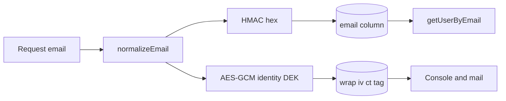
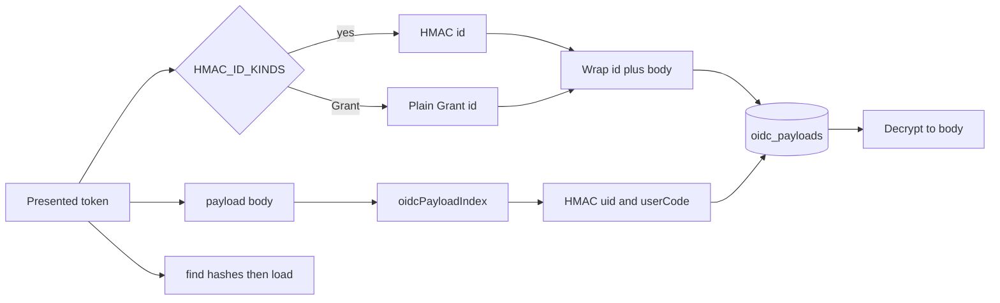

# Plan: KMS cutover verification and email at rest

Canonical interactive plan: Cursor CreatePlan **Email at rest + KMS**. Topology: [.loadout/tasks/email-at-rest/TASK.md](../../.loadout/tasks/email-at-rest/TASK.md).

## Review changelog (2026-09-09 review-plan)

P0/P1 fixes applied in this file and the CreatePlan twin. Do not implement from the pre-review text.

- **P0 — `oidcPayloadIndex` after wrap.** [`upsertOidcPayload`](../../src/store/postgres.ts) extracts `uid` / `user_code` / `grant_id` / `client_id` / `account_id` from `payload` JSON ([`oidcPayloadIndex`](../../src/store/types.ts) 456–474). Wrapping first yields all-null indexes. Client revoke and `revokeByGrantId` miss. Locked: adapter extracts the index from plaintext, HMAC-replaces `userCode` and `uid`, then passes `index` into the store. Store uses the provided index and does not parse wrapped JSON.
- **P0 — revoke parses Grant JSON.** [`destroyOidcPayloadsForClient`](../../src/hosted/oidc-adapter.ts) 64–74 `JSON.parse`s Grant `payload` and calls `deleteOidcPayloadsByGrantId(kind, row.id)`. After wrap, parse yields an envelope and revoke no-ops. Locked: decrypt Grant payloads through `OidcDirectory` before parse. Never HMAC `Grant.id` (see D-07).
- **P0 — restore cannot invert HMAC.** oidc-provider adapter `id` is the token and is not copied into the payload ([panva Redis adapter](https://github.com/panva/node-oidc-provider/discussions/1310): `find(id)` / `destroy(id)` use the presented token as the key). HMAC-overwrite without storing the original id inside the ciphertext makes `scripts/oidc-restore-plaintext.ts` impossible and an image revert kills every MCP refresh. Locked: ciphertext plaintext is `JSON.stringify({ id, body })` where `id` is the presented token and `body` is the oidc-provider payload object (D-11).
- **P0 — HMAC of Grant.id breaks revoke.** `deleteOidcPayloadsByGrantId` matches `grant_id` (plaintext from the token payload) to `Grant.id`. HMAC of Grant.id makes `deleteOidcPayloadsByGrantId(kind, row.id)` miss. Locked D-07: HMAC `id` only for bearer-presented kinds.
- **P0 — `createStoreAdapter(store)` has no directory.** [`createOauthProvider`](../../src/hosted/oauth-as.ts) 198 builds the adapter from `kernel.store` only. An optional directory that falls back to plaintext would keep dumping tokens. Locked: `oidcDirectory` is a required `OauthAsOpts` field. Six call sites: `src/hosted/main.ts`, `test/identity-harness.ts`, `test/oauth-helpers.ts`, `test/helpers/console-boot.ts`, `test/access-ledger.test.ts`, `test/identity.test.ts`.
- **P0 — migration either/or.** "015 if unshipped, else 016" is an unresolved fork. Locked: one file `migrations/015_email_and_oidc_at_rest.sql`. If another agent already added a `015_*.sql` on this shared trunk, stop and ask; do not invent `016` silently.
- **P1 — Session cookie is a bearer.** Plan named RefreshToken / AuthorizationCode / DeviceCode only. oidc-provider `Session` id is the OP cookie. Dump of Session.id is session theft. Locked: HMAC Session and Interaction ids too (D-07).
- **P1 — `consumed` injection needs a column on the read path.** `OidcPayloadRow` is `{ id, payload, expiresAt }` today. Add `consumedAt: number | null`. `#live` deletes by the **stored** id (HMAC), not the presented token.
- **P1 — T-01 is a deploy gate, not a compile gate.** Code tasks proceed without Fly access. Production deploy waits on AC-01.
- **P1 — late hunt (after first review-plan close).** [`ensureMagicChallenge`](../../src/hosted/kernel-grant-approval.ts) writes the live HMAC token into `approval_challenges.code_hash` (lines 64–75) and `magicGrant` compares it as plaintext (line 138). A dump yields `/approve?token=` for 15 minutes. Using it still needs an operator session; it is email-equivalent, not MCP impersonation. Locked D-12: store `sha256Hex(token)` only; reuse of an unexpired row returns `{ fresh: false }` without the token (notify already skips when `fresh` is false). 8-digit code challenges already hash; do not change them.
- **P1 — `/security` prose beyond AAD.** T-05 must also drop the last-four redaction claim (S7 removed it), say raw connector cap is 1 MiB then redact then 256 KiB, and qualify the dump sentence and the bootstrap MFA exception.

## 1. Summary

- Problem: A Neon dump cannot decrypt item values after KMS cutover, but it still lists every operator inbox and holds live OAuth adapter tokens (`oidc_payloads.id` is the refresh/auth/device/session token). The dump-resistance story is also false on any plane that still has raw `VAULT_KEK` next to `DATABASE_URL`.
- Outcome: Each hosted plane refuses raw `VAULT_KEK`. A dump without the platform KEK contains no inbox strings and no usable OAuth refresh, authorization, device, session, or interaction tokens. Operators still sign in, invite, and see emails. MCP OAuth still works. Client revoke still deletes grant-bound tokens. Item and org keys are not derived from email. Remaining dump metadata is named in ADR 0009.
- Approach: Confirm KMS cutover. Wrap inboxes and OAuth payloads under the identity DEK. Replace email columns and bearer `oidc_payloads.id` / `user_code` / `uid` with HMAC-SHA256 keyed by HKDF of that DEK. Put the original adapter id inside the wrap so rollback can restore it. Add `consumed_at` so consume does not mutate ciphertext.

## 2. Scope

### In scope

- Operator verification (and completion if needed) of `VAULT_KEK_REQUIRE_KMS=1` plus raw `VAULT_KEK` unset on `botpasses-staging` and `botpasses-prod`, using [docs/ops/kek-rotation.md](../ops/kek-rotation.md) and [docs/ops/botpasses-cutover.md](../ops/botpasses-cutover.md). This is the production **deploy** gate (AC-01), not a blocker for writing code.
- Encrypt `users.email` and `org_invites.email` under the identity DEK. Replace those columns, and `email_otp_challenges.email`, with the lookup HMAC.
- HMAC bearer `oidc_payloads.id` values and `user_code` / `uid`; wrap every kind's payload (including Grant) under the identity DEK; add `consumed_at`. Leave `Grant.id` and `grant_id` / `client_id` / `account_id` as the oidc-provider plaintext ids.
- Boot-time rebind (same shape as item AAD rebind in [src/hosted/main.ts](../../src/hosted/main.ts)): email rows whose column still contains `@`; oidc rows whose payload is not envelope `v:1`, or whose bearer `id` is not 64 hex. OTP rows migrate on read/write; leftover plaintext OTP expires in ten minutes.
- Identity, team, grant-approval, and account surfaces keep returning decrypted emails to an authenticated operator.
- Rollback scripts that write plaintext email and original oidc ids/payloads back so an image revert is possible.
- Hash `approval_challenges` magic tokens (`kind=magic`). 8-digit `kind=code` rows already use salted SHA-256.
- ADR 0009, threat-model dump row, public `/security` Encryption / Connector / identity paragraphs (AAD, last-4, caps, dump, bootstrap), changelog.

### Non-goals (with rationale)

- Deriving org DEKs or item keys from email or from the HMAC. That turns a public identifier into the vault key; hosted inject already has the email. Rejected in the 2026-09-09 dump-resistance review; ADR 0006 already rejects client-side zero-knowledge.
- Unlinkable identity or a second database. Login, OTP, invites, approvals, and GDPR subject access need the join. A join key reconstructs the graph from two dumps. Google Cloud envelope guidance stores the wrapped DEK next to the ciphertext.
- Per-org CMK / BYOK. ADR 0007 left this out; it does not change Neon-only dump contents for emails.
- Changing `logAuthEvent` (12-hex SHA-256 of email). That is a log correlation token, not a database lookup key.
- An email-change API. None exists; this plan does not add one.
- Encrypting item names, last-4, usernames, or allowed hosts. Those are a separate metadata-minimization product choice. Ranked and accepted in section 11 and ADR 0009.
- Lengthening the 8-digit OTP. TOTP is already required; a live OTP dump is a 10-minute scrypt guess.
- HMAC on `/collect/:id`. Fulfill already requires an operator session. Existence oracle only.
- HMAC of `Grant.id`. It is an internal oidc-provider id, not a client-held bearer. Hashing it breaks `deleteOidcPayloadsByGrantId` (D-07).
- CipherStash EQL / Postgres searchable encryption. New vendor and SQL-layer crypto. Rejected against D-04 and "no new runtime dependency."
- Stop pre-filling collect hosts from the need, and stop connect auto-`item_standing`. Product/UX changes; named in ADR 0009 residuals. Not this dump-crypto change.
- Put `username` in item AAD. Separate bind-integrity change.

### Assumptions (labeled; must not block implementation)

- A1: Hiding inboxes from a dump requires every persistent email column, not only `users.email`. OTP and invite rows are the same PII class.
- A2: T-01 is operator-run Fly/AWS work and a **deploy** gate. Email-at-rest code still helps a Neon-only dump even if a plane has not cut over (raw KEK is a Fly secret, not a Neon column). The public "dump plus Fly secrets cannot decrypt" claim stays false until T-01 passes. An implementing agent without `flyctl` ships the code and leaves AC-01 for the operator.
- A3: Production and staging user counts fit a one-shot boot rebind. The rebind must not gate `/ready` (same rule as `aad_rebind` in `serveHosted`).
- A4: `normalizeEmail` already lowercases and requires `@`; after rebind, `@` in the email column is the legacy-plaintext detector.
- A5: oidc-provider treats adapter `id` as the token for bearer kinds. HMAC of those ids is the dump control. Encrypting only `payload` leaves the token in the primary key.
- A6: Grant.id is not a token a client presents at the token endpoint. `provider.Grant.find(grantId)` ([oidc-provider `loadExistingGrant`](https://github.com/panva/node-oidc-provider/blob/main/docs/README.md)) uses that internal id. It stays plaintext.
- A7: Shared-trunk collision: `015_*.sql` does not exist in this tree today (latest is `014_audit_host.sql`). If it appears before this change lands, stop and ask.
- A8: Test harnesses that call `createOauthProvider` already construct `OperatorIdentity` or can construct `IdentityKeyring` from the same `store` + `kek`. Required `oidcDirectory` is wired at those six call sites, not inside `HostedKernel`.

### Open questions

<!-- Must be EMPTY at delivery. -->

## 3. Current state (in-repo, evidence-based)

- What exists today:
  - Envelope hierarchy: AWS CMK unwraps `VAULT_KEK_WRAPPED`; platform KEK wraps per-org DEKs and one identity DEK; items are AES-256-GCM with AAD `orgId|itemId|allowed_hosts_json|inject` ([src/hosted/kms.ts](../../src/hosted/kms.ts), [src/hosted/kek.ts](../../src/hosted/kek.ts), [src/hosted/identity-keys.ts](../../src/hosted/identity-keys.ts), [docs/security/threat-model.md](../security/threat-model.md)).
  - Identity DEK wrap API is `wrap` / `unwrap` with `WrappedSecretKind` `"totp" | "totp_pending"` and AAD `userId` / `totp_pending:${userId}` ([src/hosted/identity-keys.ts](../../src/hosted/identity-keys.ts) lines 8–21, 94–96).
  - Emails are unique plaintext on `users`, `email_otp_challenges`, and `org_invites` ([src/store/schema.ts](../../src/store/schema.ts) 168–178, 180–187, 392–405). Lookup is `getUserByEmail`, `latestEmailOtp`, and string compare on invite rows ([src/store/types.ts](../../src/store/types.ts) 275–279; [src/hosted/kernel-members.ts](../../src/hosted/kernel-members.ts) 81–84, 131–137).
  - OAuth adapter tokens are the `oidc_payloads` primary key. `upsert(id, payload)` writes the token as `id` and JSON as plaintext ([src/hosted/oidc-adapter.ts](../../src/hosted/oidc-adapter.ts) 117–125). Access JWTs are not stored; refresh/auth/device/session tokens are. `consume` does `jsonb_set` / `json_set` on `payload` ([src/store/postgres.ts](../../src/store/postgres.ts) 1394–1400).
  - Indexed columns are derived **from payload JSON** on upsert ([src/store/types.ts](../../src/store/types.ts) `oidcPayloadIndex`; [src/store/postgres.ts](../../src/store/postgres.ts) 1006–1015).
  - Client revoke lists Grant rows and `JSON.parse`s payload, then `deleteOidcPayloadsByGrantId(kind, row.id)` ([src/hosted/oidc-adapter.ts](../../src/hosted/oidc-adapter.ts) 64–74). `grant_id` on token rows must equal plaintext `Grant.id`.
  - `listMemberEmails` is a SQL join that returns `u.email` ([src/store/postgres.ts](../../src/store/postgres.ts) 997–1003). Grant approval mail uses it ([src/hosted/kernel-grant-approval.ts](../../src/hosted/kernel-grant-approval.ts) 83–89).
  - Logs already rewrite `email` to a 12-hex SHA-256 ([src/hosted/observe.ts](../../src/hosted/observe.ts) 107–116).
  - HKDF-SHA-256 is already used to derive OIDC cookie keys from `VAULT_SESSION_SECRET` ([src/hosted/oauth-as.ts](../../src/hosted/oauth-as.ts) 80, 149).
  - Boot rebind pattern: listen first, rebind in batches, do not gate readiness, resume next boot ([src/hosted/main.ts](../../src/hosted/main.ts) 172–182).
  - Latest numbered migration is `014_audit_host.sql`. Schema twins live in `HOSTED_SCHEMA_*` constants.
  - Public `/security` Encryption blurb still says item AAD is the org id only ([site/src/pages/security.astro](../../site/src/pages/security.astro) 76–78). Code uses the bound AAD.
  - `HostedKernel` does not own `IdentityKeyring`. `OperatorIdentity` does ([src/hosted/operator-identity.ts](../../src/hosted/operator-identity.ts) 200–208). `createOauthProvider` only receives `kernel.store`.
- Gaps / constraints:
  - Cutover state is not in git. `VAULT_KEK_REQUIRE_KMS=1` is optional until an operator sets it ([src/hosted/boot.ts](../../src/hosted/boot.ts) 330–349).
  - Store is crypto-agnostic (it does not unwrap TOTP). Email wrap and HMAC must stay in hosted identity, not in SQL.
  - Expand-only schema: cannot DROP `email`. Overwriting the column with the HMAC keeps `NOT NULL` and the unique index.
  - After overwrite, an old image cannot look up users or OAuth tokens. Rollback needs restore scripts shipped in the same change. OAuth restore requires the original id inside the wrap (D-11).
- Reusable components: `IdentityKeyring`, `encrypt`/`decrypt`, `hkdfSync`, `normalizeEmail`, `serveHosted` rebind loop, `listUsersWithTotp` as the model for `listUsersWithLegacyEmail`, store-parity + identity harness tests, `OperatorIdentity.keys` as the DEK holder for `OidcDirectory`.
- Files read (path — why):
  - `src/hosted/identity-keys.ts` — wrap kinds and AAD
  - `src/hosted/operator-identity.ts` — normalize, OTP, user create, keyring owner
  - `src/hosted/kernel-members.ts` — invite compare and display
  - `src/hosted/kernel-grant-approval.ts` — member email fan-out
  - `src/hosted/oidc-adapter.ts` — upsert/find/consume/revoke
  - `src/hosted/oauth-as.ts` — adapter construction, Grant.find
  - `src/store/schema.ts`, `src/store/types.ts`, `src/hosted-types.ts` — columns and records
  - `src/store/postgres.ts`, `src/store/sqlite-hosted.ts` — lookups, consume, index extract
  - `src/hosted/kms.ts`, `src/hosted/boot.ts`, `docs/ops/kek-rotation.md`, `docs/ops/botpasses-cutover.md` — cutover
  - `src/hosted/main.ts` — rebind-without-gating-ready
  - `docs/adr/0006-grant-vault-trust-model.md`, `0007-kms-wrapped-kek.md`, `docs/security/threat-model.md`
  - `test/identity-keys.test.ts`, `test/migrations.test.ts`, `test/oauth-helpers.ts`, `test/identity-harness.ts`
  - `site/src/pages/security.astro`

## 4. External research

### Questions investigated

1. How do production systems look up an account by email without storing the inbox in plaintext?
2. Is SHA-256(email) enough, or must the hash be keyed?
3. Does GDPR treat encrypted or hashed email as anonymous?
4. Where should the wrap key and the HMAC key live relative to the database?
5. What do envelope-encryption vendors say about storing wrapped keys next to ciphertext?
6. **(review hole)** Does oidc-provider treat adapter `id` as the token, and is that id copied into the payload?
7. **(review hole)** Can you `jsonb_set` a column after you encrypt the JSON?
8. **(review hole)** What happens to grant-scoped revoke if Grant.id is hashed but `grant_id` is not?

### Sources consulted

| Source | URL | Takeaway |
| ------ | --- | -------- |
| Google Cloud envelope encryption | https://cloud.google.com/kms/docs/envelope-encryption | Generate DEKs locally; store wrapped DEKs next to data; AES-256-GCM; do not reuse one DEK across users; KEK stays in KMS. |
| WorkOS envelope encryption | https://workos.com/blog/envelope-encryption-explained | A KEK in an environment variable defeats the envelope. Rotation rewraps DEKs. Shared KEK means no tenant isolation (accepted residual; out of scope). |
| Security Stack Exchange: hashed emails in DB | https://security.stackexchange.com/questions/280824/hashed-email-addresses-in-database-and-plain-text-emails-in-jwt | Unkeyed email hashes are brute-forceable. Use HMAC so a dump without the key cannot test candidates. Encrypt the address if some component must send mail. |
| OWASP Password Storage Cheat Sheet | https://cheatsheetseries.owasp.org/cheatsheets/Password_Storage_Cheat_Sheet.html | Slow hashes (Argon2id) are for secrets the attacker will guess. A pepper/HMAC key must not live in the database. Email lookup cannot use a slow unique-salt hash because lookup would become a table scan. |
| HMAC vs SHA256(key\|\|data) | https://security.stackexchange.com/questions/79577/whats-the-difference-between-hmac-sha256key-data-and-sha256key-data | Use HMAC, not concatenation, to avoid length-extension on SHA-256. |
| ICO: encryption and data storage | https://ico.org.uk/for-organisations/uk-gdpr-guidance-and-resources/security/encryption/encryption-and-data-storage/ | Encrypting personal data at rest is an appropriate measure against a stolen store. Do not store the key with the ciphertext. Residual risk: the running process that decrypts can still see plaintext. |
| ICO: encryption scenarios | https://ico.org.uk/for-organisations/uk-gdpr-guidance-and-resources/security/encryption/encryption-scenarios/ | Cloud encryption at rest does not stop the process that holds the key. Matches grant-vault honesty. |
| EDPB-aligned HMAC pseudonymisation (2026 practitioner summaries of Guidelines 01/2025) | https://sota.io/blog/gdpr-pseudonymisation-vs-anonymisation-personal-data-recital-26-developer-guide-2026 | HMAC is pseudonymisation, not anonymisation. Key must be separate from the dataset. Unkeyed SHA-256 of email is not acceptable. |
| inferadb email HMAC | https://docs.rs/inferadb-ledger-types/latest/src/inferadb_ledger_types/email_hash.rs.html | `HMAC-SHA256(key, "email:" \|\| normalize(email))` as hex; blinding key never stored with the index. |
| HashiCorp Vault seal | https://developer.hashicorp.com/vault/docs/concepts/seal | Storage dumps are ciphertext; unseal/KMS is a separate control; identity stays in the same system. |
| NIST SP 800-132 | https://csrc.nist.gov/pubs/sp/800/132/final | PBKDF is for a secret passphrase, not a public identifier. Do not derive vault keys from email. |
| OWASP Secrets Management Cheat Sheet | https://cheatsheetseries.owasp.org/cheatsheets/Secrets-Management-Cheat-Sheet.html | Protect tokens in storage. Metadata (created/rotated/used) may stay queryable; the secret value must not. |
| AWS Well-Architected SEC02-BP03 | https://docs.aws.amazon.com/wellarchitected/latest/framework/sec_identities_secrets.html | OAuth tokens and API keys are stored encrypted at rest, retrieved at runtime, rotated. |
| Paragon / multi-tenant OAuth token records | https://www.useparagon.com/blog/multi-tenant-oauth-token-storage-architecture | Refresh and access token fields are ciphertext only. Expiry and audit stay plaintext. |
| OWASP ASVS 5.0 V13.3 | https://github.com/OWASP/ASVS/blob/master/5.0/en/0x22-V13-Configuration.md | Secrets management for backend tokens; least privilege; rotate on a documented schedule. |
| ICO residual risks of encrypted storage | https://ico.org.uk/for-organisations/uk-gdpr-guidance-and-resources/security/encryption/encryption-and-data-storage/ | A running process that has unlocked the key still sees plaintext. SQL injection and malware see decrypted data. |
| ADR 0006 / 0007 (repo) | docs/adr/0006-grant-vault-trust-model.md, docs/adr/0007-kms-wrapped-kek.md | Grant-vault, not ZK. KMS wrap of the platform KEK. |
| panva oidc-provider Redis adapter | https://github.com/panva/node-oidc-provider/discussions/1310 | `upsert`/`find`/`destroy` key by `id`. `findByUserCode` maps a side key back to `find(id)`. The token string is the adapter id, not a field you can recover from payload JSON. |
| oidc-provider `loadExistingGrant` | https://github.com/panva/node-oidc-provider/blob/main/docs/README.md | `Grant.find(grantId)` uses the internal grant id from session/consent. That id is not a refresh token. |
| Stack Overflow: securely store JSONB | https://stackoverflow.com/questions/38804910/is-it-possible-to-securely-store-data-in-jsonb-column-with-postgres | Application-level encrypt of the blob; Postgres JSON operators do not run on ciphertext. |
| CipherStash searchable encryption in Postgres | https://cipherstash.com/blog/searchable-encryption-in-postgres | Deterministic query indexes are a separate product. `pg_dump` should show ciphertext only. Rejected as a dependency; adopted the "never SQL-operate on ciphertext" rule (`consumed_at` column). |

### State of the art / common practice

Secret managers (HashiCorp Vault, AWS Secrets Manager) encrypt values and keep identity associated. They do not key the vault with an email hash. For PII minimization, the documented pattern is: deterministic HMAC (or token) for lookup, AES-GCM for the display/send value, key material outside the database. For OAuth adapters, the presented token is the primary key; encrypting the JSON and leaving the key is not token-at-rest.

### Pitfalls and anti-patterns to avoid

- SHA-256(email) or per-row salt without a pepper: emails are low-entropy; a dump is enumerable.
- Per-row salt as the only key: lookup becomes a scan of every row.
- Argon2id(email) as the unique index: correct for passwords, unusable for `getUserByEmail`.
- New `VAULT_EMAIL_PEPPER` Fly secret: extra rotation surface; KEK rotation would not refresh it; two secrets to lose.
- Deriving the HMAC key from the platform KEK: `vault kek-rotate` would invalidate every lookup hash unless a rehash job runs.
- Leaving plaintext in `users.email` after adding wrap columns: the feature does not change dump contents.
- Reverting the image after overwrite without restoring plaintext: sign-in breaks; MCP refresh breaks.
- Wrapping `oidc_payloads.payload` and leaving `id` as the token: the dump still holds every refresh token.
- HMAC-overwrite of `id` without storing the original token inside the wrap: rollback cannot restore tokens.
- HMAC of `Grant.id` while `grant_id` stays plaintext: client revoke leaves refresh tokens live.
- `jsonb_set` / `json_set` on a wrapped payload: corrupts ciphertext or stamps `consumed` onto the envelope.
- Optional crypto directory with a plaintext fallback: tests stay green and production dumps still leak.
- SQL `oidcPayloadIndex` on wrapped JSON: revoke indexes go null.

### Implications for this plan

- Adopt Google/WorkOS envelope for the address (identity DEK + AAD), HMAC-SHA256 for lookup, HKDF info label for domain separation.
- Adapt inferadb's `"email:"` prefix and hex output.
- Reject unkeyed SHA-256, per-row-salt-only lookup, email-derived DEKs, a second database, and CipherStash EQL.
- Treat GDPR outcome as pseudonymisation of a dump without KMS, not anonymisation. Copy must say that.
- Adopt panva's adapter contract: hash the presented token on find/upsert/destroy; put that same token inside the wrap for restore.
- Adopt "no JSON operators on ciphertext": `consumed_at` column; indexes passed in from plaintext.

## 5. Requirements

### Functional (EARS, R-01…)

- **R-01.** When an operator lists Fly secrets on `botpasses-staging` or `botpasses-prod`, the names shall include `VAULT_KEK_WRAPPED`, `VAULT_KMS_KEY_ID`, `AWS_ROLE_ARN`, and `VAULT_KEK_REQUIRE_KMS`, and shall not include `VAULT_KEK`. If `VAULT_KEK` is present, the operator shall finish the cutover steps in `docs/ops/kek-rotation.md` before calling T-01 done. Production deploy of this image shall not start until that check passes.
- **R-02.** When the hosted process stores a user or an invite, it shall write `HMAC-SHA256(hkdf(identityDEK, "botpasses/email-lookup/v1"), "email:" \|\| normalizeEmail(address))` as 64 lowercase hex into the `email` column, and shall write the AES-256-GCM wrap of the normalized address under the identity DEK with AAD `email:${userId}` or `invite_email:${inviteId}`.
- **R-03.** When the hosted process stores an OTP challenge, it shall write that same HMAC into `email_otp_challenges.email` and shall not persist the inbox string.
- **R-04.** When `getUserByEmail` / `latestEmailOtp` / invite match runs, the identity layer shall hash the request email and look up by that hex. During rebind, a row whose `email` contains `@` shall still match the plaintext once, then be rewritten.
- **R-05.** When an authenticated operator reads account, team, consent, TOTP otpauth issuer, or invite preview, the process shall decrypt the wrap and return the inbox. SQL and audit rows shall not gain a new plaintext email column.
- **R-06.** When member inboxes are needed for approval mail, the kernel shall load member users and decrypt wraps. The store shall not `SELECT u.email` as the send-to list after this change.
- **R-07.** When boot finishes listening, a background rebind shall page users and invites whose `email` contains `@`, wrap, overwrite, and log `email_rebind` with counts only (no addresses). Failure logs `email_rebind_failed` and does not exit. `/ready` stays up. The next boot resumes.
- **R-08.** When `IdentityKeyring.rotateKek` runs, the identity DEK bytes stay the same (existing S9 test). Email HMACs and wraps remain valid with no rehash.
- **R-09.** When an operator runs `scripts/email-restore-plaintext.ts` against a store with the current KEK, every wrapped user and invite row shall have its `email` column set back to the decrypted inbox so a previous image can boot. The script shall print counts only.
- **R-10.** Public copy shall state that a dump without the KEK hides inboxes and OAuth adapter tokens, that this is not zero-knowledge, and that item AAD is `orgId|itemId|allowed_hosts_json|inject`.
- **R-11.** When the OAuth adapter upserts a kind in `HMAC_ID_KINDS` (RefreshToken, AuthorizationCode, DeviceCode, AccessToken, Session, Interaction), the stored `id` shall be `HMAC-SHA256(hkdf(identityDEK, "botpasses/oidc-lookup/v1"), "oidc:" \|\| kind \|\| ":" \|\| token)`. `find` / `destroy` / `consume` shall hash the presented token. Grant upsert shall leave `id` as the oidc-provider grant id.
- **R-12.** When consume runs, one conditional UPDATE shall set `consumed_at` where it is NULL. `find` shall add `consumed` to the parsed `body`. The store shall not `jsonb_set` / `json_set` a wrapped payload.
- **R-13.** Device `user_code` and adapter `uid` shall be stored as HMAC (same HKDF; messages `oidc-user-code:` + code and `oidc-uid:` + uid). `findByUserCode` / `findByUid` shall hash the presented value. `grant_id`, `client_id`, and `account_id` stay the plaintext oidc-provider ids.
- **R-14.** When the adapter upserts any kind, it shall wrap `JSON.stringify({ id: presentedId, body: payload })` under the identity DEK with AAD `oidc:${kind}:${storedId}` (`storedId` is the HMAC for bearer kinds and the plaintext Grant id for Grant). `find` shall decrypt and return `body`.
- **R-15.** When `destroyOidcPayloadsForClient` runs, it shall decrypt each Grant payload before reading `resources` / `accountId`, and shall call `deleteOidcPayloadsByGrantId` with the plaintext `Grant.id`.
- **R-16.** When `upsertOidcPayload` runs from the hosted adapter, the store shall persist the caller-supplied `index` and shall not call `oidcPayloadIndex` on the wrapped payload. Direct store upserts in unit tests that omit `index` may still extract from plaintext JSON.
- **R-17.** When boot finishes listening, `oidc_rebind` shall page rows whose payload is not envelope `v:1`, or whose kind is in `HMAC_ID_KINDS` and whose `id` is not 64 hex; wrap; HMAC bearer ids / user_code / uid in one transaction per row; log counts only. `/ready` stays up.
- **R-18.** When an operator runs `scripts/oidc-restore-plaintext.ts` with the current KEK, each wrapped row shall have `id` set to the inner `id`, `payload` set to `JSON.stringify(body)`, and `user_code` / `uid` set to the inner body fields (or null). Counts only on stdout.
- **R-19.** When `ensureMagicChallenge` mints a link, `approval_challenges.code_hash` shall be `sha256Hex(token)` and shall not equal the URL token. `magicGrant` shall accept the presented token when `sha256Hex(token)` matches. An unexpired prior row shall return `{ fresh: false }` without a token. Rows whose `code_hash` contains `.` (legacy minted token) shall be hashed in place on next read or expire in 15 minutes.

### Non-functional

- No new runtime dependency. Use `node:crypto` `hkdfSync` + `createHmac` + existing `encrypt`/`decrypt`.
- Expand-only schema: add wrap columns and `consumed_at`; do not DROP `email` or `oidc_payloads.id`.
- Store stays free of crypto imports.
- Isolation canary: after rebind, a raw `SELECT` of email / oidc id / payload / wrap ciphertext decoded as utf8 must not contain the fixture inbox or the fixture token.

### Acceptance criteria (Given/When/Then, AC-01…)

- **AC-01.** Given Fly secrets on a plane, when T-01 is checked, then `VAULT_KEK` is absent and `VAULT_KEK_REQUIRE_KMS` is `1`. Evidence is the `fly secrets list` name list (no values in git, chat, or the changelog). Required before production deploy; not required to merge code.
- **AC-02.** Given a new sign-up `canary-inbox@example.com`, when the user row is read through the store, then `email` is 64 hex and wrap columns are set; `getUserByEmail("canary-inbox@example.com")` returns that user; decrypt yields the inbox.
- **AC-03.** Given that user, when a test reads the SQLite/Postgres row with raw SQL, then the inbox string is absent from every column.
- **AC-04.** Given a legacy row with plaintext `email` and null wrap columns, when boot rebind runs, then the row matches AC-02 and a second rebind is a no-op.
- **AC-05.** Given OTP send + verify on a rebound user, when two concurrent verifies run, then `claimOtpAttempt` still admits one winner (existing atomic claim).
- **AC-06.** Given an invite to `teammate@example.com`, when the owner lists the team, then the pending row shows that inbox; the `org_invites.email` column is 64 hex; accept by that signed-in user succeeds; accept by a different inbox fails.
- **AC-07.** Given KEK rotation (existing S9), when the process reopens on the new KEK, then OTP sign-in and team list still show the original inboxes and lookups succeed.
- **AC-08.** Given a dump of `users` + `orgs` and no KEK, when a test tries `unwrapDek` with an empty key, then email wraps fail closed and the inbox is absent.
- **AC-09.** Given `scripts/email-restore-plaintext.ts` after rebind, when it exits 0, then `users.email` and `org_invites.email` contain `@` again and equal the decrypted wraps.
- **AC-10.** Given the site build, when `/security` is rendered, then the Encryption section names bound item AAD, email-at-rest, and OAuth-token-at-rest, and does not say item AAD is the org id only.
- **AC-11.** Given a stored RefreshToken, when raw SQL reads `oidc_payloads.id`, then the value is 64 hex and a string search for the real token misses; `find(realToken)` still returns the payload body.
- **AC-12.** Given that row, when two concurrent `consume` calls run, then one sets `consumed_at` and the other is `invalid_grant`. Raw SQL of `payload` after consume still has no `consumed` key inside ciphertext.
- **AC-13.** Given a DeviceCode, when `user_code` is read from SQL, then it is 64 hex; `findByUserCode(typedCode)` still works.
- **AC-14.** Given a stored Grant plus a RefreshToken under that grant, when `destroyOidcPayloadsForClient` runs for that vault client and org, then both rows are gone. A variant that `JSON.parse`s the Grant payload without decrypt leaves the RefreshToken (prove fail-before in the implementing session).
- **AC-15.** Given adapter upsert of a RefreshToken whose body has `grantId`, when raw SQL reads `grant_id`, then it equals that plaintext grant id (not null, not 64-hex HMAC of the token).
- **AC-16.** Given a stored Session, when raw SQL reads `id`, then it is 64 hex; `find(cookieValue)` still returns the session body. Grant rows keep a non-hex `id` equal to the oidc-provider grant id.
- **AC-17.** Given a pending grant with a minted magic link, when raw SQL reads `approval_challenges.code_hash` for `kind=magic`, then the URL token is absent; `previewMagic` / `approveMagic` with the real token still succeed; a second `requestGrant` on the same pending grant does not write the token back to SQL.

### Edge cases and error paths

- Invalid email: `normalizeEmail` still 400s before hash.
- Wrap missing on a hashed email row: treat as unreadable identity data; sign-in that needs display can still look up by HMAC; team list shows empty email and logs `email_unwrap_failed` with `user_id` only.
- Concurrent rebind of the same row: last wrap wins; both decrypt to the same inbox / same inner `{ id, body }`.
- Invite limiter and OTP limiter keys stay the request email in process memory, never the stored column.
- Delete user / delete org: existing cascades; wraps go away with the row.
- GDPR erase is delete-the-row; subject access decrypts wraps for the operator session of that user.
- Oidc find on a legacy (pre-rebind) bearer id: hash miss, then raw-id lookup; if found, that request may rewrite the row the same way rebind does.
- Oidc unwrap failure: treat as missing row (same as corrupt payload today); log `oidc_unwrap_failed` with `kind` only.
- Expiry purge in `#live`: `deleteOidcPayload` uses the stored id (HMAC or Grant id), never double-hashes a listed id.
- `upsertOidcPayload` without `index` and with wrapped JSON: indexes would be null. The hosted adapter always passes `index`. Store-level tests that write plaintext JSON omit `index`.

## 6. Design decisions (mini-ADRs)

### D-01: All persistent inbox columns, not only `users.email`

- Context: The seed named `users.email`. OTP and invite tables also store inboxes.
- Options: (1) Users only. (2) Users + invites + OTP lookup key.
- Decision: (2).
- Informed by: dump-hide-inboxes outcome; ICO storage encryption; A1.
- Consequences: `listMemberEmails` SQL goes away; invite compare hashes; OTP column holds HMAC only.

### D-02: HMAC-SHA256 with HKDF(identity DEK), not per-row salt and not SHA-256(email)

- Context: Seed said "salted hash". Per-row salt breaks O(1) lookup. Unkeyed SHA-256 is rainbow-tabled.
- Options: (1) SHA-256(email). (2) Per-row salt + SHA-256. (3) New `VAULT_EMAIL_PEPPER`. (4) HMAC with HKDF of the identity DEK, info `botpasses/email-lookup/v1`, message `email:` + normalized address.
- Decision: (4).
- Informed by: Security.SE 280824; OWASP pepper-not-in-DB; inferadb email HMAC; existing `hkdfSync` in `oauth-as.ts`; R-08 (KEK rotate must not rehash).
- Consequences: Dump without KEK cannot test `alice@gmail.com`. Dump with KMS can. No new Fly secret. "Salted" means keyed HMAC, not a stored per-row salt.

### D-03: Overwrite `email` with the HMAC; add wrap columns; no DROP

- Context: Expand-only forbids dropping `email`. Leaving plaintext makes the feature a no-op.
- Options: (1) Dual-write plaintext forever. (2) New `email_hash` plus nullable `email`. (3) Overwrite `email` with 64-hex HMAC; add wrap iv/ct/tag.
- Decision: (3). Unique index and NOT NULL stay valid. `@` detects legacy rows.
- Informed by: migrations 010/013/014 expand-only pattern; unique `users_email`.
- Consequences: Old images cannot look up after overwrite. Ship `scripts/email-restore-plaintext.ts` in the same change (R-09).

### D-04: Store remains crypto-agnostic

- Context: Stores do not unwrap TOTP.
- Options: (1) Hash inside SQL functions. (2) Identity/`EmailDirectory` hashes and decrypts; store gets/sets opaque `email` plus wrap columns. (3) CipherStash EQL in Postgres.
- Decision: (2). Reject (3): new dependency and SQL-layer crypto.
- Informed by: `IdentityKeyring` + `updateUser` split; CipherStash blog (rejected).
- Consequences: `listMemberEmails` moves to the kernel. Add `listUsersWithLegacyEmail` / `listInvitesWithLegacyEmail` for rebind. Oidc store upsert accepts an optional `index` so it never has to parse ciphertext.

### D-05: Rebind must not gate `/ready`

- Context: `serveHosted` already refuses to block health on item AAD rebind.
- Options: (1) Rebind before listen. (2) Listen, then batch rebind, resume on next boot.
- Decision: (2), same as AAD.
- Informed by: [src/hosted/main.ts](../../src/hosted/main.ts) 172–182.
- Consequences: Mixed plaintext/hash rows exist briefly; lookup tries HMAC first, then plaintext (R-04 / R-17).

### D-06: HMAC oidc bearer token ids in this change

- Context: `createStoreAdapter.upsert` stores the oidc-provider token as `oidc_payloads.id` and the JSON as plaintext (`src/hosted/oidc-adapter.ts` 117–125). A dump is a live refresh-token theft.
- Options: (1) Leave it; email-only plan. (2) Wrap `payload` only. (3) HMAC bearer `id` / `user_code` / `uid`, wrap every payload, add `consumed_at`.
- Decision: (3).
- Informed by: AWS SEC02-BP03; OWASP secrets storage; Paragon ciphertext-only refresh tokens; A5; panva adapter discussion 1310.
- Consequences: Adapter `find` / `findByUserCode` / `findByUid` hash first. `consumeOidcPayload` must not `jsonb_set` ciphertext. Restore script required before image revert.

### D-07: HMAC id only for bearer-presented kinds; never Grant.id

- Context: `destroyOidcPayloadsForClient` deletes tokens with `deleteOidcPayloadsByGrantId(kind, grantRow.id)`. Token `grant_id` is the plaintext Grant id from the payload. `Grant.find(grantId)` uses that same id.
- Options: (1) HMAC every `oidc_payloads.id` including Grant. (2) HMAC Grant.id and HMAC `grant_id` so they still join. (3) HMAC only RefreshToken, AuthorizationCode, DeviceCode, AccessToken, Session, Interaction; leave Grant.id plaintext; still wrap Grant payloads.
- Decision: (3). (1) breaks revoke. (2) works but hashes a non-bearer internal id and complicates `Grant.find` for no dump-resistance gain against token theft.
- Informed by: live `oidc-adapter.ts` 64–74; oidc-provider `loadExistingGrant`; A6.
- Consequences: A dump still contains Grant ids. Those ids are not refresh tokens. Named residual in ADR 0009.

### D-08: Indexes from plaintext; store does not parse wraps

- Context: `oidcPayloadIndex(payload)` on wrapped JSON returns nulls. Revoke-by-grant and findByUid/userCode die.
- Options: (1) Store decrypts (violates D-04). (2) Dual-write plaintext payload then wrap (dump window). (3) Adapter computes `oidcPayloadIndex(JSON.stringify(payload))`, HMAC-replaces `userCode` and `uid`, passes `index` into `upsertOidcPayload`.
- Decision: (3).
- Informed by: `oidcPayloadIndex` 456–474; CipherStash/SO "do not JSON-operate on ciphertext."
- Consequences: `upsertOidcPayload` grows an optional `index`. Hosted adapter always supplies it.

### D-09: One migration file `015_email_and_oidc_at_rest.sql`

- Context: Pre-review text said 015 or 016 depending on ship state.
- Options: (1) Two migrations. (2) One 015 with email wrap columns plus `oidc_payloads.consumed_at`.
- Decision: (2). Latest shipped file is `014_audit_host.sql`. If a sibling agent lands another `015_*.sql` first, stop and ask (A7).
- Informed by: expand-only convention; shared-working-tree.
- Consequences: `test/migrations.test.ts` lists `015_email_and_oidc_at_rest`.

### D-10: `oidcDirectory` is required on `createOauthProvider`

- Context: Adapter is constructed from `kernel.store` alone. A missing directory must not write plaintext.
- Options: (1) Optional directory, plaintext fallback. (2) Required `OauthAsOpts.oidcDirectory`. (3) Move IdentityKeyring onto HostedKernel.
- Decision: (2). (1) is a silent leak. (3) is a larger refactor than this change; A8 lists the six call sites that already have `OperatorIdentity` or can build `IdentityKeyring`.
- Informed by: `oauth-as.ts` 198; `operator-identity.ts` 200–208; call-site grep.
- Consequences: TypeScript fails the build if a test omits the directory.

### D-11: Wrapped oidc blob contains the original adapter id

- Context: HMAC is one-way. oidc-provider does not put the token string into the payload. Restore and image revert need the original id.
- Options: (1) No oidc restore; document "revert = every MCP client reconnects" and accept that an old image cannot find HMAC ids. (2) Wrap `JSON.stringify({ id: presentedId, body: payload })`. (3) Keep plaintext id and add an `id_hmac` column (dump still has the token).
- Decision: (2). (3) is a no-op for dump resistance. (1) leaves production stuck if this image is bad: operators cannot revert without breaking every connected agent.
- Informed by: panva discussion 1310; R-09/R-18 rollback.
- Consequences: `find` returns `body` only. Restore writes `id` and `JSON.stringify(body)` back. AAD is `oidc:${kind}:${storedId}`.

### D-12: Hash magic-link tokens; do not wrap them

- Context: `ensureMagicChallenge` stores the minted `body.sig` token in `code_hash` and later returns that column as the URL token ([`src/hosted/kernel-grant-approval.ts`](../../src/hosted/kernel-grant-approval.ts) 64–75, 138). 8-digit codes already use salted SHA-256. A dump is a 15-minute `/approve?token=` leak. Approve still requires an operator session.
- Options: (1) Leave it; email/OAuth-only plan. (2) Wrap under the identity DEK so the same link can be re-read. (3) Store `sha256Hex(token)`; on reuse return `{ fresh: false }` without a token (notify already skips).
- Decision: (3). (2) is extra wrap surface for a 15-minute value that is already HMAC-bound to `VAULT_APPROVAL_HMAC`. Reuse does not need the plaintext token.
- Informed by: late residual hunt; existing `hashCode` for `kind=code`; `requestGrant` notify guard `!reusedPending || magic.fresh`.
- Consequences: Legacy plaintext magic rows expire in 15 minutes or hash-on-read when `code_hash` contains `.`. No restore script. No new column.

Rejected (whole plan): email-derived DEKs, unlinkable identity, separate identity DB, sidecar ZK, per-org CMK, encrypting item names/last-4/hosts in this change, collect-host prefill, connect auto-standing.

## 7. Technical design

### Architecture / data flow

1. Request carries the inbox or the oidc-provider token.
2. Email: `normalizeEmail` then HMAC + wrap. Oidc: HMAC presented id when kind is in `HMAC_ID_KINDS`.
3. Persist HMAC (or Grant id) and the envelope. Persist caller-supplied index.
4. Lookup hashes the request (email / token / user_code / uid).
5. Display/mail decrypts email wraps. Adapter `find` decrypts and returns `body`.

### Data model and migrations

Migration `015_email_and_oidc_at_rest.sql`, mirrored as `HOSTED_SCHEMA_EMAIL_AND_OIDC_AT_REST_ALTER_SQLITE` / `_PG` in [src/store/schema.ts](../../src/store/schema.ts):

- `users`: `email_wrapped_iv TEXT`, `email_wrapped_ciphertext TEXT`, `email_wrapped_tag TEXT`
- `org_invites`: the same three columns
- OTP: no new columns; `email` becomes the HMAC
- `oidc_payloads`: `consumed_at INTEGER` (epoch seconds, nullable). Payload TEXT becomes the envelope JSON `{ "v": 1, "iv", "ciphertext", "tag" }` after rebind. No new oidc wrap columns; the envelope lives in `payload`.

Wire the ALTER into both store `migrate`/`open` paths the way 014 is wired. `test/migrations.test.ts` parity must include 015.

`UserSecurityState` / `InviteRecord` gain the three wrap fields (nullable). `OidcPayloadRow` gains `consumedAt: number | null`. `upsertOidcPayload` gains optional `index?: OidcPayloadIndex`.

### Modules

- [`src/hosted/email-directory.ts`](../../src/hosted/email-directory.ts): `emailLookupKey`, `isLegacyPlaintextEmail`, wrap/unwrap using `IdentityKeyring.wrap` with new kinds `email` / `invite_email` (AAD `email:${userId}` / `invite_email:${inviteId}`).
- [`src/hosted/oidc-directory.ts`](../../src/hosted/oidc-directory.ts): `oidcLookupKey(kind, token)`, `userCodeLookupKey`, `uidLookupKey`, `isLegacyOidcId`, `wrap`/`unwrap` via `encrypt`/`decrypt` + `keyring.dek()` (do not overload `IdentityKeyring.wrap` with a fake userId). `HMAC_ID_KINDS` constant. Envelope plaintext `{ id, body }`.
- Adapter: `createStoreAdapter(store, directory)`. `createOauthProvider` requires `oidcDirectory`.
- `#live`: parse after unwrap; inject `consumed` from `consumedAt`; on expiry `deleteOidcPayload(storedId, kind)`.

### APIs / tools / jobs / UI surfaces

- No HTTP contract change: JSON still has `email` as the inbox for authenticated operator routes.
- New scripts: `scripts/email-restore-plaintext.ts` and `scripts/oidc-restore-plaintext.ts`. Open `PostgresStore` with `DATABASE_URL` and resolve the platform KEK the same way [src/hosted/boot.ts](../../src/hosted/boot.ts) does (`VAULT_KEK_WRAPPED` + KMS, or raw `VAULT_KEK` only on a rollback plane). Print counts. Never print inboxes or tokens.
- New boot jobs: `email_rebind` and `oidc_rebind` next to `aad_rebind`.
- UI: no client-bundle logic change if the API keeps returning decrypted emails. Regenerate the bundle only if a client module is touched.

### Failure modes and retries / idempotency

- Email rebind is idempotent: skip rows without `@`.
- Oidc rebind is idempotent: skip envelope `v:1` rows whose bearer id is already 64 hex.
- Restore scripts are idempotent: email skips rows that already contain `@` and match the wrap; oidc skips rows whose payload parses as a normal oidc body (has `clientId` or `accountId` or `grantId` and no `v:1` envelope).
- Unwrap failure: no inbox in the response; oidc find returns missing; log id/kind only.
- KMS down at boot: process already fails closed (existing). Directories never start.
- PK update collision on oidc rebind (HMAC id already present): keep the HMAC row, delete the plaintext-id row in the same transaction.

### Feature flags / KV / prompt registry

N/A — no flags. Presence of wrap columns plus `@` / 64-hex / envelope `v:1` detectors is the expand/contract.

### Security, privacy, tenancy notes

- Same trust boundary as TOTP: dump without KEK hides inboxes and bearer tokens; Fly process and dump+KMS do not.
- HMAC key is not in Neon as plaintext; it is HKDF of the identity DEK, which is wrapped under the KEK.
- AAD prevents swapping a wrap onto another user, invite, or oidc row.
- Do not log inboxes or tokens in rebind counts.
- This is not unlinkability and not zero-knowledge. ADR 0009 must say so.
- Grant ids remain in the dump (D-07). Named residual.

## 8. Implementation tasks

### T-01: Confirm KMS cutover

- Depends on: none
- Touch: none in git unless the runbook needs a "verify names only" checklist line in [docs/ops/kek-rotation.md](../ops/kek-rotation.md)
- Do: `fly secrets list -a botpasses-staging` and `-a botpasses-prod`. Require names `VAULT_KEK_WRAPPED`, `VAULT_KMS_KEY_ID`, `AWS_ROLE_ARN`, `VAULT_KEK_REQUIRE_KMS`. Forbid name `VAULT_KEK`. If raw is present, run the existing wrap/require/unset steps. Confirm `/health` 200. Do not paste secret values into chat, docs, or tests. If `flyctl` is unavailable in the implementing session, leave AC-01 for the operator and continue T-02. Do not deploy production without AC-01.
- Acceptance: AC-01
- Verify: secret name lists + health curl

### T-02: Schema, types, stores, EmailDirectory, keyring kinds

- Depends on: none (code). Production deploy after T-01 on each plane.
- Touch: `src/store/schema.ts`, `migrations/015_email_and_oidc_at_rest.sql`, `src/store/types.ts`, `src/hosted-types.ts` if InviteRecord wrap fields live there, `src/store/postgres.ts`, `src/store/sqlite-hosted.ts`, `src/hosted/identity-keys.ts`, new `src/hosted/email-directory.ts`
- Do: ALTER email wrap columns + `oidc_payloads.consumed_at`; `listUsersWithLegacyEmail` / `listInvitesWithLegacyEmail`; stop SQL `listMemberEmails` returning raw `u.email` (replace with user-id list or delete and use `listMembers` + `getUser`); add kinds `email` and `invite_email`; implement `emailLookupKey`, `isLegacyPlaintextEmail`, wrap/unwrap helpers; extend `upsertOidcPayload` with optional `index`; extend `OidcPayloadRow` with `consumedAt`; change `consumeOidcPayload` to set `consumed_at` where NULL (both stores).
- Acceptance: types compile; migrations parity test lists `015_email_and_oidc_at_rest`
- Verify: `node --experimental-strip-types --disable-warning=ExperimentalWarning --test --test-reporter=spec test/migrations.test.ts`

### T-03: Wire identity, team, approval mail, boot rebind, restore script

- Depends on: T-02
- Touch: `src/hosted/operator-identity.ts`, `src/hosted/kernel-members.ts`, `src/hosted/kernel-grant-approval.ts`, `src/hosted/kernel.ts` / `src/hosted/main.ts`, `src/hosted/http-member-routes.ts` (only if it reads `user.email` off the store), `scripts/email-restore-plaintext.ts`
- Do: all writes go through EmailDirectory; all reads decrypt for humans/mail; boot `email_rebind`; restore script using boot KEK resolution. Hash magic tokens (D-12 / R-19): `ensureMagicChallenge` stores `sha256Hex(token)`; reuse returns `{ fresh: false }` without a token; `magicGrant` compares hashes with `timingSafeEqual`.
- Acceptance: AC-02, AC-04, AC-05, AC-06, AC-09, AC-17
- Verify: identity + members tests in T-04

### T-04: Email tests

- Depends on: T-02, T-03
- Touch: new `test/identity-email-at-rest.test.ts`; extend `test/identity-keys.test.ts` (rotate still shows inbox); `test/store-parity.test.ts`; isolation-style raw SQL assertion in the new file
- Do: AC-02 through AC-09 automated. Fail-before: temporarily skip wrap write and assert AC-03 fails, then keep the wrap write. No `git stash`.
- Acceptance: those ACs
- Verify: `node --experimental-strip-types --disable-warning=ExperimentalWarning --test --test-reporter=spec test/identity-email-at-rest.test.ts test/identity-keys.test.ts` and `npm run test:pg` when `DATABASE_URL` is set

### T-06: OAuth adapter tokens at rest

- Depends on: T-02 (consumed_at + optional index already in 015)
- Touch: new `src/hosted/oidc-directory.ts`; `src/hosted/oidc-adapter.ts`; `src/hosted/oauth-as.ts` (`OauthAsOpts.oidcDirectory` required; `createStoreAdapter(store, directory)`); `src/hosted/main.ts` (`oidc_rebind` + pass directory); `test/identity-harness.ts`, `test/oauth-helpers.ts`, `test/helpers/console-boot.ts`, `test/access-ledger.test.ts`, `test/identity.test.ts`; `scripts/oidc-restore-plaintext.ts`; `test/oidc-at-rest.test.ts`
- Do: HMAC bearer ids / user_code / uid; wrap `{ id, body }`; find returns body; consume uses `consumed_at`; decrypt Grants in `destroyOidcPayloadsForClient`; boot rebind; restore script; tests AC-11–AC-16.
- Acceptance: AC-11, AC-12, AC-13, AC-14, AC-15, AC-16
- Verify: `node --experimental-strip-types --disable-warning=ExperimentalWarning --test --test-reporter=spec test/oidc-at-rest.test.ts test/oauth-flow.test.ts test/access-ledger.test.ts`

### T-05: Docs, ADR, public copy, changelog

- Depends on: T-03, T-06 (T-01 evidence when available)
- Touch: `docs/adr/0009-email-at-rest.md`, `docs/security/threat-model.md`, `site/src/pages/security.astro`, `CHANGELOG.md`, `docs/ops/kek-rotation.md`, `docs/ops/restore.md`
- Do: ADR 0009 covers email, OAuth tokens (including D-07 Grant-id residual and D-11 wrap shape), hashed magic links (D-12), and the residual inventory (metadata, avt_, process memory, shared KEK, OTP length, collect 404 oracle, collect host prefill, connect auto-standing, bootstrap, log hash, username-not-in-AAD). Threat-model Neon dump row matches R-10. `/security` must say: bound item AAD; dump without KEK hides values, inboxes, bearer tokens, and magic URL tokens, not names/last-4/hosts; last-4 is not stripped from connector bodies; raw response cap is 1 MiB then redact then 256 KiB; bootstrap bearer with `VAULT_BOOTSTRAP_ALLOW_PLANE=1` skips TOTP. Changelog Unreleased. No em dashes in user-facing copy. restore.md: run both scripts, then revert the image; never revert first.
- Acceptance: AC-10
- Verify: `test/site-copy.test.ts` / `test/trust-copy.test.ts` plus assertion that `/security` does not claim org-id-only AAD

## 9. Test plan

- Tests to add or extend:
  - `test/identity-email-at-rest.test.ts` (AC-02–AC-06, AC-08, AC-09)
  - `test/identity-keys.test.ts` rotation + inbox (AC-07)
  - `test/store-parity.test.ts` wrap columns + hashed email + `consumed_at`
  - `test/migrations.test.ts` version `015_email_and_oidc_at_rest`
  - site-copy assertion for AC-10
  - `test/oidc-at-rest.test.ts` (AC-11–AC-16)
  - Magic-link hash assertion in the identity/grant test that already mints an approve link (AC-17)
  - Existing `test/oauth-flow.test.ts` and `test/access-ledger.test.ts` must stay green after directory wiring
- Regression: AC-03 fails if wrap write is skipped; AC-11 fails if `id` is left as the raw token; AC-14 fails if Grant payloads are parsed without decrypt; AC-15 fails if index is taken from wrapped JSON (prove once each in the implementing session).
- Gate: `npm run lint && npm test && npm run typecheck`. With `DATABASE_URL`, `npm run test:pg`.
- Manual: T-01 `fly secrets list` names only; after staging deploy, Team shows inboxes; Neon `users.email` and bearer `oidc_payloads.id` are 64 hex; reconnect one MCP client.

## 10. Rollout and rollback

- Ship steps:
  1. Merge code when lint/test/typecheck pass. AC-01 may still be open if the agent lacks Fly.
  2. T-01 on staging, then production, before each plane's deploy.
  3. Deploy this image to staging. Watch `email_rebind` and `oidc_rebind`. Sign in and reconnect one MCP client. Confirm Neon hex columns for emails and bearer oidc ids. Confirm Grant ids are still the oidc-provider values.
  4. Deploy production the same way, only after AC-01 on that app.
- Rollback (data): run both restore scripts on that plane with the current KEK, confirm plaintext emails and original oidc ids, then revert the image. Do not revert the image first.
- Rollback (cutover): existing kek-rotation rollback (raw `VAULT_KEK`, unset `VAULT_KEK_REQUIRE_KMS`). Item, email, and OAuth rows stay wrapped.
- Monitoring: `email_rebind`, `email_rebind_failed`, `oidc_rebind`, `oidc_rebind_failed`, `email_unwrap_failed`, `oidc_unwrap_failed`, `kek_raw_fallback`.

## 11. Risk register

| Risk | Likelihood | Impact | Mitigation |
| --- | --- | --- | --- |
| Cutover not done; dump + Fly secrets still decrypts everyone | Medium | High | T-01 deploy gate; alert `kek_raw_fallback` |
| Image revert before restore scripts | Low | High | ADR 0009 / restore.md; both scripts in the same change; D-11 stores original oidc id in the wrap |
| Rebind lags; mixed rows | Low | Low | Dual lookup HMAC then plaintext; OTP TTL 10 min |
| Unwrap bug shows empty team emails | Low | Medium | Tests AC-06; log id only |
| HMAC key from KEK would break rotate | Avoided | High | D-02 uses identity DEK, which rotate rewraps in place |
| OAuth consume still json-sets ciphertext | Medium | High | R-12 / AC-12; `consumed_at` column |
| Wrapping payload only, leaving token in `id` | Avoided | High | D-06 / A5 / AC-11 |
| Indexes null after wrap; revoke misses tokens | High if ignored | High | D-08 / AC-15 |
| HMAC Grant.id; revoke no-ops | High if ignored | High | D-07 / AC-14 |
| Restore cannot invert HMAC | High if ignored | High | D-11 / R-18 |
| Adapter constructed without directory | High if optional | High | D-10 required opts |

Accepted residuals (named in ADR 0009, not mitigated here): item names, last-4, usernames, hosts, need/grant text; plaintext Grant ids; `avt_` resolve; Fly process memory; shared platform KEK; 8-digit OTP offline guess; collect 200/404 oracle; collect host prefill from the need; connect auto-`item_standing` for the requesting agent; username outside item AAD; identity-DEK raw-KEK unwrap of leftover TOTP envelopes; bootstrap form behind `VAULT_BOOTSTRAP_ALLOW_PLANE`; in-process IP limiter; unsalted log `email_hash`; `BACKUP_KEY` revealing the same dump; leftover `clerk_oauth_user_id` column.

## 12. Pre-mortem (review-plan Pass 3)

Failure narratives six months out, with the mitigation already in this plan:

1. **Revoke is theater.** An operator clicks revoke client. Refresh tokens stay valid because Grant payloads are envelopes and `JSON.parse` sees no `resources`. MCP agents keep injecting. Mitigation: D-07 + D-08 + AC-14 fail-before.
2. **Rollback trap.** A bad deploy. Someone `fly deploy`s the previous image first. Nobody can sign in; every MCP refresh is `invalid_grant`. Mitigation: restore.md order; D-11 original id in wrap; scripts in the same change.
3. **Silent plaintext adapter.** A new test boots `createOauthProvider` without a directory. CI passes. Staging dump still has tokens. Mitigation: D-10 required field; six call sites named.
4. **Consume corrupts wraps.** `jsonb_set` stamps `consumed` onto envelope JSON. Next find fails closed; half the plane's codes die; the other half stay reusable. Mitigation: R-12 / AC-12 asserts payload has no `consumed` key after consume.
5. **Index wipe.** Upsert wraps first; `grant_id` is null; `revokeByGrantId` deletes zero rows. Mitigation: D-08 / AC-15.

Serious alternative not chosen: keep plaintext `oidc_payloads.id` and add `id_hmac` for lookup (option D-11.3). Simpler rollback, zero PK updates, and a dump that still contains every refresh token. That fails the outcome. Rejected.

## 13. Definition of done

- [ ] All ACs pass (AC-01 may be operator-held until deploy; AC-17 is automated)
- [ ] Typecheck + affected tests green (`npm run lint && npm test && npm run typecheck`)
- [ ] Docs / changelog / ADR 0009 / `/security` in the same change
- [ ] No stubs or in-scope decisions left open
- [ ] External research recorded and reflected in D-01–D-11
- [ ] plan-ban-sweep RECEIPT quoted; `plan-checker` PASS
